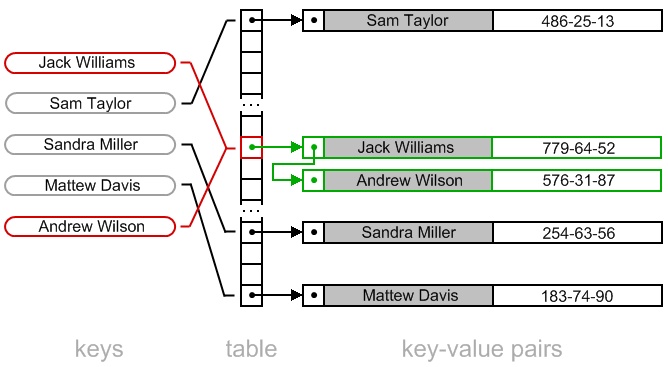

[Перелік усіх робіт](README.md)

# Робота з хеш-таблицею

## Мета роботи 

Навчитися працювати з хеш-таблицями, як з структурою, призначеною для пришвидшеного пошуку даних. 

## Обладнання

Персональний комп’ютер, IDE Microsoft Visual Studio або інша середа розробки для мови C++

## Теоретичні відомості

### Хеш-таблиці


Хеш-таблиця (англ. Hash Table) - це структура даних в комп'ютерних науках, яка використовується для зберігання та пошуку даних з високою швидкістю. В основі хеш-таблиці лежить хеш-функція, яка призначена для перетворення вхідних даних (ключа) в індекс таблиці (хеш-код). Основна ідея полягає в тому, що завдяки хеш-функції можна швидко знайти місце, де зберігається відповідний запис (значення) для даного ключа.

Основні характеристики хеш-таблиці:

1. Швидкий доступ: завдяки хеш-функції пошук елементів в хеш-таблиці виконується за константний час (O(1)), що робить її однією з найшвидших структур даних для пошуку та доступу.
2. Використання ключів: у хеш-таблиці використовуються ключі, за якими можна отримувати та зберігати значення. Ключі повинні бути унікальними в межах таблиці.
3. Хеш-функція: це важливий компонент хеш-таблиці, яка визначає, яким чином ключі перетворюються в індекси таблиці. Якщо хеш-функція правильно розроблена, вона гарантує рівномірний розподіл ключів та мінімізує колізії.
4. Колізії: коли два різних ключі призводять до одного і того ж індексу хеш-таблиці, виникає колізія. В хеш-таблицях існують різні методи вирішення колізій, такі як використання списків або дерев для зберігання декількох значень за одним індексом.
5. Розширення і скорочення: деякі реалізації хеш-таблиць дозволяють автоматично розширювати або скорочувати розмір таблиці для зберігання даних при зміні навантаження.

Хеш-таблиці широко використовуються в програмуванні для різноманітних завдань, таких як зберігання даних, швидкий пошук та видалення даних, реалізація словників, оптимізація запитів до баз даних та багато інших варіантів використання.

### Хеш-функція

Хеш-функція - це функція, яка призначена для перетворення вхідних даних (наприклад, ключа) в велике число (хеш-код) фіксованої довжини. Основна ідея хеш-функції полягає в тому, що вона повинна призводити до одного й того ж хеш-коду для одного й того ж вхідного значення. Іншими словами, для кожного унікального вхідного значення хеш-функція повинна генерувати унікальний хеш-код.

Хеш-функції використовуються у хеш-таблицях для визначення місця зберігання значення за його ключем. Найважливіші властивості хорошої хеш-функції включають:

1. Детермінованість: Функція повинна завжди повертати один і той самий хеш-код для одного й того ж вхідного значення.
2. Рівномірний розподіл: Хороша хеш-функція розподіляє ключі рівномірно по всьому діапазону можливих хеш-кодів, запобігаючи "скупчення" ключів в обмежених діапазонах.
3. Швидкодія: Обчислення хеш-коду має бути швидким процесом, оскільки він виконується при додаванні, пошуку та видаленні елементів в хеш-таблиці.
4. Мінімізація колізій: Хороша хеш-функція мінімізує кількість колізій (ситуацій, коли різні ключі призводять до одного і того ж хеш-коду).

Деякі популярні хеш-функції, які можна використовувати у хеш-таблицях, включають:

1. Division (Метод ділення): Цей метод використовує залишок від ділення ключа на певне просте число, що визначає розмір таблиці.
2. Multiplication (Метод множення): Цей метод використовує операцію множення та вибірка фракційного частку як хеш-коду.
3. SHA (Secure Hash Algorithm) хеш-функції: Це криптографічно стійкі хеш-функції, які гарантують надійний розподіл хеш-кодів.

MD5 та CRC32: Ці хеш-функції також використовуються для генерації хеш-кодів, але вони менш стійкі до атак і не рекомендуються для криптографічних застосувань.

У теяких випадках можливе повторне хешування або додаткова модифікація отриманого хешу.

### Колізії

Колізії у хеш-таблицях - це ситуації, коли два або більше різних ключів призводять до одного і того ж хеш-коду або індексу в хеш-таблиці. олізії виникають тоді, коли різні ключі призводять до одного і того ж хеш-коду через хеш-функцію. Це може відбуватися через обмежену кількість можливих хеш-кодів в порівнянні з нескінченним числом можливих ключів.

Колізії можуть впливати на продуктивність хеш-таблиці, оскільки вони можуть призводити до збільшення часу доступу до даних та операцій вставки та пошуку. Якщо колізії стають дуже частими, це може суттєво зменшити продуктивність.

Вибір ефективної хеш-функції та методу вирішення колізій є критичним для успішної роботи хеш-таблиці. Хороша хеш-функція повинна рівномірно розподіляти ключі по всьому діапазону хеш-кодів, а метод вирішення колізій повинен бути ефективним та забезпечувати швидкий доступ до даних навіть під час колізій.

### Вирішення колізій

Існує кілька способів вирішення колізій у хеш-таблицях. Вибір методу вирішення колізій залежить від конкретних потреб та вимог вашого застосування. Ось деякі з найпоширеніших методів:

1. Використання списків (Chaining):
   - При цьому методі, кожен індекс хеш-таблиці містить список (часто званий "ланцюжком") елементів з однаковим хеш-кодом.
   - Коли виникає колізія, новий елемент просто додається до списку за відповідним індексом.
   - Цей метод дозволяє зберігати декілька значень з однаковим хеш-кодом під одним індексом.
    
2. Відкрита адресація (Open Addressing):
   - При цьому методі, коли виникає колізія, новий елемент шукає вільний індекс в межах хеш-таблиці.
   - Різні варіації відкритої адресації включають лінійну адресацію (пошук наступного доступного індексу), квадратичну адресацію та подвійне хешування (використовуючи іншу хеш-функцію для знаходження нового індексу).
    
3. Ланцюжки з відкритою адресацією (Chaining with Open Addressing):
   - Цей метод поєднує обидва попередніх методи. Кожен індекс містить список, і якщо виникає колізія, використовується відкрита адресація для пошуку нового вільного індексу в межах цього списку.
4. Використання другої хеш-функції (Double Hashing):
   - В цьому методі використовується друга хеш-функція для обчислення додаткового індексу, якщо перший індекс вже зайнятий.
   - Друга хеш-функція має бути незалежною від першої та має враховувати змінні фактори для визначення нового індексу.
5. Використання відкритої адресації з переміщенням (Cuckoo Hashing):
   - В цьому методі, коли виникає колізія, новий елемент може виштовхнути інший елемент, який вже знаходиться в таблиці.
   - Цей метод може вимагати великих зусиль для вирішення колізій та переставлення елементів.
6. Використання рандомізованих хеш-функцій (Perfect Hashing):
   - Цей метод використовує рандомізовані хеш-функції, які генерують хеш-коди випадковим чином, що дозволяє уникнути колізій.

## Хід роботи

1. Завантажити Visual Studio. Знайдіть на робочому столі ярлик з Visual Studio або Пуск → Всі програми→ Microsoft → Microsoft Visual Studio.

2. Створити новий проект «Visual C++ (консольное приложение Win32)». Файл → Cтворити → Проект, тип проекту «Консольное приложение Win32».

3. Перевірити роботу програми та намалювати блок-схему алгоритму
```cpp
#include <iostream>

using namespace std;

// Клас для представлення елементу хеш-таблиці
class HTItem {
public:
    string value;
    HTItem* next;
    HTItem(string val) {
        value = val;
        next = nullptr;
    }
    int searchNext(string key) {
        // Функція пошуку наступного елементу
    }
};

// Клас для представлення хеш-таблиці
class HT {
private:
    const unsigned long CAPACITY = 1024 * 64; // Розмір хеш-таблиці
public:
    HTItem** rows;
    // Конструктор хеш-таблиці
    HT() {
        rows = new HTItem* [CAPACITY];
        for (unsigned long i = 0; i < CAPACITY; i++) {
            rows[i] = nullptr;
        }
    }
    // функція простого хешування рядку
    unsigned long simpleHash(string str) {
        unsigned long i = 0;
        for (int j = 0; str[j]; j++)
            i += str[j];
        return i % CAPACITY;
    }
    // функція додавання рядку в таблицю
    void insert(string value) {
        unsigned long key = simpleHash(value);
        rows[key] = new HTItem(value);
    }
    // функція друку таблиці
    void print() {
        for (unsigned long i = 0; i < CAPACITY; i++) {
            if (rows[i] != nullptr) {
                cout << hex;
                cout << i << "\t" << rows[i]->value << endl;
            }
        }
    }
    // функція пошуку в таблиці
    HTItem* search(string key) {
        unsigned long sindex = simpleHash(key);
        if (rows[sindex] != nullptr) {
            return rows[sindex];
        }
        else {
            return nullptr;
        }
    }
};

int main()
{
    HT table;
    table.insert("df agdf dsfhbsdg hbsdg dfagdfgadfgvafgdfhbd");
    table.insert("dfg dfgdf agdh shbggadfgvafgdfhbd");
    table.insert("df ag3333g dfagdfgadfgv555 6 6765 45afgdfhbd");
    table.insert("jh kvjdf axfb dgfnbxfgn dfdfgadfgvafgdfhbd");
    table.insert("hg hg6565 df agdf dsfhbsdg hbsdg dfagdfgadfgvafgdfhbd");
    table.insert("df agd65832625 325 4654  000fgvafgdfhbd");
    table.insert("df agdffxg vbk,yfu hsfd gshggdfgadfgvafgdfhbd");
    table.insert("3243 435df agdf dsfhbsdg hbsdg dfag dfj ydgfchsdgfaesgrgsgvafgdfhbd");
    table.insert("h jkgfhdf agdf dsfhbsdg hafgdfhbd");
    table.insert("906 3 5 u7df agdf dsfhsf hgasehb bsdg hbsdg dfagd7 djdhghb s5 shstrhbs fgadfgvafgdfhbd");
    table.insert("");
    table.insert("a");
    table.print();
    cout << hex;
    cout << table.search("a") << endl;
    cout << table.search("asd") << endl;
    cout << table.search("h jkgfhdf agdf dsfhbsdg hafgdfhbd") << endl;
}
```

4. Розгляньте приклади до лабораторної роботи. Визначте відмінності між програмою на С та на С++.
5. Додайте до програми можливість видаляти елементи з таблиці
6. Додайте до програми можливість очищати таблицю. Зверніть увагу на корректне вивільнення пам'яті
7. Додайте до програми можливість зберігання даних з колізійними хешами, методом ланцюжків, запропонованим в теоретичних відомостях
8. Для кожного етапу роботи зробити знімки екрану та додати їх у звіт з описом кожного скіншота
9. Додайте програмний код завдання для самомтійного виконання
10. Дайте відповіді на контрольні запитання
11. Збережіть звіт у форматі PDF та надішліть викладачу

## Контрольні запитання

1. Що таке хеш-таблиця та яку роль вона відіграє в комп'ютерних науках?
2. Які переваги використання хеш-таблиці порівняно з іншими структурами даних, такими як масиви чи списки?
3. Які можливі недоліки або обмеження хеш-таблиці?
4. Як вирішується колізія в хеш-таблиці, і які існують методи її уникнення?
5. Як впливає якість хеш-функції на ефективність хеш-таблиці?
6. Як визначити розмір хеш-таблиці та чому він важливий?
7. Як впливає розмір хеш-таблиці на час доступу до даних?
8. Як виглядає операція пошуку елементу, якщо необхідно обробити колізії?

## Приклади

1. [Робота з хеш-таблицею C++1](src/lab-05/lab-05-001.cpp)
2. [Робота з хеш-таблицею C1](src/lab-05/lab-05-002.c)

## Довідники та додаткові матеріали

1. [Hash table. Collision resolution by chaining (closed addressing)](https://www.algolist.net/Data_structures/Hash_table/Chaining)
2. [Hash table. Open addressing strategy](https://www.algolist.net/Data_structures/Hash_table/Open_addressing)
3. [Concepts of Hashing and collision resolution techniques](https://abhishekchattopadhyay.wordpress.com/2014/06/14/concepts-of-hashing/)
4. [Collision Resolution](https://mathcenter.oxford.emory.edu/site/cs171/collisionResolution/)
5. [Геш-таблиця](https://uk.wikipedia.org/wiki/%D0%93%D0%B5%D1%88-%D1%82%D0%B0%D0%B1%D0%BB%D0%B8%D1%86%D1%8F)
6. [12-13 Хеш-таблиці й алгоритми їх обробки](http://elcat.pnpu.edu.ua/docs/%D0%90%D0%BB%D0%B3%D0%BE%D1%80%D0%B8%D1%82%D0%BC%D0%B8%20%D1%96%20%D1%81%D1%82%D1%80%D1%83%D0%BA%D1%82%D1%83%D1%80%D0%B8%20%D0%B4%D0%B0%D0%BD%D0%B8%D1%85/lab12-13_table.html)

