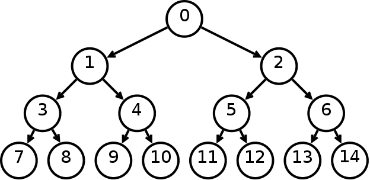
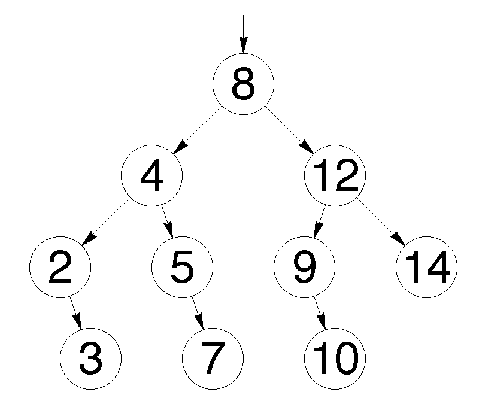
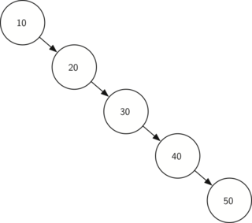

[Перелік усіх робіт](README.md)

# Робота з бінарним деревом пошуку

## Мета роботи 

Навчитися опрацьовувати бінарні дерева, вносити вносити та видаляти значення, проводити пошук у дереві. 

## Обладнання

Персональний комп’ютер, IDE Microsoft Visual Studio або інша середа розробки для мови C++

## Теоретичні відомості

Бінарне дерево - це ієрархічна структура даних, в якій кожен вузол може мати не більше двох дочірніх вузлів, які зазвичай називаються лівим та правим. Бінарні дерева використовуються для різних задач і можуть приймати різні форми залежно від конкретного використання.

Основні елементи бінарного дерева включають:

1. Корінь (Root): Початковий вузол дерева, до якого немає батьківського вузла.
2. Вузол (Node): Кожен об'єкт у дереві, який може мати по одному або два дочірніх вузли.
3. Лист (Leaf): Вузли, у яких немає дочірніх вузлів, тобто це кінцеві елементи дерева.
4. Лівий та правий нащадок (Left and Right Child): Дочірні вузли, що знаходяться ліворуч і праворуч від батьківського вузла, відповідно.
5. Піддерево (Subtree): Частина дерева, яка сама є деревом, але включається в інше дерево як вузол.

Бінарні дерева можуть бути використані для різноманітних завдань, таких як пошук, сортування, вирази індексів, побудова виразів та інше. Одні з видів бінарних дерев включають бінарні дерева пошуку (BST), бінарні дерева виразів, бінарні кучі та інші.

### Бінарне дерево пошуку

Бінарне дерево пошуку (Binary Search Tree, BST) - це тип бінарного дерева, яке використовується для структуризації даних для швидкого пошуку, вставки і видалення елементів. Основна ідея полягає в тому, що кожен вузол дерева має не більше двох дочірніх вузлів: лівого і правого.

Основні властивості бінарного дерева пошуку:

1. Всі значення в лівому піддереві менше або рівні значенню в поточному вузлі.
2. Всі значення в правому піддереві більше або рівні значенню в поточному вузлі.
3. Кожне піддерево також є бінарним деревом пошуку.

Ці властивості забезпечують швидкий пошук, вставку та видалення елементів, оскільки вони дозволяють використовувати принцип поділу простору пошуку попереду та назад. У середньому, часова складність операцій у бінарному дереві пошуку становить $O(log n)$, де n - кількість вузлів у дереві.

Цей вид дерева часто використовується в комп'ютерних науках інформатики для реалізації операцій пошуку, вставки і видалення великої кількості даних з ефективністю $O(log n)$.

### Сбалансоване бінарне дерево пошуку (Balanced Binary Search Tree, BST):

Сбалансоване бінарне дерево пошуку - це тип бінарного дерева, в якому глибина лівого і правого піддерева для будь-якого вузла не відрізняється більше, ніж на один рівень. Сбалансовані дерева, такі як AVL-дерева та червоно-чорні дерева, забезпечують оптимальний час виконання операцій пошуку, вставки та видалення, оскільки гарантують, що дерево залишається досить рівномірно розподіленим.

Перавга сбалансованих дерев в тому, що вони дозволяють уникнути гірших випадків, коли дерево може стати виродженим (виглядати як впорядкований список), що призводить до збільшення часової складності операцій.

### Несбалансоване бінарне дерево пошуку:

Несбалансоване бінарне дерево пошуку - це дерево, в якому різниця в глибині між лівим і правим піддеревом для деяких вузлів може бути великою. У найгіршому випадку несбалансовані дерева можуть перетворитися в лінійні списки, що призводить до втрати переваг бінарних дерев пошуку.

Операції вставки, видалення та пошуку в несбалансованих деревах можуть мати гіршу часову складність у порівнянні з сбалансованими деревами. Такі дерева можуть виникати при неправильному порядку вставки даних або в результаті динамічної зміни структури дерева без відновлення балансу.

### Обхід дерева

Порядок обходу вузлів дерева надано у [Лекції 12](../%D0%9B%D0%B5%D0%BA%D1%86%D1%96%D1%96/lec-12.md)

### Пошук у бінарному дереві пошуку

Алгоритм пошуку в бінарному дереві називається бінарним пошуком. Основна ідея полягає в тому, щоб порівнювати ключ пошуку із ключами вузлів дерева та визначати напрямок пошуку в залежності від порівнянь.

Основний алгоритм бінарного пошуку у бінарному дереві пошуку (BST) виглядає наступним чином:

1. Почніть з кореня дерева.
2. Порівняйте ключ пошуку з ключем поточного вузла.
   1. Якщо ключ пошуку менший, перейдіть до лівого піддерева.
   2. Якщо ключ пошуку більший, перейдіть до правого піддерева.
   3. Якщо ключі рівні, вузол знайдено, і пошук завершено.
3. Повторюйте цей процес відповідно до результатів порівнянь.

Якщо дерево добре збалансоване (наприклад, AVL-дерево або червоно-чорне дерево), часова складність операції пошуку в середньому складає $O(log n)$, де n - кількість вузлів у дереві.

Важливо враховувати, що бінарне дерево пошуку допускає ефективний пошук, вставку і видалення елементів лише в тому випадку, якщо дерево залишається збалансованим. Якщо дерево не збалансоване, операції можуть займати час до $O(n)$, де n - кількість вузлів.

## Хід роботи

1. Завантажити Visual Studio. Знайдіть на робочому столі ярлик з Visual Studio або Пуск → Всі програми→ Microsoft → Microsoft Visual Studio.
2. Створити новий проект «Visual C++ (консольное приложение Win32)». Файл → Cтворити → Проект, тип проекту «Консольное приложение Win32».
3. Перевірити роботу програм, які вказані в прикладах до лабораторної роботи.
4. Оцініть складність реалізації бінарного дерева пошуку на мовах С та С++.
5. Додайте до програми на С++ наступні функції:
   1. Створіть клас Tree з вказівником на корінь дерева
   2. До класу Tree додайте метод друку дерева в консоль
   3. До класу Tree додайте методи додавання та видалення вузлів дерева
   4. Функцію пошуку зробіть членом класу Tree
   5. Змініть функцію пошуку таким чином, щоб вона підраховувала кількість порівнянь під час своєї роботи і записувала це значення у змінну класу Tree
   6. Модифікуйте основну програму таким чином, щоб дерево заповнювалось випадковими значеннями, а шукане значення вводилось з клавіатури
6.  Додайте програмний код завдання для самомтійного виконання
7.  Дайте відповіді на контрольні запитання
8.  Збережіть звіт у форматі PDF та надішліть викладачу

## Контрольні запитання

1. Що таке бінарне дерево? Як воно відрізняється від інших типів дерев?
2. Які основні властивості бінарного дерева пошуку (BST)?
3. Як виконати операції вставки, видалення та пошуку в бінарному дереві пошуку?
4. Як визначити, чи є дане бінарне дерево збалансованим? Які переваги та недоліки збалансованих та несбалансованих дерев?
5. Що таке обхід бінарного дерева та які види обходу існують (pre-order, in-order, post-order)? Які приклади застосування для кожного виду обходу?
6. Як визначити найменший та найбільший елемент в бінарному дереві пошуку?
7. Як використовувати бінарне дерево для сортування послідовності чисел? Яка часова складність алгоритму сортування через бінарне дерево?
8. Як вибрати ефективний алгоритм бінарного дерева для конкретного завдання, враховуючи його особливості та вимоги?

## Приклади

1. [Просте бінарне дерево пошуку C++](src/lab-07/lab-07-001.cpp)
2. [Просте бінарне дерево пошуку C](src/lab-07/lab-07-002.c)

## Довідники та додаткові матеріали

