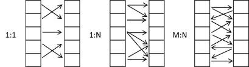
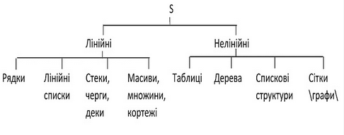

[Перелік лекцій](README.md)

# Вступ. Інформація та дані

## Інформація та дані

Під терміном "**дані**" розуміється інформація - сукупність фактів, явищ і подій, що представляють інтерес і підлягають реєстрації та обробці - подана у вигляді, який дозволяє автоматизувати процес збору, зберігання і обробки її на комп'ютері.

## Типи даних

Елементи даних звичайно розділяють на дві основні групи: скаляри й структури. До скалярів відносяться бінарні прапори, числа; до структур - масиви, таблиці, списки, стеки, рядки, множини й записи. Структури формуються зі скалярних даних, згрупованих відповідно до певних правил. Зовнішні до програмної системи дані також формуються зі структурованих елементів.

У той час як деякі мови програмування забезпечені засобами для формування різних даних, інші дозволяють тільки явно задати певну структуру. Способи опису або зображення складних структур даних, прийняті в людській практиці, часто відрізняються від способів їх опису для використання в комп'ютері. Програмісти настільки звикли до роботи з масивами, що іноді забувають, що структура масиву звичайно не відображає структуру даних, що зберігаються в ньому. При використанні масиву мається на увазі, що, по-перше, відоме число його елементів, по-друге, усі елементи належать тому самому типу й мають той самий розмір і, нарешті, по-третє, доступ до елементів масиву організує відповідно до їхніх положень у масиві. Реальні множини даних рідко бувають однотипними. Порядок використання даних може виявитися несуттєвим або може визначатися значеннями даних. Таким чином, можна зробити висновок про те, що мови програмування накладають штучні обмеження на дані.

## Рівні організації даних

Програміст, проектувальник і користувач мають свої власні погляди на організацію даних. Відповідно до цього можуть бути виділено три рівні організації даних:

*   Логічна організація даних: проектний рівень.
*   Представлення даних: рівень мови реалізації.
*   Фізична організація даних: машинний рівень.

Логічна організація даних відображає погляд користувача на дані. У її основі лежать вимоги користувача й внутрішньо властиві даним зв'язки. Це найбільш важливий рівень абстракції, використовуваний представленні даних, оскільки саме вимоги користувачів визначають вигляд проектованої системи. Якщо на етапі проектування системи вдало обрана логічна організація даних, зміни системних вимог, що не приводять до модифікації логічної структури даних, не спричинять реорганізації на більш низьких рівнях представлення даних. Тільки на логічному рівні можуть застосовуватися формальні методи опису динамічно-змінюваних структур.

Логічна організація структур даних - це моделі структур, які не залежать від способу їх зберігання у комп'ютерній пам'яті. Логічну модель даних називають абстрактною моделлю.

Опис даних мовою програмування належить до рівня представлення даних. Відношення між даними задаються у вигляді, характерному для конкретної мови. На цьому рівні оперують масивами й вказівниками.

Інформація про представлення даних може бути розподілена по окремих програмних модулях, причому можна використовувати як зовнішню, так і внутрішню форми представлення даних. Під зовнішнім представленням розуміється погляд на дані з боку інших програм, тобто представлення на рівні потоків даних. При зовнішньому представленні головним є визначення можливих шляхів доступу.

Внутрішнє представлення - це представлення у вигляді внутрішніх областей зберігання даних, тобто структура даних може бути в зовнішньому представленні стеком, а у внутрішньому - масивом або зв'язаним списком. Припустимо, що дані про покупця включають номер рахунку, ім'я, адресу, дати попередніх витрат, платежі й рахунку. Зовнішньою формою їх представлення є окремі агрегати даних про особу покупця й про його платежі. Внутрішнє представлення може складатися з таблиць, полів ознак і вказівників.

Фізична організація даних вказує на те, у якому вигляді дані зображуються в пам'яті комп'ютера. Фізична організація даних суттєво залежить від типу пам'яті, на якій вони записуються. Фізичну модель даних називають конкретною моделлю.

Рівень фізичної організації пов'язаний із системним програмним забезпеченням. На цьому рівні доводиться оперувати із межами слів, розмірами полів, двійковими кодами й фізичними записами. Більшість засобів системного програмного забезпечення дають можливість програмісту здійснити вибір з досить вузького кола способів представлення даних, які мають більш-менш ясну фізичну організацію. Агрегати даних, що зберігаються у швидкодіючій пам'яті, можуть бути представлені масивами або стеками. До записів файлу можна звертатися в послідовному або довільному порядку, використовуючи ключі різних типів.

### Класифікація структур даних

Структури даних - це сукупності різних структурованих типів даних. Останні, в свою чергу, мають власну структуру, яка відображає різноманітні відношення між їх складовими компонентами. 

Особливе місце серед структурованих даних займає тип вказівника або посилання, призначений для забезпечення можливості посилання на інші дані. Компонент такого типу уже має свою структуру.

Відношення, які мають місце в наведених структурованих типах даних, можуть існувати як серед елементів даних, так і серед їх сукупностей.

За аналогією з типами даних сукупність, що складається тільки з елементів даних, називається **простою**, а сукупність, що містить інші сукупності, - **складовою**. Сукупність даних може відповідати об'єкту в конкретних застосуваннях, а її елементи - властивостям цього об'єкту. Глибина вкладень сукупностей у складові може бути як завгодно великою.

Складові сукупності дозволяють будувати **ієрархічні відношення** між її членами, при цьому виділяються батьківська і залежна сукупності. Якщо відношення між сукупностями не ієрархічне, кожна залежна сукупність може бути зв'язаною з однією або декількома батьківськими сукупностями. Якщо ж відношення ієрархічне, кожна залежна сукупність може бути зв'язана тільки з однією батьківською сукупністю.

Зв'язки між компонентами структур можуть бути задані явно і неявно. Зокрема, структуровані дані типу посилання дозволяють будувати зв'язки між компонентами структур у явному вигляді. Якщо ж структура побудована на основі відношень між іншими структурованими типами даних, такі зв'язки між її компонентами задані неявно.

Система обробки даних може передбачати більше як один тип відношення між сукупностями, тобто допускаються відношення, що мають різні правила композиції, або по-різному застосовуються для складання інших структур.

У загальному випадку всі **типи зв'язків** між компонентами структур можна розділити на три: 1) зв'язок типу _1:1_; 2) зв'язок типу _1:N_; 3) зв'язок типу _М:N_(рис. 1.1).

Типи зв'язків у структурах даних

Виходячи з типів даних і зв'язків між ними, розділимо всі структури даних на три класи: найпростіші, лінійні і нелінійні. При цьому розглянемо всі можливі структури, які бувають на абстрактному та конкретному рівнях.

До **найпростіших** або примітивних структур відносять усі типи даних, над якими безпосередньо виконуються машинні операції, тобто арифметичні і рядкові елементи даних. Із рядкових елементів найпростішими є символьні і бітові. Останні є не в усіх системах обробки даних. Наприклад, у мові Фортран бітового рядка немає, а є тільки символьний, а в мові Сі - є і бітовий, і символьний.

Лінійні і нелінійні структури - це сукупності структурованих типів даних. **Лінійною структурою даних** назвемо таку сукупність структурованих типів даних, яка відображає відношення сусідства між компонентами. Інші структури назвемо **нелінійними структурами даних.**

Прості сукупності даних, а також ті прості структури, в яких реалізовано зв'язок _1:1_, віднесемо до лінійних структур даних. Двозв'язані лінійні списки, в яких реалізовано зв'язок _1:2_, як частковий випадок структур із зв'язком _і:N_ , також віднесемо до лінійних структур даних. Інші складні структури, в яких реалізовано зв'язок _1:N_ та _M:N_ між складовими сукупностями, віднесемо до нелінійних структур даних.

Таким чином, класифікацію структур даних можна зобразити наступною діаграмою, де _**S**_ означає структури даних (рис.1.2).

Класифікація структур даних

### Основні операції над структурами даних

В усіх типах структур даних найзагальнішими є наступні чотири операції.

1. Операція "**створити**". Присутня в усіх системах обробки даних, але по різному реалізована. Наприклад, у мовах Сі, Фортран, Паскаль та інших змінні можуть бути створені за допомогою операторів описання. Пам'ять для змінних у цих мовах виділяється під час виконання або компіляції програми, в залежності від того, як здійснюється розподіл пам'яті – динамічно або статично. Є й інші способи створення структур даних. Але важливо те, що незалежно від мови програмування всі структури даних, що є в програмі, не можуть виникнути "із нічого", а явно чи неявно оголошуються операторами створення структур.

2. Операція "**ліквідувати**". Вона не є необхідною, але допомагає ефективно використовувати пам'ять. Деякі мови, наприклад такі, як Фортран, не дають програмісту можливості ліквідувати створені структури даних. У мові Сі структури даних, що є в середині блоку програми, ліквідовуються в процесі виконання програми при виході з цього блоку.

3. Операція "**вибрати**". Дає програмісту можливість здійснити доступ до даних в середині самої структури. Форма цієї операції у великій мірі залежить від типу структури даних, до якої відбувається звертання, і є однією з найважливіших властивостей структур.

4. Операція "**оновити**" дозволяє змінювати дані в структурі. Операція присвоєння є наочним прикладом операції поновлення. Для неї існують і інші складніші форми, наприклад, передача параметрів при вході в блок або підпрограму.

Перелічені операції є загальними для всіх структур даних, але форма їх реалізації суттєво залежить від типу самих структур.

## Відображення даних у комп'ютері

При поданні даних у пам'яті комп'ютера одному елементу даних виділяється певна одиниця пам'яті, яку переважно називають **полем**. Сукупність полів, в яких записана послідовність елементів даних, що розглядаються як одне ціле (наприклад, один рядок накладної), називають **записом**. Сукупність записів утворює **файл**. Під файлом здебільшого розуміють сукупність записів, організованих на зовнішній пам'яті комп'ютера.

Сама сукупність даних, що систематизована певним чином, має ім'я, запам'ятовується в пам'яті комп'ютера більш-менш постійно, використовується багатьма користувачами і не залежить від програм користувачів, називається **базою даних** (БД).

Для модифікації та використання цих даних багатьма користувачами необхідне програмне забезпечення - **система управління базами даних** (СУБД). Головна її роль полягає у можливості оперувати даними незалежно від способу їх зберігання.

**Банком даних** називають систему програмних, мовних, організаційних і технічних засобів, призначених для нагромадження і колективного використання даних.

Отже, між інформаційною моделлю реального світу і даними в комп'ютері існує взаємно однозначна відповідність: одній предметній області відповідає один файл; число об'єктів у предметній області дорівнює кількості записів у файлі; число атрибутів, що описує об'єкт, дорівнює кількості полів у кожному записі. БД відображає стан об'єктів і їх відношень в даний момент часу у предметній області, що розглядається.

## Документування даних

У документацію, що відноситься до організації даних, входять схеми й діаграми, що характеризують відносини між елементами потоків даних і програмами, між елементами потоків даних і областями зберігання даних і різні рівні структурування даних.

Функціональні схеми використовуються для зображення потоків зовнішніх стосовно програм даних, а ієрархічні схеми модулів - для зображення внутрішніх потоків даних. Відомості про дані, які не локалізовані в якомусь одному модулі, а беруть участь в обміні інформацією між модулями або програмами, представляються у формі таблиць потоків даних, словників даних і схем організації даних. Схеми організації даних можуть мати форму графічних схем, або графів відносин між даними. Опис усіх рівнів об'єднання даних в агрегати також повинне знайти відображення в документації. Слід згадати в документації про методи зберігання даних. Якщо в системі є файли, їх опис повинний включати інформацію про файлові мітки, а в іншому вони описуються так само, як поділювані області пам'яті й параметри.

Інформація про логічну й фізичну організацію обов'язково повинна бути включена в документацію. Крім словника даних у документацію повинні входити:

*   схема й форма організації зовнішніх даних;
*   визначення тих компонентів апаратного й програмного забезпечень системи, які є джерелами даних;
*   визначення тих частин системи, які звертаються до даних;
*   визначення тих частин системи, які змінюють дані;
*   опис усіх рівнів організації складних структур даних;
*   опис пам'яті, необхідної для розміщення даних, включаючи розмір файлу, блокування, мітки й т.п..

У загальну системну документацію обов'язково повинна бути включена документація, у якій міститься інформація, по-перше, про потоки даних, що циркулюють між функціональними блоками й областями зберігання даних, по-друге, про дані, якими обмінюються програми й області зберігання (цю інформацію також зручно представляти у вигляді словника даних), і, по-третє, про використовувані ресурси. Програмна документація також буде містити інформацію, що відноситься до документації даних, а саме опис потоків даних між програмними модулями. Документація модулів буде, у свою чергу, включати аналогічну інформацію, пов'язану з елементами даних, визначеними усередині модулів.

## Об'єкти та атрибути

При розв'язуванні конкретних проблем маємо справу не з усім реальним світом, а тільки з деякими його об'єктами. Тобто **об'єктами** називаємо елементи реального світу, інформацію про які ми запам'ятовуємо; сукупність таких об'єктів утворює **предметну область**. Прикладами об'єктів можуть бути люди, що перелічені в будь-якій платіжній відомості; деталі, які виготовляє завод; банківські рахунки та інше.

Очевидно, що об'єкти відрізняються один від одного. Їх необхідно описати характеристиками, які є найважливішими для даної задачі. Такі характеристики називають **атрибутами**. Атрибути має кожний об'єкт. Об'єкти відрізняються один від одного значеннями атрибутів. Значення елемента даних повинно бути пов'язане з конкретним атрибутом конкретного об'єкта.

## Теми для самостійного вивчення

1. Способи представлення даних в комп'ютерній техніці

## Контрольні питання

1. Які структури даних ви знаєте?
2. Що таке масив?
3. Що таке множина?
4. Які основні дії виконуються над елементами структури даних?
5. Які типи даних ви знаєте?