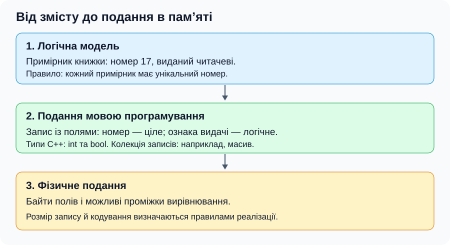
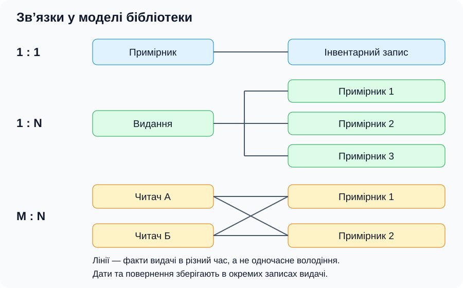
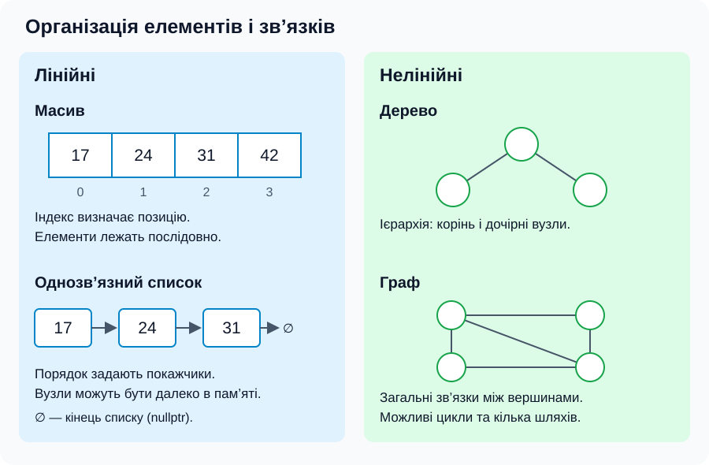

[Перелік лекцій](../README.md)

# Вступ. Інформація та дані

**Лекція №1 · 2 години**

## Мета та очікувані результати

Мета — пояснити перехід від предметної області до даних програми. Після лекції ви зможете розрізняти дані, інформацію, тип і структуру даних; пояснювати діапазони типів, рівні організації, зв’язки та основні операції.

## Інформація та дані. Об’єкти й атрибути

**Дані** — зафіксоване подання фактів, спостережень або повідомлень, придатне для зберігання, передавання й обробки. **Інформація** — зміст, який отримувач дістає з даних у певному контексті. Число `23` саме по собі не пояснює, чи йдеться про температуру, вік або кількість елементів. Потрібні контекст і одиниця вимірювання.

**Предметна область** — частина світу, яку описує задача. **Об’єкт** — сутність, про яку зберігаємо дані; **атрибут** — її властивість. Для обліку книжок об’єкт — примірник, атрибути — номер, назва та ознака видачі. Номер унікальний, назва може повторюватися.

## Типи та структури даних

**Тип даних** визначає множину допустимих значень і операції над ними. **Структура даних** задає організацію елементів та зв’язків. Масив містить однотипні елементи, запис `struct` — поля, які можуть мати різні типи.

У таблиці наведено **поширені подання**, а не однакові для всіх систем гарантії C++: байт із 8 бітів, цілі зі знаком у доповняльному коді, `float` у форматі IEEE 754 binary32 і `double` у binary64.

| Тип C++ | Призначення | Діапазон у зазначеному поданні |
| --- | --- | --- |
| `bool` | Логічне значення | `false`, `true` |
| `signed char` (8 бітів) | Мале ціле зі знаком | −128 … 127 |
| `unsigned char` (8 бітів) | Беззнакове ціле, байт даних | 0 … 255 |
| `char` (8 бітів) | Кодова одиниця тексту | −128 … 127 або 0 … 255; залежить від реалізації |
| `short` (16 бітів) | Ціле зі знаком | −32 768 … 32 767 |
| `int` (32 біти) | Ціле зі знаком | −2 147 483 648 … 2 147 483 647 |
| `unsigned int` (32 біти) | Невід’ємне ціле | 0 … 4 294 967 295 |
| `long long` (64 біти) | Велике ціле зі знаком | −2⁶³ … 2⁶³ − 1 |
| `float` (binary32) | Число з рухомою крапкою | Скінченні значення приблизно від −3,40 × 10³⁸ до +3,40 × 10³⁸ |
| `double` (binary64) | Число з рухомою крапкою | Скінченні значення приблизно від −1,80 × 10³⁰⁸ до +1,80 × 10³⁰⁸ |

Розмір `int` не обов’язково становить 32 біти, а `long` часто має 32 або 64 біти. Межі конкретної реалізації описує `std::numeric_limits` із заголовка `<limits>`. Для беззнакового цілого з n бітами значення діапазон дорівнює 0 … 2ⁿ − 1; для доповняльного подання зі знаком — −2ⁿ⁻¹ … 2ⁿ⁻¹ − 1.

**Діапазон не дорівнює точності.** Числа з рухомою крапкою утворюють дискретну множину: не кожне число між межами можна подати точно. Типова точність `float` — близько 7, `double` — 15–16 значущих десяткових цифр; десятковий дріб 0,1 у цих двійкових форматах наближений. Переповнення цілого зі знаком у C++ має невизначену поведінку; беззнакова арифметика виконується за модулем 2ⁿ.

Покажчик є скалярним типом і зберігає адресу. Для масивів і записів допустимі значення визначаються типами компонентів та правилами задачі.

**Абстрактний тип даних (АТД)** описує значення й операції без прив’язки до зберігання. Стек працює за правилом «останнім додано — першим вилучено», а реалізувати його можна масивом або зв’язаними вузлами.

## Рівні організації даних

1. **Логічний рівень:** сутності, властивості та зв’язки. Примірник має унікальний номер і може бути виданий читачеві.
2. **Рівень подання мовою програмування:** типи й структури реалізації — записи, масиви, покажчики.
3. **Фізичний рівень:** байти в пам’яті або сховищі, розміри, вирівнювання й кодування.

*Рисунок 1 — одна сутність на різних рівнях опису.*

## Зв’язки та класифікація структур

Зв’язки **1:1**, **1:N** і **M:N** описують кількість пов’язаних сутностей за правилами предметної області. Примірник має один інвентарний запис; видання — багато примірників; читачі в різний час позичають різні примірники. Видачі з датами зберігають окремими записами.

*Рисунок 2 — типи зв’язків; можливість відсутності зв’язку задають окремо.*

Кількість зв’язків не визначає лінійність: двозв’язний список лінійний, хоча вузол зв’язаний із попереднім і наступним.

| Ознака | Різновиди та приклади |
| --- | --- |
| Логічна організація | Лінійні: масив, список; нелінійні: дерево, граф |
| Однорідність | Однотипні елементи масиву; різнотипні поля запису |
| Зміна кількості елементів | Фіксована кількість у звичайному масиві; змінна у списку |
| Розміщення | Неперервне в масиві; вузли зі зв’язками у списку |

*Рисунок 3 — логічний порядок і розміщення в пам’яті є різними ознаками.*

У масиві позиції задаються індексами, у списку — зв’язками між вузлами. Логічно сусідні вузли можуть бути далеко в пам’яті. Динамічно виділений масив має незмінний розмір протягом свого існування: для іншого розміру потрібен інший масив.

## Основні операції та життєвий цикл

Базові дії — **створити, знищити, вибрати, оновити** — доповнюються пошуком, обходом, вставленням і видаленням елементів. Знищення структури й видалення елемента — різні дії.

**Алгоритм** задає послідовність дій для розв’язання задачі. Структура даних впливає на витрати цих дій: O(1) означає сталу, O(n) — лінійну верхню оцінку зростання витрат.

Доступ за індексом масиву має час O(1), а до i-го вузла однозв’язного списку — O(n) у найгіршому випадку. Послідовний пошук серед n невпорядкованих елементів потребує до n порівнянь: O(n) часу й O(1) додаткової пам’яті за ітеративного обходу. Для порожньої структури пошук одразу повідомляє, що елемента немає; індекси масиву мають належати діапазону від 0 до n − 1.

**Час життя** — період, протягом якого об’єкт існує. У C++ окремому об’єкту, створеному через `new`, відповідає `delete`, масиву через `new[]` — `delete[]`. Покажчик із значенням `nullptr` не вказує на об’єкт. Звернення через нього або через покажчик на вже знищений об’єкт неприпустиме. Втрата адреси зайнятої динамічної пам’яті без її звільнення призводить до витоку.

## Подання в комп’ютері та документування

Біти самі по собі не задають змісту: потрібні тип і правила кодування. Unicode задає коди символів, а UTF-8 кодує їх послідовностями від одного до чотирьох байтів. Тому кількість байтів тексту не обов’язково дорівнює кількості видимих символів.

Поле запису відповідає атрибуту моделі. Файл може містити записи, текст, зображення тощо. Одна предметна область може використовувати багато файлів і таблиць. База даних організовує взаємопов’язані дані, а СУБД забезпечує операції з ними. Розміщення `struct` у пам’яті може містити проміжки вирівнювання, тому копіювання його байтів не є універсальним переносимим форматом файлу.

Документація визначає типи полів, обмеження, одиниці вимірювання, зв’язки, кодування й правила оновлення. Для динамічних структур зазначають, хто володіє пам’яттю та хто її звільняє. Для примірника зазначають унікальність номера та зміст ознаки видачі.

## Тема для самостійного вивчення

СРС №1 — «Способи представлення даних в комп’ютерній техніці». Складіть словник даних для обліку книжок: поле, зміст, тип, обмеження.

## Питання для самоперевірки

1. Чим дані відрізняються від інформації? Наведіть приклад ролі контексту.
2. Як пов’язані об’єкт, атрибут, тип і структура даних?
3. Чим відрізняються діапазон і точність типу? Чому розмір `int` треба уточнювати?
4. Чому стек можна реалізувати і масивом, і списком?
5. Чому двозв’язний список лінійний? Наведіть приклад зв’язку M:N.
6. Чим доступ за індексом відрізняється від пошуку за значенням?
7. Що станеться при розіменуванні `nullptr` або зверненні після `delete`?
8. Назвіть три рівні організації даних. Чому байти запису не є універсальним форматом файлу?

## Джерела

1. Cormen, T. H.; Leiserson, C. E.; Rivest, R. L.; Stein, C. *Introduction to Algorithms*. 4th ed. MIT Press, 2022. Базові структури та аналіз операцій. [Сторінка видавництва](https://mitpress.mit.edu/9780262046305/introduction-to-algorithms/).
2. Knuth, D. E. *The Art of Computer Programming. Vol. 1: Fundamental Algorithms*. 3rd ed. Addison-Wesley, 1997. Подання інформації та структури даних. [Сторінка автора](https://www-cs-faculty.stanford.edu/~knuth/taocp.html).
3. Weiss, M. A. *Data Structures and Algorithm Analysis in C++*. 4th ed. Приклади реалізації структур мовою C++. [Матеріали автора до книги](https://users.cs.fiu.edu/~weiss/dsaa_c++4/code/).
4. Unicode Consortium. *What is Unicode?* Призначення Unicode. [Офіційний огляд](https://www.unicode.org/standard/WhatIsUnicode.html); [Unicode Encoding Forms](https://www.unicode.org/faq/utf_bom.html).
5. ISO/IEC JTC1/SC22/WG21. *Working Draft, Standard for Programming Language C++*. Фундаментальні типи, динамічне створення та знищення об’єктів. [basic.fundamental](https://eel.is/c++draft/basic.fundamental), [expr.new](https://eel.is/c++draft/expr.new), [expr.delete](https://eel.is/c++draft/expr.delete).
