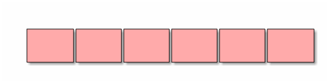
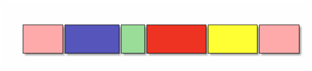

[Перелік лекцій](README.md)

# Статичні структури. Масиви, структури (записи) та множини

Статичні структури відносяться до класу структур, які представляють собою структуровану множину примітивних, базових, структур. Оскільки статичні структури відрізняються відсутністю змінності, пам'ять для них виділяється автоматично - як правило, на етапі компіляції, або при виконанні - в момент активізації того програмного блоку, в якому вони описані. Ряд мов програмування допускають розміщення статичних структур в пам'яті на етапі виконання за явною вимогою програміста, але й у цьому випадку обсяг виділеної пам'яті залишається незмінним до знищення структури. Виділення пам'яті на етапі компіляції є такою зручною властивістю статичних структур, що у ряді задач програмісти використовують їх навіть для представлення об'єктів, які мають властивість змінності. Наприклад, коли розмір масиву невідомий наперед, для нього резервується максимально можливий розмір.

Статичні структури в мовах програмування зв'язані із структурованими типами. Структуровані типи в мовах програмування є тими засобами інтеграції, які дозволяють будувати структури даних будь-якої складності. До таких типів відносяться масиви, структури та їхні похідні типи.

## Масиви

Логічно масив об'єднує елементи одного типу даних, тобто належить до однорідного типу даних. Більше формально його можна визначити як впорядковану сукупність елементів деякого типу, які адресуються за допомогою одного або декількох індексів.

Масиви можна класифікувати за кількістю розмірностей масиву масиви поділяються на одновимірні масиви (вектори), двохвимірні (матриці) і багатовимірні (трьох, чотирьох і більше).

Логічно масив - це така структура даних, яка характеризується:

1.  фіксованим набором елементів одного і того ж типу;
2.  кожний елемент має унікальний набір значень індексів;
3.  кількість індексів визначають мірність масиву;
4.  звернення до елемента масиву виконується за ім'ям масиву і значенням індексів для даного елемента.

Фізична структура масиву - це спосіб розміщення елементів масиву в пам'яті комп'ютера. Під елемент масиву виділяється кількість байт пам'яті, яка визначається базовим типом елемента цього масиву. Кількість елементів масиву і розмір базового типу визначають розмір пам'яті для зберігання масиву.



Схематичне зображення масиву

Сама найважливіша операція фізичного рівня над масивом - доступ до заданого елемента. Як тільки реалізовано доступ до елемента, над ним може бути виконана будь-яка операція, що має сенс для того типу даних, якому відповідає елемент. Перетворення логічної структури масиву у фізичну називається процесом лінеаризації, в ході якого багатовимірна логічна структура масиву перетвориться в одновимірну фізичну структуру.

Адресою масиву є адреса першого байту початкового компоненту масиву. Індексація масивів в C/C++ обов'язково починається з нуля.

До операцій логічного рівня над масивами необхідно віднести такі як сортування масиву, пошук елемента за ключем.

```
Елемент[0]
Елемент[1]
…
Елемент[n-1]
```

## Структури

На відміну від масивів чи множин, усі елементи яких однотипні, структура може містити елементи різних типів.


Схематичне зображення масиву



Схематичне зображення структури (запису)

Елементи структури називаються полями структури і можуть мати довільний тип, крім типу цієї ж структури, але можуть бути покажчиками на неї. Якщо при описі структури відсутній тип структури, обов'язково повинен бути вказаний список змінних, покажчиків або масивів визначеної структури.

Звернення до окремих полів структури замінюються на їхні адреси ще на етапі компіляції.

Самою найважливішою операцією для структури є операція доступу до вибраного поля структури - операція кваліфікації.

Над вибраним полем структури можливі будь-які операції, які допустимі для типів цього поля.

Більшість мов програмування підтримує деякі операції, які працюють із структурою, як з єдиним цілим, а не з окремими її полями. Це операція присвоєння значення одного запису іншому однотипному запису, при цьому відбувається по елементне копіювання.

## Об'єднання


Об'єднання представляють собою частковий випадок структури, усі поля якої розміщуються за однією ж і тою ж адресою. Формат опису такий же, як і в структури. Довжина об'єднання рівна найбільшій із довжин його полів. У кожен момент часу в змінній типу об'єднання зберігається тільки одне значення, і відповідальність за його правильне використання лягає на програміста.

Об'єднання застосовуються для економії пам'яті в тих випадках, коли відомо, що більше одного поля одночасно не потрібно, а також для різної інтерпретації одного і того ж бітового представлення.

Дуже часто деякі об'єкти програми відносяться до одного й того ж класу, відрізняючись лише деякими деталями. У цьому випадку застосовують комбінацію структурного типу і об'єднання. Об'єднання використовують як поля структури, при цьому в структурі включають поле, яке визначає, який саме елемент об'єднання використовується в кожний момент.

У загальному випадку змінна структура буде складатися з трьох частин: набір спільних компонентів, мітки активного компоненту і частини зі змінними компонентами.


## Теми для самостійного вивчення


1. Масиви на мові програмування С++
2. Структури на мові програмування С++
3. Масиви на мові програмування Python
4. Асоціативні масиви


## Контрольні питання

1.  Що представляє собою структура даних «масив»? Які основні властивості масивів?
2.  Чим характеризується "розріджений масив"? Які існують способи його зберігання?
3.  Які основні операції виконуються над масивами? Наведіть приклади.
4.  Що таке структура? Чим структура відрізняється від масиву?
5.  Що таке об'єднання? Для чого використовуються об'єднання у програмах?
6.  Як визначається адреса будь-якого елемента одновимірного та багатовимірного масиву?
7.  Які переваги та недоліки статичних структур даних порівняно з динамічними?
8.  Як організовано доступ до полів структури у мовах програмування C/C++?
9.  Що таке бітові поля? Для чого вони використовуються?
10. Які типи структур даних належать до статичних, а які — до динамічних?
11. Як здійснюється ініціалізація масивів і структур у C/C++?
12. Які обмеження мають масиви у мовах програмування?
13. Як можна реалізувати асоціативний масив у C++?
14. Які особливості роботи з багатовимірними масивами?
15. Які типові помилки виникають при роботі з масивами та структурами?