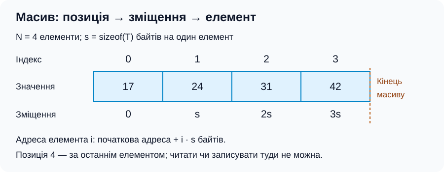
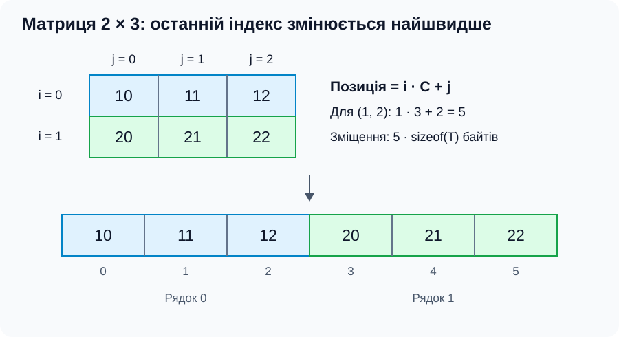
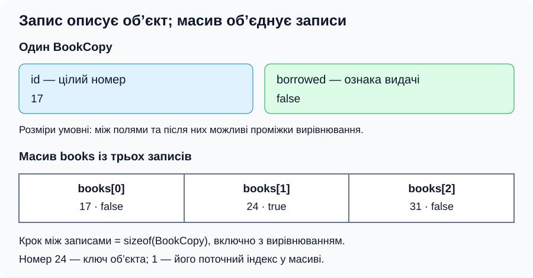

[Перелік лекцій](../README.md)

# Статичні структури. Масиви та структури (записи)

**Лекція №2 · 2 години**

## Мета та очікувані результати

Мета — пояснити будову масивів і записів у C++. Ви навчитеся розрізняти розмір, місткість і час життя; обчислювати зміщення елемента й оцінювати операції.

## Що означає статична структура

У цій темі **статична структура** має фіксовану будову протягом існування: кількість елементів звичайного масиву або набір полів запису не змінюються. Значення можна змінювати, якщо немає обмеження `const`. Це не синонім `static` у C++.

Відомий компілятору розмір не означає виділення пам’яті під час компіляції.

| Тривалість зберігання | Приклад | Коли звільняється пам’ять |
| --- | --- | --- |
| Автоматична | Звичайний локальний масив | При виході з відповідного блоку |
| Статична | Глобальний масив або локальний із `static` | Наприкінці роботи програми |
| Динамічна | Масив, створений через `new[]` | Після `delete[]` |

Розмір масиву через `new[]` визначають під час виконання, але далі він незмінний. Збільшення потребує нового масиву й перенесення елементів; `std::vector` автоматизує таке керування.

## Одновимірний масив: індекс і адреса

**Масив** — послідовність однотипних елементів із доступом за індексом. Повтори дозволені; елементи не обов’язково відсортовані.

Для N елементів індекси належать 0 … N − 1. Елементи розміщені неперервно: за розміру s = `sizeof(T)` зміщення елемента i дорівнює i · s, обсяг масиву — N · s байтів. Розмір `int` не завжди дорівнює чотирьом байтам.



*Рисунок 1 — крок між елементами дорівнює розміру їхнього типу.*

Масив **не є покажчиком**. У багатьох виразах його ім’я перетворюється на покажчик на перший елемент. `a[i]` еквівалентне `*(a + i)` для допустимого індексу; арифметика покажчиків уже враховує розмір елемента. `&a[0]` указує на елемент, а `&a` — на весь масив: початок області той самий, але типи й крок арифметики різні.

Покажчик за останнім елементом позначає кінець; розіменовувати його не можна. Доступ за межами масиву має невизначену поведінку; автоматичної перевірки немає.

У звичайному оголошенні розмір — додатна константа часу компіляції; VLA з уведеним розміром не є стандартним C++. Ініціалізація `{}` зануляє числові елементи. Неініціалізовані локальні числові елементи не можна читати до запису значень.

## Місткість, операції та складність

**Місткість C** — кількість комірок; **логічний розмір n** — кількість елементів, використаних від початку масиву. Інваріант: 0 ≤ n ≤ C. Порожня послідовність має n = 0.

| Операція над використаною частиною | Час | Додаткова пам’ять |
| --- | --- | --- |
| Читання або зміна за індексом | O(1) | O(1) |
| Повний обхід, пошук без сортування | O(n) | O(1) |
| Двійковий пошук у відсортованому масиві | O(log n) | O(1) за ітеративної реалізації |
| Додавання в кінець за n < C | O(1) | O(1) |
| Вставлення або видалення зі збереженням порядку | O(n) | O(1) |

Оцінки — для найгіршого випадку зі сталою вартістю обробки елемента. Вставлення потребує вільної комірки й зсуву хвоста праворуч; видалення — зсуву ліворуч. Для вставлення допустимо 0 ≤ i ≤ n, для читання та видалення — 0 ≤ i < n. Сортування вибором потребує O(n²) часу й O(1) додаткової пам’яті; інші алгоритми мають інші оцінки.

## Багатовимірні та розріджені масиви

Двовимірний масив C++ складається з рядків, які є масивами. Для R рядків і C стовпців перевіряють обидві межі: 0 ≤ i < R, 0 ≤ j < C. Рядки розміщуються послідовно; найшвидше змінюється останній індекс.



*Рисунок 2 — лінеаризація: елемент із координатами (1, 2) має позицію 5.*

**Лінеаризація** переводить набір індексів у лінійну позицію. Для прямокутного подання позиція дорівнює i · C + j, байтове зміщення — (i · C + j) · `sizeof(T)`. Для трьох вимірів із розмірами L, R, C позиція елемента (k, i, j) дорівнює (k · R + i) · C + j.

Формули не дозволяють виходити за межі рядка через покажчик на його елемент. До вбудованої матриці звертаються двома індексами. Масив окремо виділених рядків через `int**` — інше подання: рядки можуть бути різної довжини й лежати в різних ділянках пам’яті. Вбудована матриця не перетворюється на `int**`.

**Розріджена матриця** має переважно нульові значення. Подання трійками «рядок, стовпець, значення» зберігає лише ненульові елементи. Економія пам’яті залежить від розрідженості й витрат на індекси; спосіб доступу змінюється.

## Структура (запис) та масив записів

**Запис** об’єднує іменовані поля, типи яких можуть відрізнятися. У C++ його описують через `struct`. Доступ до поля: крапка для об’єкта, `->` для покажчика. Адреси полів залежать від адреси конкретного об’єкта під час виконання.



*Рисунок 3 — у записі доступ задає ім’я поля, у масиві — індекс.*

Між полями й наприкінці запису можуть бути проміжки **вирівнювання**, тому `sizeof` запису не обов’язково дорівнює сумі розмірів полів. У масиві записів крок дорівнює розміру цілого запису, включно з такими проміжками. Його байти не є універсальним форматом для обміну файлами.

Запис може містити інші записи, масиви й покажчики. Поле власного типу неможливе через нескінченну вкладеність, але покажчик на власний тип дозволений, як у вузлі списку.

Стандартне присвоєння простих записів копіює поля. Для покажчика копіюється адреса, а не об’єкт: власника пам’яті визначають окремо. Вбудований масив не можна присвоїти цілком, але масивне поле копіюється поелементно при присвоєнні записів.

## Приклад C++: пошук примірника за номером

Знайдемо примірник за унікальним додатним номером і змінимо ознаку видачі. Номер є ключем, а не індексом.

```cpp
#include <iostream>

struct BookCopy {
    int id;
    bool borrowed;
};

int findById(const BookCopy* books, int count, int id) {
    if (books == nullptr || count <= 0) return -1;
    for (int i = 0; i < count; ++i) {
        if (books[i].id == id) return i;
    }
    return -1;
}

int main() {
    BookCopy books[3] = {{17, false}, {24, true}, {31, false}};
    int id = 0;
    if (!(std::cin >> id) || id <= 0) {
        std::cerr << "Invalid ID\n";
        return 1;
    }
    int index = findById(books, 3, id);
    if (index == -1) {
        std::cout << "Not found\n";
        return 0;
    }
    BookCopy* found = &books[index];
    found->borrowed = true;
    std::cout << found->id << ' ' << std::boolalpha
              << found->borrowed << '\n';
    return 0;
}
```

Передумова: ненульовий покажчик позначає щонайменше `count` елементів. Покажчик не містить довжини; його `sizeof` не визначає розмір масиву. Інваріант: перед ітерацією в переглянутій частині ключ відсутній. Результат — індекс першого збігу або −1; час O(n), пам’ять O(1).

Для `17` результат — `17 true`, для `99` — `Not found`; нуль, від’ємне число, текст або кінець потоку замість числа відхиляються. Читається одне ціле, весь рядок не перевіряється. За порожньої послідовності доступу до елементів немає. Покажчик `found` позичає адресу локального запису: `delete` для нього не потрібний і неприпустимий.

## Теми для самостійного вивчення

СРС №2 — «Масиви на мові програмування С++»; №3 — «Структури на мові програмування С++»; №4 — «Масиви на мові програмування Python»; №5 — «Асоціативні масиви». Назви з програми; реалізації адаптовано до C++. Асоціативний масив задає доступ за ключем.

## Питання для самоперевірки

1. Чим фіксований розмір відрізняється від статичної тривалості зберігання?
2. Чому масив не є покажчиком? Як передати його довжину функції?
3. Які межі індексу для читання, вставлення та порожньої послідовності?
4. Як знайти зміщення елемента матриці? Чим матриця відрізняється від `int**`?
5. Коли розріджене подання економить пам’ять?
6. Чому запис може мати проміжки й містити покажчик на власний тип?
7. Що копіюється при присвоєнні покажчиків?
8. Поясніть інваріант пошуку й відмінність ключа від індексу.

## Джерела

1. Cormen, T. H.; Leiserson, C. E.; Rivest, R. L.; Stein, C. *Introduction to Algorithms*. 4th ed. MIT Press, 2022. Масиви, пошук та оцінки складності. [Сторінка видавництва](https://mitpress.mit.edu/9780262046305/introduction-to-algorithms/).
2. Knuth, D. E. *The Art of Computer Programming. Vol. 1: Fundamental Algorithms*. 3rd ed. Addison-Wesley, 1997. Подання лінійних структур. [Сторінка автора](https://www-cs-faculty.stanford.edu/~knuth/taocp.html).
3. Weiss, M. A. *Data Structures and Algorithm Analysis in C++*. 4th ed. Структури та операції мовою C++. [Матеріали автора](https://users.cs.fiu.edu/~weiss/dsaa_c++4/code/).
4. Oualline, S. *Practical C++ Programming*. 2nd ed. O’Reilly Media, 2003. Масиви, покажчики й записи. [Сторінка видавництва](https://www.oreilly.com/library/view/practical-c-programming/0596004192/).
5. ISO/IEC JTC1/SC22/WG21. *Working Draft, Standard for Programming Language C++*. [Масиви — dcl.array](https://eel.is/c++draft/dcl.array), [перетворення на покажчик — conv.array](https://eel.is/c++draft/conv.array), [поля класів — class.mem.general](https://eel.is/c++draft/class.mem.general).
