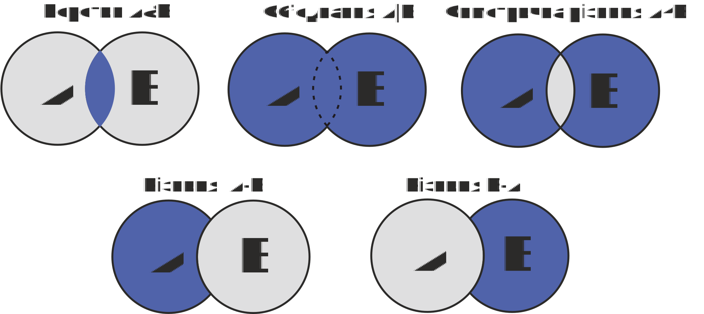
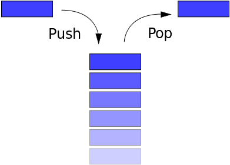
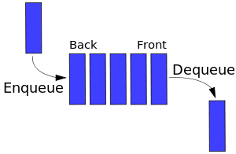
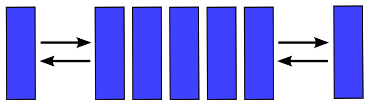

[Перелік лекцій](README.md)

# Абстрактні структури.

## Множини

Тип даних „множина” не реалізований як стандартний тип мови програмування С/С++, але дуже часто використовується в програмуванні і реалізовується засобами визначення типів користувача, тому дамо йому короткий опис.

Множина - така структура, яка є набором даних одного і того ж типу, що не повторюються (кожен елемент множини є унікальним). Порядок слідування елементів множини на має принципового значення.

До множин застосовується стандартний принцип виключення. Це означає, що конкретний елемент або є членом множини, або ні. Множина може бути пустою, таку множину називають нульовою.

Множина є підмножиною іншої множини, якщо в цій другій множині можна знайти усі елементи, які є в першій множині. Відповідно, множина вважається надмножиною іншої множини, якщо вона містить усі елементи цієї другої множини.

Кожен окремий елемент є членом множини, якщо він входить до складу елементів множини.

Над множинами визначені наступні специфічні операції:

1.  Об'єднання множин. Результатом є множина, що містить елементи початкових множин.
2.  Перетин множин. Результатом є множина, що містить спільні елементи початкових множин.
3.  Різниця множин. Результатом є множина, яка містить елементи першої множини, які не входять в другу множину.
4.  Симетрична різниця. Результатом є множина, яка містить елементи, які входять до складу однієї або другої множини (але не обох).
5.  Перевірка на входження елемента в множину. Результатом цієї операції є значення логічного типу, що вказує чи входить елемент в множину.

Діаграми Ейлера для операцій над множинами

## Таблиці

Елементами векторів і масивів можуть бути інтегровані структури. Одна з таких складних структур - таблиця. З фізичної точки зору таблиця є вектором, елементами якого є структури. Характерною логічною особливістю таблиць є те, що доступ до елементів таблиці проводиться не за номером (індексом), а за ключем - значення однієї з властивостей об'єкту, який описується структурою-елементом таблиці. Ключ - це властивість, що ідентифікує дану структуру в множині однотипних структур і є, як правило, унікальним в даній таблиці. Ключ може включатися до складу структури і бути одним з його полів, але може і не включатися в структуру, а обчислюватися за деякими її властивостями. Таблиця може мати один або декілька ключів.

Основною операцією при роботі з таблицями є операція доступу до структури за ключем. Вона реалізовується процедурою пошуку. Оскільки пошук може бути значне більш ефективним в таблицях, впорядкованих за значеннями ключів, досить часто над таблицями необхідно виконувати операції сортування.

Іноді розрізняють таблиці з фіксованою і із змінною довжиною структури. Очевидно, що таблиці, які об'єднують структури ідентичних типів, будуть мати фіксовані довжини структур. Необхідність в змінній довжині може виникнути в задачах, подібних до тих, які розглядалися для об'єднань. Як правило таблиці для таких задач і складаються із структур до складу яких входять об'єднання, тобто зводяться до фіксованої (максимальній) довжини структури. Значно рідше зустрічаються таблиці з дійсно змінною довжиною структури. Хоча в таких таблицях і економиться пам'ять, але можливості роботи з такими таблицями обмежені, оскільки за номером структури неможливо визначити її адресу. Таблиці із структурами змінної довжини обробляються тільки послідовно - в порядку зростання номерів структур. Доступ до елемента такої таблиці звичайно здійснюється в два кроки. На першому кроці вибирається постійна частина структури, в якій міститься, - в явному чи неявному вигляді - довжина структури. На другому кроці вибирається змінна частина структури у відповідності з її довжиною. Додавши до адреси поточної структури її довжину, одержують адресу наступної структури.

## Стеки

Стеком називається множина деякої змінної кількості даних, над якою виконуються наступні операції:

1.  Поповнення стеку новими даними;
2.  Перевірка, яка визначає чи стек пустий;
3.  Перегляд останніх доданих даних;
4.  Знищення останніх доданих даних.

На основі такого функціонального опису, можна сформувати логічний опис. Стек - це такий послідовний список із змінній довжиною, включення і виключення елементів з якого виконуються тільки з одного боку списку. Застосовуються і інші назви стеку - магазин, пам'ять що функціонує за принципом LIFO (Last-In-First-Out - „останнім прийшов - першим вийшов”).

Схематичне зображення стеку

Самий„верхній” елемент стеку, тобто останній добавлений і ще не знищений, відіграє особливу роль: саме його можна модифікувати й знищувати. Цей елемент називають вершиною стеку. Іншу частину стеку називають тілом стеку. Тіло стеку, само собою, є стеком: якщо виключити зі стеку його вершину, то тіло перетворюється в стек.

Основні операції над стеком - включення нового елемента (**push** \- заштовхувати) і виключення елемента зі стеку (**pop** \- вискакувати).

Корисними можуть бути також допоміжні операції:

1.  визначення поточної кількості елементів в стеку;
2.  очищення стеку;
3.  „неруйнуюче” читання елемента з вершини стека, яке може бути реалізоване, як комбінація основних операцій -виключити елемент зі стеку та включити його знову в стек.

При представленні стеку в статичній пам'яті для стеку виділяється пам'ять, як для вектора. В описі цього вектора окрім звичайних для вектора параметрів повинен знаходитися також покажчик стеку - адреса вершини стека. Обмеження даного представлення полягає в тому, що розмір стеку обмежений розмірами вектора.

Покажчик стеку може вказувати або на перший вільний елемент стеку, або на останній записаний в стек елемент. Однаково, який з цих двох варіантів вибрати, важливо надалі строго дотримуватися його при обробці стеку.

При занесенні елементу в стек елемент записується на місце, яке визначається покажчиком стеку, потім покажчик модифікується так, щоб він вказував на наступний вільний елемент (якщо покажчик вказує на останній записаний елемент,то спочатку модифікується покажчик, а потім проводиться запис елемента).Модифікація покажчика полягає в надбавці до нього або у відніманні від нього одиниці (стек росте у бік збільшення адреси).

Операція виключення елемента полягає в модифікації покажчика стеку (в напрямку,зворотному модифікації при включенні) і вибірці значення, на яке вказує покажчик стеку. Після вибірки комірка, в якій розміщувався вибраний елемент,вважається вільною.

Операція очищення стеку зводиться до запису в покажчик стеку початкового значення -адреси початку виділеної ділянки пам'яті.

Визначення розміру стека зводиться до обчислення різниці покажчиків: покажчика стеку й адреси початку ділянки.

При зв'язному представленні стеку кожен елемент стеку складається із значення і покажчика, який вказує на попередньо занесений у стек елемент. Зв'язне представлення викликає втрату пам'яті, що викликане наявністю покажчика в кожному елементі стеку, і представляє інтерес тільки у випадку, коли важко визначити максимальний розмір стеку.

Отже,для зв'язного представлення стеку потрібно, щоб кожен його елемент описувався структурою, яка поєднує дані і покажчик на наступний елемент.

Для виконання операцій над стеком потрібен один покажчик на вершину стеку.Створення пустого стеку полягатиме у присвоєнні покажчику на вершину нульового значення, що означатиме, що стек пустий.

Послідовність кроків для додавання елементу в стек складається з декількох кроків:

1.  Виділити пам'ять під новий елемент стеку;
2.  Занесення значення в інформаційне поле;
3.  Встановлення зв'язку між ним і„старою” вершиною стеку;
4.  Переміщення вершини стеку на новий елемент.

Вилученняелементу зі стеку також проводять за кілька кроків:

1.  Зчитування інформації з інформаційного поля вершини стеку;
2.  Встановлення на вершину стеку допоміжного покажчика;
3.  Переміщення покажчика вершини стеку на наступний елемент;
4.  Звільнення пам'яті, яку займає „стара” вершина стеку.

## Черга

Чергою називається множина змінної кількості даних, над якою можна виконувати наступні операції:

1.  Поповнення черги новими даними;
2.  Перевірка, яка визначає чи пуста черга;
3.  Перегляд перших добавлених даних;
4.  Знищення самих перших доданих даних.

На основі такого функціонального опису, можна сформувати логічний опис. ЧергоюFIFO (First - In - First - Out - „першим прийшов - першим вийшов”). Називається такий послідовний список із змінній довжиною, в якому включення елементів виконується тільки з одного боку списку (хвіст черги), а виключення - з другого боку (голова черги).

Схематичне зображення черги

Основні операції над чергою - ті ж, що і над стеком - включення, виключення, визначення розміру, очищення, „неруйнуюче” читання.

При представленні черги вектором в статичній пам'яті на додаток до звичайних для опису вектора параметрів в ньому повинні знаходитися два покажчики: на голову і на хвіст черги. При включенні елемента в чергу елемент записується за адресою,яка визначається покажчиком на хвіст, після чого цей покажчик збільшується на одиницю. При виключенні елемента з черги вибирається елемент, що адресується покажчиком на голову, після чого цей покажчик зменшується на одиницю.

Очевидно,що з часом покажчик на хвіст при черговому включенні елемента досягне верхньої межі тієї ділянки пам'яті, яка виділена для черги. Проте, якщо операції включення чергувати з операціями виключення елементів, то в початковій частині відведеної під чергу пам'яті є вільне місце. Для того, щоб місця, займані виключеними елементами, могли бути повторно використані, черга замикається в кільце: покажчики (на початок і на кінець), досягнувши кінця виділеної області пам'яті, перемикаються на її початок. Така організація черги в пам'яті називається кільцевою чергою. Можливі, звичайно, і інші варіанти організації:наприклад, всякий раз, коли покажчик кінця досягне верхньої межі пам'яті, зсувати всі не порожні елементи черги до початку ділянки пам'яті, але як цей, так і інші варіанти вимагають переміщення в пам'яті елементів черги і менш ефективні,ніж кільцева черга.

У початковому стані покажчики на голову і хвіст вказують на початок ділянки пам'яті. Рівність цих двох покажчиків є ознакою порожньої черги. Якщо в процесі роботи з кільцевою чергою кількість операцій включення перевищує кількість операцій виключення, то може виникнути ситуація, в якій покажчик кінця„наздожене” покажчик початку. Це ситуація заповненої черги, але якщо в цій ситуації покажчики порівняються, ця ситуація буде така ж як при порожній черзі.Для розрізнення цих двох ситуацій до кільцевої черги пред'являється вимога, щоб між покажчиком кінця і покажчиком початку залишався „проміжок” з вільних елементів. Коли цей „проміжок” скорочується до одного елемента, черга вважається заповненою і подальші спроби запису в неї блокуються. Очищення черги зводиться до запису одного і того ж (не обов'язково початкового) значення в обидва покажчики. Визначення розміру полягає в обчисленні різниці покажчиків з урахуванням кільцевої природи черги.

При зв'язному представленні черги кожен елемент черги складається із значення іпокажчика, який вказує на попередньо занесений у чергу елемент.

Зв'язне представлення викликає втрату пам'яті, що викликане наявністю покажчика в кожному елементі черги, і представляє інтерес тільки у випадку, коли важко визначити максимальний розмір черги. Для зв'язного представлення черги потрібно, щоб кожен його елемент описувався структурою, яка поєднує дані і покажчик на наступний елемент.

Для виконання операцій над чергою потрібно два покажчики: на голову і хвіст черги.Створення пустої черги полягатиме у присвоєнні покажчикам на голову і хвістчерги нульових значень, що означатиме, що черга пуста.

Послідовність кроків для додавання елемента в кінець черги складається з декількох кроків:

1.  Виділити пам'ять під новий елемент черги;
2.  Занесення значення в інформаційне поле;
3.  Занесення нульового значення в покажчик;
4.  Встановлення зв'язку між ним і останнім елементом черги і новим, враховуючи випадок пустої черги;
5.  Переміщення покажчика кінця черги на новий елемент.

Вилучення елементу з черги також проводять за кілька кроків:

1.  Зчитування інформації з інформаційного поля голови черги;
2.  Встановлення на голову черги допоміжного покажчика;
3.  Переміщення покажчика початку черги на наступний елемент;
4.  Звільнення пам'яті, яку займав перший елемент черги.

В реальних задачах іноді виникає необхідність у формуванні черг, відмінних від приведених структур. Порядок вибірки елементів з таких черг визначається пріоритетами елементів. Пріоритет в загальному випадку може бути представлений числовим значенням, яке обчислюється або на підставі значень яких-небудь полів елемента, або на підставі зовнішніх чинників. Так попередньо наведені структури стек і черги можна трактувати як пріоритетні черги, в яких пріоритет елемента залежить від часу його включення в структуру. При вибірці елемента всякий раз вибирається елемент з щонайбільшим пріоритетом.

Черги з пріоритетами можуть бути реалізовані на лінійних структурах - в суміжному або зв'язному представленні. Можливі черги з пріоритетним включенням- в яких послідовність елементів черги весь час підтримується впорядкованою,тобто кожний новий елемент включається на те місце в послідовності, яке визначається його пріоритетом, а при виключенні завжди вибирається елемент з голови. Можливі і черги з пріоритетним виключенням - новий елемент включається завжди в кінець черги, а при виключенні в черзі шукається (цей пошук може бути тільки лінійним) елемент з максимальним пріоритетом і після вибірки вилучається з послідовності. І в тому, і в іншому варіанті потрібний пошук, а якщо черга розміщується в статичній пам'яті - ще і переміщення елементів.

## Деки

Дек - особливий вид черги. Дек (deq - double ended queue, тобто черга з двома кінцями) - це такий послідовний список, в якому як включення, так і виключення елементів, може здійснюватися з будь-якого з двох кінців списку. Так само можна сформулювати поняття деку, як стек, в якому включення і виключення елементів може здійснюватися з обох кінців.

Схематичне зображення дека

Деки рідко зустрічаються у своєму первісному визначенні. Окремий випадок деку - дек з обмеженим входом і дек з обмеженим виходом. Логічна і фізична структури деку аналогічні логічній і фізичній структурі кільцевої черги. Проте, стосовно деку доцільно говорити не про голову і хвіст, а про лівий і правий кінець.

Над деком доступні наступні операції:

1.  включення елемента праворуч;
2.  включення елемента ліворуч;
3.  виключення елемента з права;
4.  виключення елемента з ліва;
5.  визначення розміру;
6.  очищення.

Фізична структура деку в статичній пам'яті ідентична структурі кільцевої черги.

## Теми для самостійного вивчення

1. Реалізація множин на мові С++
2. Реалізація стеків на мові С++
3. Реалізація черг на мові С++

## Контрольні питання

1.  Що таке хеш-функція?
2.  Яке призначення хеш-функцій?
3.  Які алгоритми хешування ви знаєте?
4.  В чому головна відмінність процесів хешування та шифрування?