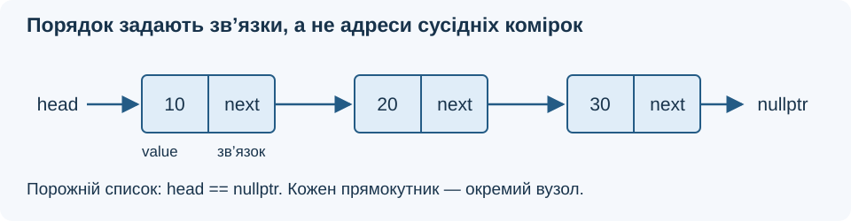
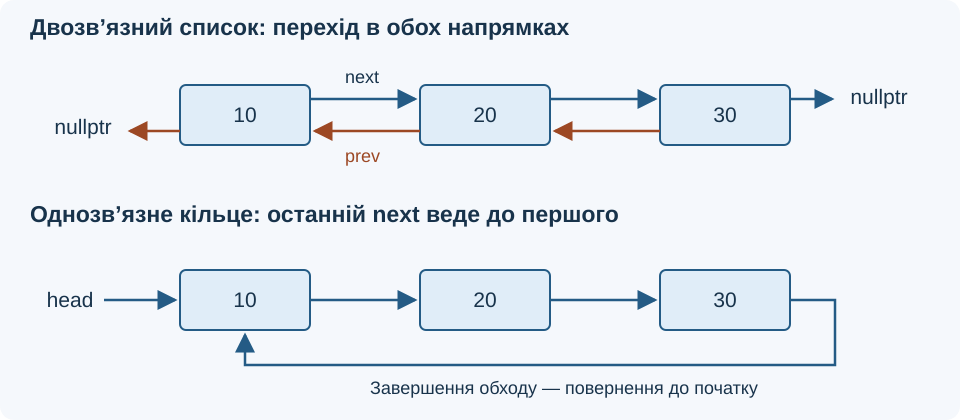
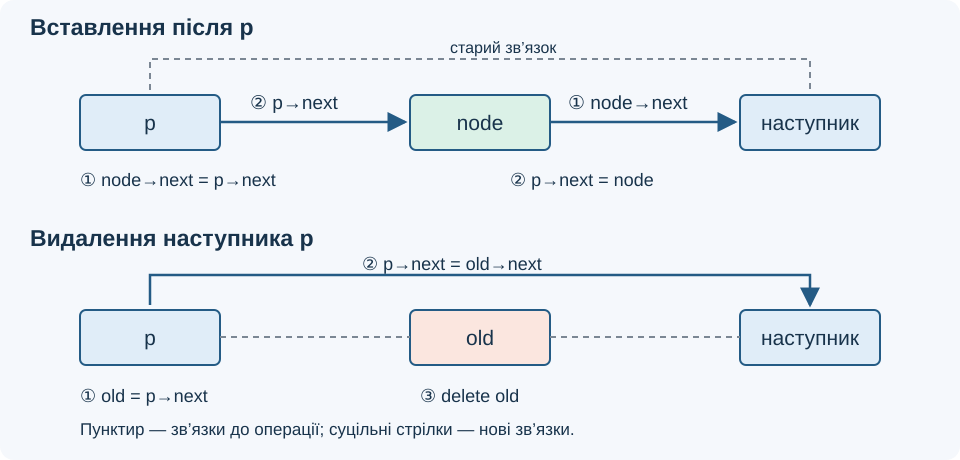

[Перелік лекцій](../README.md)

# Лекція 3. Лінійні динамічні структури даних

> TODO: уточнити за робочою програмою: у програмі 2023 року №3 — «Абстрактні структури», №4 — «Динамічні структури. Списки». Збережено заданий контекст `lec-03`.

## Мета та очікувані результати

Навчитися розрізняти абстрактний список і його зв’язне подання, пояснювати операції та їхню складність, безпечно звільняти пам’ять у C++.

## Логічний порядок і подання в пам’яті

**Лінійний список** — скінченна послідовність елементів L = (a₀, a₁, …, aₙ₋₁). Порядок визначається позиціями, а не обов’язково значеннями; повтори дозволені. За n = 0 список порожній. На відміну від множини, перестановка елементів може змінити список.

Абстрактний тип задає операції: читання, пошук, вставлення, видалення, перевірку порожності. Реалізація визначає розміщення елементів: у масиві або зв’язних вузлах.

**Динамічна структура** може змінювати кількість елементів під час виконання. Це не синонім зв’язного списку: динамічний масив також може зростати, виділяючи більший блок і переносячи елементи. Сам блок, отриманий через `new T[n]`, не змінює розмір автоматично.

У масиві елементи розміщені послідовно. Вузли списку можуть лежати в різних ділянках пам’яті; порядок задають покажчики. Вставлення змінює позиції наступних елементів, але не пересуває їхні вузли.



*Рисунок 1 — head зберігає адресу першого вузла; nullptr позначає кінець.*

## Вузли та інваріанти списку

В однозв’язному списку вузол містить значення і покажчик `next` на наступний вузол. `head` — окрема змінна-покажчик, а не обов’язковий службовий вузол. Для порожнього списку `head == nullptr`. За потреби зберігають `tail` — адресу останнього вузла.

Для звичайного нециклічного списку підтримують **інваріант**: усі вузли доступні від `head`, останній `next` дорівнює `nullptr`, циклів немає. Якщо є `tail`, то порожня структура має обидва покажчики `nullptr`, а непорожня — `tail->next == nullptr`.

**Двозв’язний список** містить також `prev`. Для сусідніх вузлів A і B виконуються A.next = B та B.prev = A; перший `prev` і останній `next` — `nullptr`. Це дозволяє рухатися назад і видаляти відомий вузол без пошуку попередника, але потребує додаткової пам’яті та узгодженого оновлення зв’язків.

**Циклічний список** замикає останній вузол на перший. У двозв’язному варіанті перший `prev` також указує на останній. Для одного вузла зв’язок веде на нього самого. Після перевірки порожності обхід завершують при поверненні до початкового вузла; очікування `nullptr` спричинить нескінченний цикл.



*Рисунок 2 — зворотні зв’язки й замикання кільця змінюють правила обходу.*

## Вставлення, видалення та пошук

Щоб вставити новий вузол після відомого `p`, спочатку зберігають продовження списку в `node->next = p->next`, потім виконують `p->next = node`. Зворотний порядок може втратити старий зв’язок і створити цикл. Для вставлення на початок: `node->next = head`, потім `head = node`.

Для видалення наступника `p` потрібні живий вузол `p` та ненульовий `p->next`: зберегти адресу жертви, приєднати `p` до її наступника, звільнити жертву. При видаленні першого вузла змінюють `head`. За наявності `tail` його також оновлюють, якщо видаляється останній вузол.



*Рисунок 3 — продовження ланцюжка зберігають до зміни або звільнення вузла.*

Пошук порівнює значення та переходить через `next`. Інваріант: серед перевірених вузлів збігу немає. Домовимося повертати адресу першого збігу або `nullptr`, якщо збігу немає.

Для доступу за індексом допустимо 0 ≤ i < n, для вставлення — 0 ≤ i ≤ n. Позицію знаходять обходом; некоректну позицію відхиляють до розіменування покажчика.

## Приклад C++: додавання та вилучення на початку

Програма додає введені значення на початок, потім вилучає всі: для `3 10 20 30` виводить `30 20 10`. Кількість 0 дозволена; ліміт 100 — навчальне обмеження.

```cpp
#include <iostream>
#include <new>

struct Node {
    int value;
    Node* next;
};

bool pushFront(Node*& head, int value) {
    Node* node = new (std::nothrow) Node{value, head};
    if (node == nullptr) return false;
    head = node;
    return true;
}

bool popFront(Node*& head, int& value) {
    if (head == nullptr) return false;
    Node* old = head;
    value = old->value;
    head = old->next;
    delete old;
    return true;
}

void clear(Node*& head) {
    int ignored = 0;
    while (popFront(head, ignored)) {}
}

int main() {
    Node* head = nullptr;
    int count = 0;
    if (!(std::cin >> count) || count < 0 || count > 100) {
        std::cerr << "Invalid count\n";
        return 1;
    }
    for (int i = 0; i < count; ++i) {
        int value = 0;
        if (!(std::cin >> value)) {
            clear(head);
            std::cerr << "Invalid value\n";
            return 1;
        }
        if (!pushFront(head, value)) {
            clear(head);
            std::cerr << "Allocation failed\n";
            return 1;
        }
    }
    int value = 0;
    while (popFront(head, value)) std::cout << value << ' ';
    std::cout << '\n';
    return 0;
}
```

`Node*&` — посилання на покажчик: функція змінює сам `head` виклику. `p->value` означає `(*p).value`; розіменовувати `nullptr` не можна. `new` створює вузол і повертає адресу; форма з `std::nothrow` повертає `nullptr` за невдалого виділення пам’яті. Звичайний `new` у такому разі кидає виняток.

Список володіє вузлами: кожному успішному `new Node` відповідає один `delete`. Після `delete old` адреса в `old` більше не дає доступу до живого вузла. Занулення одного покажчика не виправляє його копій. Для масиву `new[]` потрібен `delete[]`; змішувати ці форми не можна.

`pushFront` зберігає старий ланцюжок, а `popFront` читає наступника до звільнення вузла. `clear` видаляє по одному вузлу до `head == nullptr`; повторне очищення безпечне. Присвоєння `head = nullptr` без очищення втратило б доступ до вузлів.

Перевірте `0`, `1 7`, `3 5 5 5`, від’ємну кількість, текст і передчасний кінець потоку. Зайві дані після чисел не перевіряються. При помилці вже створені вузли звільняються.

## Вартість операцій і вибір структури

Оцінки для n вузлів, сталого розміру значення та звичайної моделі зі сталою вартістю виділення/звільнення одного вузла:

| Операція | Однозв’язний список | Двозв’язний список |
| --- | --- | --- |
| Пошук значення або доступ за індексом | O(n) | O(n) |
| Вставлення на початок | O(1) | O(1) |
| Вставлення після відомого вузла | O(1) | O(1) |
| Видалення відомого вузла | O(n), якщо попередник невідомий | O(1) |
| Додавання в кінець за наявності tail | O(1) | O(1) |
| Видалення останнього за наявності tail | O(n) | O(1) |
| Повний обхід або очищення | O(n) | O(n) |

Це найгірші оцінки; видалення голови однозв’язного списку — O(1). Пошук позиції може перетворити вставлення на O(n). Ітеративні операції використовують O(1) допоміжної пам’яті; вся структура займає O(n), з витратами на зв’язки та виділення пам’яті. Код вище загалом працює за O(n).

Масив дає доступ за індексом за O(1) і кращу локальність пам’яті. Список доречний, коли часто змінюють зв’язки біля вже відомих вузлів. **Стек** можна реалізувати додаванням і вилученням на початку (LIFO), **чергу** — додаванням через `tail` і вилученням через `head` (FIFO). Після вилучення єдиного вузла черги обидва покажчики стають `nullptr`.

## Питання для самоперевірки

1. Чому лінійний порядок не означає суміжне розміщення в пам’яті?
2. Чим `head` відрізняється від першого вузла?
3. Чому під час вставлення спочатку зберігають старого наступника?
4. Коли видалення з однозв’язного списку має вартість O(1), а коли O(n)?
5. Що зміниться при видаленні єдиного вузла? Як обійти кільце з одного вузла?
6. Навіщо передавати `head` через `Node*&`? Чому копія адреси не є копією списку?
7. Як приклад запобігає витоку пам’яті при некоректному введенні?

## Джерела

1. Cormen, T. H.; Leiserson, C. E.; Rivest, R. L.; Stein, C. *Introduction to Algorithms*. 4th ed. MIT Press, 2022. Елементарні структури даних і складність. [Сторінка видавництва](https://mitpress.mit.edu/9780262046305/introduction-to-algorithms/).
2. Knuth, D. E. *The Art of Computer Programming. Vol. 1: Fundamental Algorithms*. 3rd ed. Addison-Wesley, 1997. Лінійні списки та подання зв’язків. [Сторінка автора](https://www-cs-faculty.stanford.edu/~knuth/taocp.html).
3. Weiss, M. A. *Data Structures and Algorithm Analysis in C++*. 4th ed. Списки, стеки та черги. [Програмні матеріали автора](https://users.cs.fiu.edu/~weiss/dsaa_c++4/code/).
4. Morin, P. *Open Data Structures (in C++)*. Розділ 3: Linked Lists. [Відкрите видання автора](https://opendatastructures.org/ods-cpp/3_Linked_Lists.html).
5. ISO/IEC JTC1/SC22/WG21. *Working Draft, Standard for Programming Language C++*. [Delete — expr.delete](https://eel.is/c++draft/expr.delete): звільнення окремих об’єктів і масивів.
