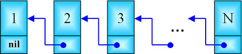
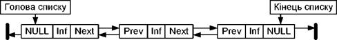
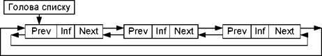
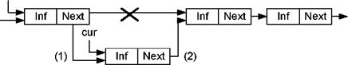
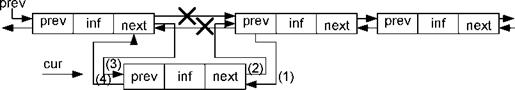
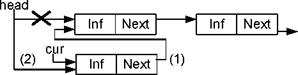
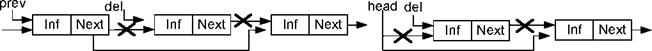
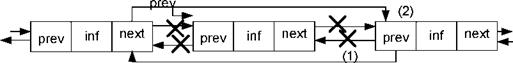
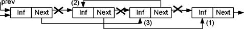

[Перелік лекцій](README.md)

# Динамічні структури даних. Списки

## Лінійні списки

Лінійні списки є узагальненням попередніх структур; вони дозволяють представити множину так, щоб кожний елемент був доступний і при цьому не потрібно було б зачіпати деякі інші.

Списки є досить гнучкою структурою даних, так як їх легко зробити більшими або меншими, і їх елементи доступні для вставки або вилучення в будь-якій позиції списку. Списки також можна об'єднувати або розділяти на менші списки.

Лінійний список - це скінчена послідовність однотипних елементів(вузлів), можливо, з повторенням. Кількість елементів у послідовності називається довжиною списку. Вона в процесі роботи програми може змінюватися.Лінійний список $L$, що складається з елементів $D_1,D_2,\dots,D_n$, які мають однаковий тип, записують у вигляді

$L = \left \{  D_1,D_2,\dots,D_n ) $, або зображають графічно.

Важливою властивістю лінійного списку є те, що його елементи можна лінійно впорядкуватиу відповідності з їх позицією в списку.

Для формування абстрактного типу даних на основі математичного визначення списку потрібно задати множину операторів, які виконуються над об'єктами типу список.Проте не існує однієї множини операторів, які виконуються над списками, які задовольняють відразу всі можливі застосування.

Найчастіше зі списками доводиться виконувати такі операції:

1.  Знайти елемент із заданою властивістю;
2.  Визначити і-й елемент у лінійному списку;
3.  Внести додатковий елемент до або після вказаного вузла;
4.  Вилучити певний елемент списку;
5.  Впорядкувати вузли лінійного списку в певному порядку.

У реальних мовах програмування не існує якої-небудь структури даних для зображення лінійного списку так, щоб усі операції над ним виконувалися в однаковій мірі ефективно. Тому при роботі з лінійними списками важливе значення має подання лінійних списків, які використовуються в програмі, таким чином, щоб була забезпечена максимальна ефективність і за часом виконання програми, і за обсягом потрібної їй пам'яті.

Лінійний список є послідовність об'єктів. Позиція елемента в списку має інший тип даних,відмінний від типу даних елемента списку, і цей тип залежить від конкретної фізичної реалізації.

Над лінійним списком допустимі наступні операції.

Операція вставки - вставляє елемент в конкретну позицію в списку, переміщуючи елементивід цієї позиції і далі в наступну, більш вищу позицію.

Операція локалізації - повертає позицію об'єкта в списку. Якщо в списку об'єкт зустрічається декілька разів, то повертається позиція першого від початку списку об'єкта. Якщо об'єкта немає в списку, то повертається значення, яке рівне довжині списку, збільшене на одиницю.

Операція вибірки елемента з списку - повертає елемент, який знаходиться в конкретній позиції списку. Результат не визначений, якщо в списку немає такої позиції.

Операція вилучення - вилучає елемент в конкретній позиції зі списку. Результат невизначений, якщо в списку немає вказаної позиції.

Операції вибірки попереднього і наступного елемента - повертають відповідно наступній і попередній елемент списку відносно конкретної позиці в списку.

Функція очищення списку робить список пустим.

Основні методи зберігання лінійних списків поділяються на методи послідовного і зв'язного зберігання. При виборі способу зберігання в конкретній програмі слід враховувати, які операції і з якою частотою будуть виконуватися над лінійними списками, вартість їх виконання та обсяг потрібної пам'яті для зберігання списку.

Найпростіша форма представлення лінійного списку — це вектор. Визначивши, таким чином, список можна по-черзі звертатися до них в циклі і виконувати необхідні дії. Однак при такому представленні лінійного списку не вдасться уникнути фізичного переміщення елементів, якщо потрібно додавати нові елементи, або вилучати існуючі. Набагато швидше вилучати елементи можна за допомогою простої схеми чистки пам'яті. Замість вилучення елементів із списку, їх помічають як невикористані.

Більш складною організацією при роботі зі списками є розміщення в масиві декількох списків або розміщення списку без прив'язки його початку до першого елемента масиву.

При зв'язному представленні лінійного списку кожен його елемент складається із значення і покажчика, який вказує на наступний елемент у списку.

На наступному рисунку приведена структура однозв'язного списку. Кожний список повинен мати особливий елемент, який називається покажчиком на початок списку, або головою списку.

Голова списку -----

Проте,обробка однозв'язного списку не завжди зручна, оскільки відсутня можливість просування в протилежну сторону. Таку можливість забезпечує двох - зв'язний список, кожний елемент якого містить два покажчики: на наступний і попередній елементи списку.

Для зручності обробки списку додають ще один особливий елемент - покажчик кінця списку. Наявність двох покажчиків в кожному елементі ускладнює список і приводить до додаткових витрат пам'яті, але в той же час забезпечує більш ефективне виконання деяких операцій над списком.

Різновидом розглянутих видів лінійних списків є кільцевий список, який може бути організований на основі як однозв'язного, так і двохзв'язного списків. При цьому в однозв'язному списку покажчик останнього елемента повинен вказувати на перший елемент; в двох-зв'язному списку в першому і останньому елементах відповідні покажчики змінюються.

При роботі з такими списками дещо спрощуються деякі процедури, проте, при перегляді такого списку слід приймати деякі запобіжні засоби, щоб не потрапити внескінченний цикл.

В пам'яті список є сукупністю опису однакових за розміром і форматом структур,які розміщені довільно в деякій ділянці пам'яті і пов'язані одна з одною в лінійно впорядкований ланцюжок за допомогою покажчиків. Структура містить інформаційні поля і поля покажчиків на сусідні елементи списку, причому деякими полями інформаційної частини можуть бути покажчики на блоки пам'яті з додатковою інформацією, що відноситься до елемента списку.

Розглянемо деякі прості операції над лінійними списками.

Вставка елемента в середину однозв'язного списку:

Вставка елемента в двох-зв'язний список:

Наведені приклади забезпечують вставку в середину списку, але не можуть бути застосовані для вставки на початок списку. При такій операції повинен модифікуватися покажчик на початок списку:

Видалення елемента з однозв'язного списку для двох варіантів - зсередини і з голови:

Видалення елемента з двох-зв'язного списку вимагає корекції більшої кількості покажчиків:

Процедура видалення елемента з двох-зв'язного списку виявиться навіть простішою, ніж для однозв'язного, оскільки в ній не потрібно шукати попередній елемент, він вибирається за покажчиком назад.

Змінність динамічних структур даних допускає не тільки зміни розміру структури, але і зміни зв'язків між елементами. Для зв'язних структур зміна зв'язків не вимагає пересилки даних в пам'яті, а тільки зміни покажчиків в елементах зв'язної структури. В якості прикладу приведена перестановка двох сусідніх елементів списку. В алгоритмі перестановки в однозв'язному списку виходили з того, що відома адреса елемента, який передує парі, в якій проводиться перестановка. В приведеному алгоритмі також не враховується випадок перестановки початкових елементів списку.

У процедурі перестановки для двох-зв'язного списку неважко врахувати і перестановку на початку списку.

## Мультисписки

В програмних системах, які обробляють об'єкти складної структури, можуть вирішуватися різні підзадачі, кожна з яких вимагає обробки можливо не всієї множини об'єктів, а лише якоїсь його підмножини.

Для того, щоб при вибірці кожної підмножини не виконувати повний перегляд з відсіванням записів, які до необхідної підмножини не відносяться, в кожний запис включаються додаткові поля посилань, кожне з яких зв'язує в лінійний список елементи відповідної підмножини. В результаті виходить багато-зв'язковий список або мультисписок, кожний елемент якого може входити одночасно в декілька однозв'язних списків.

До переваг мультисписків крім економії пам'яті (при множині списків інформаційна частина існує в єдиному екземплярі) слід віднести також цілісність даних - втому сенсі, що всі підзадачі працюють з однією і тією ж версією інформаційної частини і зміни в даних, зроблені одній підзадачей негайно стають доступними для іншої підзадачі.

Кожна підзадача працює з своєю підмножиною як з лінійним списком,використовуючи для цього певне поле зв'язку. Специфіка мультисписку виявляється тільки в операції виключення елемента із списку. Виключення елемента з якого-небудь одного списку ще не означає необхідності видалення елемента з пам'яті,оскільки елемент може залишатися у складі інших списків. Пам'ять повинна звільнятися тільки у тому випадку, коли елемент вже не входить ні в один з приватних списків мультисписку. Звичайно задача видалення спрощується тим, що один з приватних списків є головним - в нього обов'язково входять всі наявні елементи. Тоді виключення елемента з будь-якого неголовного списку полягає тільки в зміні покажчиків, але не в звільненні пам'яті. Виключення ж з головного списку вимагає не тільки звільнення пам'яті, але і зміні покажчиків як в головному списку, так і у всіх неголовних списках, в які елемент, що видаляється, входив.

## Стрічки

Стрічка - це лінійно впорядкована послідовність символів, які належать до скінченої множини символів, яка називається алфавітом.

Стрічки мають наступні важливі властивості:

1.  їхня довжина, як правило, змінна,хоч алфавіт фіксований;
2.  звичайне звернення до символів стрічки йде з будь-якого одного боку послідовності (важлива впорядкованість послідовності, а не її індексація);
3.  метою доступу до стрічки є на окремий її елемент, а ланцюжок символів.

Кажучи про стрічки, звичайно мають на увазі текстові стрічки - стрічки, що складаються з символів, які входять в алфавіт якої-небудь вибраної мови, цифр, розділових знаків і інших службових символів. Текстова стрічка є найбільш універсальною формою представлення будь-якої інформації.

Хочастрічки й розглядаються в частині, яка присвячена напівстатичним структурам даних, в тих або інших конкретних задачах змінність стрічок може варіюватися від повної її відсутності до практично необмежених можливостей зміни.Орієнтація на ту чи іншу міру мінливості стрічок визначає і фізичне представлення їх в пам'яті і особливості виконання операцій над ними. Вбільшості мов програмування стрічки представляються саме як напівстатичні структури.

Базовими операціями над стрічками є:

1.  визначення довжини стрічки;
2.  присвоєння стрічки;
3.  конкатенація (зчеплення) стрічок;
4.  виділення підстрічки;
5.  пошук входження.

Операція визначення довжини стрічки має вид функції, яка повертає значення - ціле число- поточна кількість символів в стрічці. Операція присвоєння має такий же сенс,що і для інших типів даних.

Операція порівняння стрічок має такий же сенс, що і для інших типів даних. Порівняння стрічок проводиться за наступними правилами. Порівнюються перші символи двох стрічок. Якщо символи не рівні, то стрічка, що містить символ, місце якого в алфавіті ближче до початку, вважається меншою. Якщо символи рівні, порівнюються другі, треті і т.д. символи. При досягненні кінця в одній з стрічок стрічка меншої довжини вважається меншою. При рівності довжин стрічок і попарній рівності всіх символів в них стрічки вважаються рівними.

Результатом операції зчеплення двох стрічок є стрічка, довжина якої рівна сумарній довжині стрічок-операндів, а значення відповідає значенню першого операнда, за яким безпосередньо слідує значення другого операнда.

Операція виділення підстрічки виділяє з початкової стрічки послідовність символів,починаючи із заданої позиції, із заданою довжиною.

Операція пошуку входження знаходить місце першого входження підстрічки еталону в початкову стрічку. Результатом операції може бути номер позиції в початковій стрічці, з яким починається входження еталону або покажчик на початок входження. У разі відсутності входження результатом операції повинне бути деяке спеціальне значення, наприклад, від'ємний номер позиції або порожній покажчик.

Найпростішим способом є представлення стрічки у вигляді вектора постійної довжини. При цьому в пам'яті відводиться фіксована кількість байт, в які записуються символи стрічки. Якщо стрічка менша відведеного під неї вектора, то зайві місця заповнюються пропусками, а якщо стрічка виходить за межі вектора, то зайві(праві) символи повинні бути відкинуті.

Можливе представлення стрічки вектором змінної довжини з ознакою завершення. Цей і всі подальші за ним методи враховують змінну довжину стрічок. Ознака завершення -це особливий символ, який належить до алфавіту (таким чином, корисний алфавіт виявляється меншим на один символ), і займає ту ж кількість розрядів, що і всі інші символи. Витрати пам'яті при цьому способі складають 1 символ на рядок.

Окрім ознаки завершення можна використати лічильник символів - це ціле число, і для нього відводиться достатня кількість бітів, щоб їх з надлишком вистачало для представлення довжини найдовшої стрічки, яку можна представити. При використовуванні лічильника символів можливий довільний доступ до символів в межах стрічки.

Представлення стрічок списком у пам'яті забезпечує гнучкість у виконанні різноманітних операцій над ними (зокрема, операцій включення і виключення окремих символів і цілих ланцюжків) і використовування системних засобів управління пам'яттю при виділенні необхідного об'єму пам'яті для стрічки. Проте, при цьому виникають додаткові затрати пам'яті. Іншим недоліком такого представлення стрічок є те,що логічно сусідні елементи стрічки не є фізично сусідніми в пам'яті. Це ускладнює доступ до груп елементів стрічки в порівнянні з доступом у векторному представленні.

При представленні стрічки однозв'язним лінійним списком кожний символ стрічки представляється у вигляді елемента зв'язного списку; елемент містить код символу і покажчик на наступний елемент. Одностороннє зчеплення представляє доступ тільки в одному напрямі уздовж стрічки.

При використанні двох-зв'язних лінійних списків у кожний елемент списку додається також покажчик на попередній елемент. Двостороннє зчеплення допускає двосторонній рух уздовж списку, що може значно підвищити ефективність виконання деяких стрічкових операцій.

Блочно-зв'язне представлення стрічок дозволяє в більшості операцій уникнути витрат, які пов'язані з управлінням динамічною пам'яттю, але в той же час забезпечує достатньо ефективне використовування пам'яті при роботі зі стрічками змінної довжини.

## Теми для самостійного вивчення

1. Циклічні списки та мультисписки
2. Реалізація циклічного списку на мові С++
3. Реалізація мультисписку списку на мові С++
4. Реалізація мультисписку списку на мові Deplhi

## Контрольні питання

1.  Що таке хеш-функція?
2.  Яке призначення хеш-функцій?
3.  Які алгоритми хешування ви знаєте?
4.  В чому головна відмінність процесів хешування та шифрування?