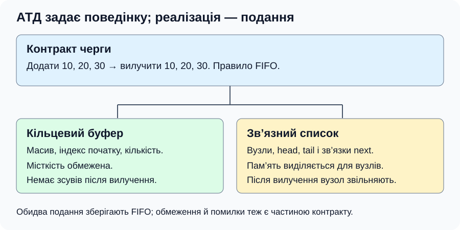
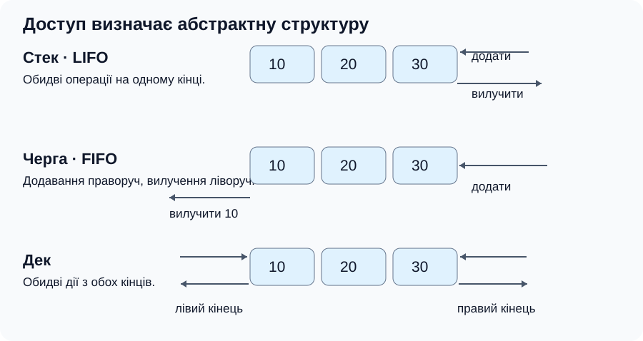
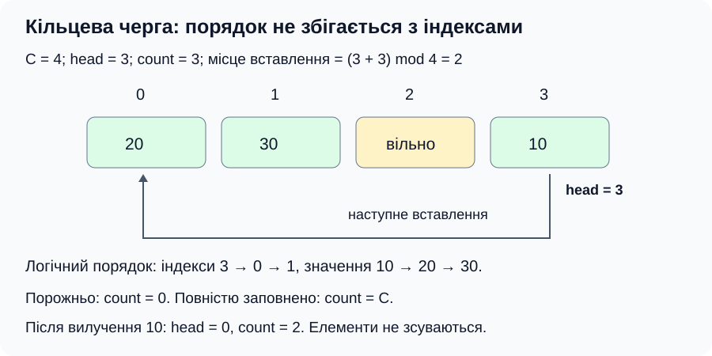

[Перелік лекцій](../README.md)

# Лекція 4. Абстрактні структури даних

> TODO: уточнити за робочою програмою: у програмі 2023 року №3 — «Абстрактні структури», №4 — «Динамічні структури. Списки». Тут збережено заданий контекст `lec-04`.

## Мета та очікувані результати

Розрізняти АТД і реалізацію; пояснювати операції множини, словника, стека, черги, дека та пріоритетної черги; обирати подання за потрібними ресурсами.

## Абстракція: що робить структура і як вона побудована

**Абстрактний тип даних (АТД)** визначає значення, операції та їхню поведінку. **Реалізація** задає подання в пам’яті й алгоритми. Стек визначається правилом LIFO, а не масивом чи покажчиками. Один АТД допускає різні реалізації, а зв’язний список може реалізувати різні АТД.

**Контракт операції** описує передумови, результат і відмови. Вилучення з порожньої черги може повертати ознаку невдачі або вимагати попередньої перевірки порожності. Нуль не позначає відмову, якщо є допустимим значенням.



*Рисунок 1 — заміна подання зберігає контракт, але може змінити витрати ресурсів.*

Інваріант — властивість, яку зберігають операції: у множині немає повторів, у черзі зберігається порядок надходження.

## Множина

**Множина** містить унікальні елементи; порядок не визначає її змісту. Порожня множина — ∅. Вставлення наявного елемента не змінює розмір. Правило рівності елементів задають явно.

Основні операції — перевірка належності, вставлення, видалення, розмір; над двома множинами — об’єднання, перетин, різниця й симетрична різниця. Для A = {1, 2, 3}, B = {3, 4}:

| Операція | Зміст | Результат |
| --- | --- | --- |
| A ∪ B | Належить хоча б одній | {1, 2, 3, 4} |
| A ∩ B | Належить обом | {3} |
| A ∖ B | Належить A, але не B | {1, 2} |
| A △ B | Належить рівно одній | {1, 2, 4} |

A ⊆ B означає, що кожний елемент A належить B; ∅ є підмножиною будь-якої множини. Відмінність від мультимножини — остання допускає повтори.

Реалізації: масив без повторів, збалансоване дерево, хеш-таблиця. Для невеликого універсуму цілих чисел підходить бітова карта: кожному можливому значенню відповідає біт присутності. У C++ немає вбудованого типу множини, але є бібліотечні `std::set` і `std::unordered_set`.

## Таблиця та словник

**Таблиця** — ширше поняття; доступ за ключем описує АТД **словник**, або асоціативний масив. Кожному ключу відповідає одне значення: інвентарний номер → відомості про примірник. Значення для різних ключів можуть повторюватися; ключ не є індексом.

Операції: пошук, вставлення, зміна, видалення. Повторний ключ означає відмову або оновлення; відсутність відрізняють від нуля. Пошук за іншими полями потребує обходу або додаткових індексів.

Реалізації: масив пар, дерево, хеш-таблиця; у C++ — `std::map`, `std::unordered_map`. Навіть для записів змінної довжини індекс адрес або зміщень дозволяє непослідовний доступ.

Оцінки пошуку, вставлення та видалення одного ключа за n елементів:

| Подання множини або словника | Пошук | Вставлення / видалення |
| --- | --- | --- |
| Невпорядкований масив | O(n) | O(n), з перевіркою унікальності / пошуком |
| Відсортований масив | O(log n) | O(n) через зсуви |
| Збалансоване дерево пошуку | O(log n) | O(log n) |
| Хеш-таблиця | У середньому O(1), найгірше O(n) | У середньому O(1), найгірше O(n) |

Вставлення в хеш-таблицю оцінене амортизовано, за належного розподілу хешів. Порівняння й хешування вважаємо O(1); довгі ключі додають витрати. Звичайні масиви й дерева займають O(n) пам’яті, хеш-таблиця — O(n + m) для m комірок/кошиків, бітова карта — O(U) бітів для універсуму з U значень.

## Стек, черга та дек

Ці АТД зберігають послідовності з повторами, а не множини. Різниця — у дозволених місцях додавання й вилучення. Внутрішній масив або список може давати ширший доступ, але користувач АТД дотримується його інтерфейсу.

### Стек: робота з останнім незавершеним елементом

**Стек** працює за LIFO: останнім додано — першим вилучено. `push` додає на вершину, `top` переглядає її без зміни стека, `pop` вилучає. Допоміжні операції — перевірка порожності, визначення кількості та очищення.

Позначатимемо стек від дна до вершини зліва направо. Після додавання 10, 20, 30 стан — [10, 20, 30], вершина — 30. Вилучення дає [10, 20]; додавання 40 — [10, 20, 40]. Значення 20 стане доступним для вилучення лише після 40. Повторне додавання 40 створить ще один елемент.

**Реалізація масивом.** Нехай `count` — кількість використаних комірок, C — місткість. Інваріант: 0 ≤ count ≤ C; елементи займають позиції 0 … count − 1, вершина має індекс count − 1. Додавання записує в позицію count і збільшує лічильник; вилучення зменшує його. Індекс вершини й покажчик — різні засоби, тому лічильник не варто називати адресою. Напрям зростання адрес не є властивістю АТД стека.

**Реалізація списком.** Покажчик вершини позначає голову однозв’язного списку. Новий вузол спочатку зв’язують зі старою головою, потім змінюють вершину. При вилученні зберігають наступника й лише тоді звільняють старий вузол. Обидві операції не потребують обходу. Розміщувати вершину в хвості однозв’язного списку незручно: пошук попередника для вилучення коштуватиме O(n).

Порожній стек не має вершини. Для обмеженого масиву `push` може відмовити через заповнення; для списку — через невдале виділення пам’яті. Очищення масиву цілих можна виконати скиданням лічильника, але очищення вузлового стека потребує O(n) звільнень. Якщо елементи володіють ресурсами, треба також забезпечити їх коректне знищення.

Стек природно описує **вкладені дії**. Для перевірки дужок відкривальну дужку додають на вершину; закривальна має відповідати саме останній незакритій. Наприкінці стек має бути порожнім. Стек викликів зберігає контекст незавершених функцій, а в системі скасування дій останню дію скасовують першою. Це приклади правила LIFO, а не вимога однакового подання в пам’яті.

### Черга: обслуговування в порядку надходження

**Черга** працює за FIFO: першим додано — першим вилучено. `enqueue` додає в кінець, `front` переглядає початок, `dequeue` вилучає з початку. Додавання 10, 20, 30 утворює [10, 20, 30]; після вилучення 10 і додавання 40 маємо [20, 30, 40]. Зміна пріоритетів обслуговування означає вже інший контракт.

**Масив зі зсувом** — коректна реалізація FIFO: після вилучення можна пересунути решту елементів на одну позицію. Однак це O(n) роботи. **Кільцевий буфер** пересуває індекси замість елементів і повторно використовує звільнені комірки. Кільцевим є спосіб індексування, а не обов’язково розміщення пам’яті чи зв’язки між вузлами.

**Зв’язна черга** має голову `head` і хвіст `tail`. Для порожньої черги обидва дорівнюють `nullptr`; для непорожньої `tail->next` дорівнює `nullptr`. Новий вузол із порожнім `next` приєднують після хвоста. Якщо черга була порожня, він стає також головою. Після вилучення єдиного вузла потрібно занулити обидва покажчики; інакше хвіст міститиме адресу звільненої пам’яті.

Застосування — буферизація повідомлень, обслуговування заявок, обхід графа в ширину. FIFO визначає порядок вилучення, але не гарантує однакової тривалості обробки чи завершення паралельних завдань. Безпечна робота кількох потоків потребує окремої синхронізації.

### Дек: доступ із двох кінців

**Дек** (deque, double-ended queue) дозволяє додавання, перегляд і вилучення з обох кінців. Назви операцій: `push_front`, `push_back`, `front`, `back`, `pop_front`, `pop_back`. Для порожнього дека перегляд і вилучення недопустимі без передбаченої контрактом обробки.

| Операція | Стан дека після операції |
| --- | --- |
| Початковий стан | [] |
| Додати 20 праворуч | [20] |
| Додати 10 ліворуч | [10, 20] |
| Додати 30 праворуч | [10, 20, 30] |
| Вилучити праворуч | [10, 20] |
| Вилучити ліворуч | [20] |

Стек можна отримати, дозволивши додавання й вилучення лише праворуч; чергу — додавання праворуч і вилучення ліворуч. **Дек з обмеженим входом** додає лише з одного кінця, але вилучає з обох; **дек з обмеженим виходом** має протилежне обмеження.

Для реалізації підходить двозв’язний список із головою й хвостом: зв’язок `prev` дозволяє вилучати хвіст без пошуку попередника. Інший варіант — кільцевий буфер. За `head` і `count` додавання ліворуч пересуває голову на (head + C − 1) mod C; правий елемент має індекс (head + count − 1) mod C. Перш ніж використовувати формули, перевіряють відповідно вільне місце або непорожність. Для єдиного елемента лівий і правий кінець збігаються.

Абстрактний дек не вимагає довільного доступу за індексом. Конкретний `std::deque` у C++ додатково підтримує такий доступ за O(1), але не гарантує суцільного розміщення всіх елементів. Тому його не слід ототожнювати зі звичайним масивом.

Приклад застосування — **максимум у рухомому вікні**. Для [2, 1, 3, 2] і ширини 3 максимуми дорівнюють 3 та 3. У деку зберігають індекси кандидатів: зліва вилучають ті, що вийшли за вікно, справа — ті, чиї значення не більші за нове. Значення кандидатів зліва направо спадають, а максимум стоїть зліва. Кожний індекс додається й вилучається не більш ніж один раз, тому загальний час O(n), пам’ять O(k) для ширини k. Передумова: 1 ≤ k ≤ n.

### Порівняння реалізацій



*Рисунок 2 — стрілки показують дозволені місця додавання й вилучення.*

| АТД | Реалізація масивом | Реалізація вузлами |
| --- | --- | --- |
| Стек | Елементи від початку; лічильник задає вершину | Вершина — голова однозв’язного списку |
| Черга | Кільцевий буфер без зсувів | Однозв’язний список із `head` і `tail` |
| Дек | Кільцевий буфер з операціями на обох кінцях | Двозв’язний список |

Для фіксованого буфера операції на кінцях мають O(1) часу, але можливе переповнення. Для списків — O(1) у моделі зі сталою вартістю виділення вузла; пам’ять O(n) із витратами на покажчики. Для масиву зі збільшенням місткості геометричними кроками додавання може бути амортизовано O(1), але окрема перебудова має O(n).

Кожний створений через `new` вузол зрештою знищують через `delete`; просте занулення голови непорожнього списку спричиняє витік. Для масиву через `new[]` потрібне `delete[]`. Скидання індексів і звільнення пам’яті — різні операції.

## Кільцева черга: інваріант і приклад C++

У буфері місткості C > 0 зберігаємо індекс першого елемента `head` і кількість `count`. Інваріант: 0 ≤ head < C, 0 ≤ count ≤ C. Наступне місце вставлення — (head + count) mod C. Після вилучення голова переходить уперед: (head + 1) mod C. Лічильник розрізняє порожню й повну чергу, тому резервувати зайву комірку не потрібно.



*Рисунок 3 — за C = 4, head = 3, count = 3 порядок елементів: 10, 20, 30.*

```cpp
#include <iostream>

const int Capacity = 4;
struct Queue {
    int data[Capacity];
    int head;
    int count;
};

bool enqueue(Queue& q, int value) {
    if (q.count == Capacity) return false;
    q.data[(q.head + q.count) % Capacity] = value;
    ++q.count;
    return true;
}

bool dequeue(Queue& q, int& value) {
    if (q.count == 0) return false;
    value = q.data[q.head];
    q.head = (q.head + 1) % Capacity;
    --q.count;
    return true;
}

int main() {
    Queue q = {};
    for (int value = 10; value <= 30; value += 10) {
        if (!enqueue(q, value)) return 1;
    }
    int value = 0;
    while (dequeue(q, value)) std::cout << value << ' ';
    std::cout << '\n';
    return 0;
}
```

Передумова: черга ініціалізована, поля змінюються лише її операціями. Відмова зберігає стан і вихідне значення. Модуль забезпечує допустимий індекс, лічильник — інваріант місткості. Масив звільняється автоматично.

Результат — `10 20 30`: FIFO зберігається. Вхідні значення задані в коді. Для перевірки операцій потрібні порожня й повна черга, зайве вставлення та повторне заповнення після вилучень. Кожна операція має O(1) часу; буфер займає O(C) пам’яті.

## Пріоритетна черга та засоби C++

**Пріоритетна черга** вибирає найбільший або найменший пріоритет згідно з контрактом. Порядок однакових пріоритетів потребує окремого правила. Двійкова купа дає перегляд вершини за O(1), вставлення й вилучення за O(log n), пам’ять O(n); це не повністю відсортована послідовність.

`std::stack`, `std::queue`, `std::priority_queue` — адаптери над іншими контейнерами; `std::deque` — контейнер. У стандартних адаптерах `pop()` не повертає вилучене значення: спочатку його читають через `top()` або `front()`, перевіривши непорожність.

## Питання для самоперевірки

1. Що має зберегтися при заміні реалізації АТД?
2. Чим множина відрізняється від словника й послідовності?
3. Чому O(1) для хеш-таблиці не є гарантією кожного виклику?
4. Як отримати стек і чергу на основі списку?
5. Чому в кільцевому буфері достатньо `head` і `count`?
6. Як відрізняються FIFO та порядок за пріоритетом?
7. Чому вершину стека зручно розміщувати в голові однозв’язного списку?
8. Що відбувається з head і tail після вилучення єдиного вузла черги?
9. Як реалізувати стек і чергу, обмеживши операції дека?
10. Чому пошук максимумів у рухомому вікні за допомогою дека має сумарний час O(n)?

## Джерела

1. Cormen, T. H.; Leiserson, C. E.; Rivest, R. L.; Stein, C. *Introduction to Algorithms*. 4th ed. MIT Press, 2022. Стеки, черги, хеш-таблиці й купи. [Сторінка видавництва](https://mitpress.mit.edu/9780262046305/introduction-to-algorithms/).
2. Knuth, D. E. *The Art of Computer Programming. Vol. 1: Fundamental Algorithms*. 3rd ed. Addison-Wesley, 1997. Лінійні структури та їхні подання. [Сторінка автора](https://www-cs-faculty.stanford.edu/~knuth/taocp.html).
3. Weiss, M. A. *Data Structures and Algorithm Analysis in C++*. 4th ed. Реалізації структур мовою C++. [Матеріали автора](https://users.cs.fiu.edu/~weiss/dsaa_c++4/code/).
4. Morin, P. *Open Data Structures (in C++)*. §1.2, Interfaces. Абстрактні типи й реалізації. [Відкрите видання автора](https://opendatastructures.org/ods-cpp/1_2_Interfaces.html).
5. ISO/IEC JTC1/SC22/WG21. *Working Draft, Standard for Programming Language C++*. [Асоціативні контейнери](https://eel.is/c++draft/associative.reqmts), [невпорядковані контейнери](https://eel.is/c++draft/unord.req), [адаптер queue](https://eel.is/c++draft/queue), [адаптер stack](https://eel.is/c++draft/stack), [властивості deque](https://eel.is/c++draft/deque.overview).
