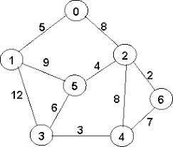

[Перелік лекцій](README.md)

# Динамічні структури даних. Графи

## Графи

Граф - це складна нелінійна багатозв'язна динамічна структура, що відображає властивості і зв'язки складного об'єкту.

Ця багато-зв'язна структура має наступні властивості:

*   на кожний елемент (вузол, вершину)може бути довільна кількість посилань;
*   кожний елемент може мати зв'язок збудь-якою кількістю інших елементів;
*   кожний зв'язок (ребро, дуга) може мати напрям і вагу.

У вузлах графа міститься інформація про елементи об'єкту. Зв'язки між вузлами задаються ребрами графа. Ребра графа можуть мати спрямованість, тоді вони називаються орієнтованими, в іншому випадку - неорієнтовані. Граф, усі зв'язки якого орієнтовані, називається орієнтованим графом; граф зі всіма неорієнтованими зв'язками - неорієнтованим графом; граф із зв'язками обох типів- змішаним графом.

Існує два основні методи представлення графів в пам'яті комп'ютера: матричний і зв'язними нелінійними списками. Вибір методу представлення залежить від природи даних і операцій, що виконуються над ними. Якщо задача вимагає великої кількості включень і виключень вузлів, то доцільно представляти граф зв'язними списками; інакше можна застосувати і матричне представлення.

При використанні матриць суміжності їхні елементи представляються в пам'яті комп'ютера елементами масиву. При цьому, для простого графа матриця складається з нулів і одиниць, для мультиграфа - з нулів і цілих чисел, які вказують кратність відповідних ребер, для зваженого графа - з нулів і дійсних чисел, які задають вагу кожного ребра.

Орієнтований граф представляється зв'язним нелінійним списком, якщо він часто змінюється або якщо півміри входу і виходу його вузлів великі.

Багато-зв'язна структура - граф - знаходить широке застосування при організації банків даних, управлінні базами даних, в системах програмного імітаційного моделювання складних комплексів, в системах штучного інтелекту, в задачах планування і в інших сферах.

## Теми для самостійного вивчення

1.  Принципи роботи алгоритмів групи CRC
2.  Принципи роботи алгоритмів групи MD
3.  Принципи роботи алгоритмів групи SHA
4.  Недоліки алгоритмів групи MD

## Контрольні питання

1.  Що таке хеш-функція?
2.  Яке призначення хеш-функцій?
3.  Які алгоритми хешування ви знаєте?
4.  В чому головна відмінність процесів хешування та шифрування?