[Перелік лекцій](README.md)

# Динамічні структури даних. Графи

## Графи

Граф — це нелінійна багатозв'язна динамічна структура даних, яка складається з вершин і ребер, де вершини містять інформацію або дані, а ребра працюють як зв’язок між парою вершин.

Він використовується для вирішення реальних текстових задач, як-от пошук найкращого маршруту до пункту призначення та маршруту для телекомунікацій і соціальних мереж. Користувачі вважаються вузлом у Графі, а дроти — ребрами, що з’єднують користувачів.

Якщо ребра представлені як E, а вершини представлені як V, то граф G можна записати як набір вершин і ребер, наприклад G (V, E)

Ця багато-зв'язна структура має наступні властивості:

*   на кожний елемент (вузол, вершину)може бути довільна кількість посилань;
*   кожний елемент може мати зв'язок збудь-якою кількістю інших елементів;
*   кожний зв'язок (ребро, дуга) може мати напрям і вагу.

У вузлах графа міститься інформація про елементи об'єкту. Зв'язки між вузлами задаються ребрами графа. Ребра графа можуть мати спрямованість, тоді вони називаються орієнтованими, в іншому випадку - неорієнтовані. Граф, усі зв'язки якого орієнтовані, називається орієнтованим графом; граф зі всіма неорієнтованими зв'язками - неорієнтованим графом; граф із зв'язками обох типів- змішаним графом.

## Термінології графів у структурі даних

| Термін             | Опис                                                                                                     |
| ------------------ | -------------------------------------------------------------------------------------------------------- |
| Вершина (вузол)    | Усі елементи даних називаються вершинами або вузлами. На зображенні вище A, B, C, D і E є вершинами.     |
| Ребро (дуга)       | Сполучні ланки між двома вузлами. Ребро має два кінці і представлений як (startingVertex, endingVertex). |
| Ненаправлене ребро | Це двонаправлене ребро                                                                                   |
| Спрямоване ребро   | Це односпрямоване ребро                                                                                  |
| Зважене ребро      | Ребро із значенням на ньому                                                                              |
| Ступінь вершини    | Кількість ребер, з’єднаних з вершиною, називається ступенем                                              |
| Попередня ступінь  | Загальна кількість вихідних ребер, з’єднаних з вершиною                                                  |
| Автопетля          | Ребро два кінці якого збігаються                                                                         |
| Суміжність         | Вершини називаються суміжними, якщо ребро з’єднане                                                       |

## Застосування структури даних графа
Граф має багато варіантів використання. Є багато algorithms які часто використовують графи. Ось деякі з застосувань Graph:

- Google Maps використовує графи, щоб знайти перехрестя двох доріг і обчислити відстань між двома місцями. Наприклад, Дейкстра, щоб знайти найкоротшу відстань між джерелом і пунктом призначення.
- Facebook використовує Graphs, щоб знайти спільного друга користувачів. Його алгоритм розглядає кожного користувача як вузол графа.
- Для розподілу ресурсів використовується DAG (Direct Acyclic Graph). Він перевіряє залежність ресурсів.
- Пошукова система Google використовує графи для створення рейтингу веб-сайтів.

Існує два основні методи представлення графів в пам'яті комп'ютера: матричний і зв'язними нелінійними списками. Вибір методу представлення залежить від природи даних і операцій, що виконуються над ними. Якщо задача вимагає великої кількості включень і виключень вузлів, то доцільно представляти граф зв'язними списками; інакше можна застосувати і матричне представлення.

При використанні матриць суміжності їхні елементи представляються в пам'яті комп'ютера елементами масиву. При цьому, для простого графа матриця складається з нулів і одиниць, для мультиграфа - з нулів і цілих чисел, які вказують кратність відповідних ребер, для зваженого графа - з нулів і дійсних чисел, які задають вагу кожного ребра.

Орієнтований граф представляється зв'язним нелінійним списком, якщо він часто змінюється або якщо півміри входу і виходу його вузлів великі.

Багато-зв'язна структура - граф - знаходить широке застосування при організації банків даних, управлінні базами даних, в системах програмного імітаційного моделювання складних комплексів, в системах штучного інтелекту, в задачах планування і в інших сферах.

## Неорієнтований граф
Неорієнтований граф містить ребра без вказівників. Це означає, що ми не можемоravel навпаки між двома вершинами.

Ось простий приклад неорієнтованого графа.

Ребра не містять напрямків.

Це приклад неорієнтованого графа, який має кінцеву кількість вершин і ребер без вагових коефіцієнтів.

## Орієнтований граф
Ребра орієнтованого графа містять стрілки, які означають напрямок. Стрілка визначає, де вказується або закінчується край.

Ось приклад орієнтованого графа.

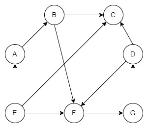

Ми можемо перейти від вузла A до D.

Однак ми не можемо переходити від вузла D до вузла A, оскільки край вказує від A до D.

Оскільки граф не має ваг, тraveling від вершини A до D буде коштувати стільки ж, скільки traveлінг від D до F.

## Зважений граф
Граф, який містить ваги або витрати на краях, називається зваженим графом. Числове значення зазвичай представляє вартість переміщення від однієї вершини до іншої. Як спрямований, так і неорієнтований граф можуть мати ваги на своїх краях.

Ось приклад зваженого графа (спрямованого).

Ось приклад неорієнтованого графа з вагами:

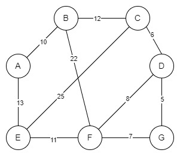
Тут край має вагу, але не має напрямку. Отже, це означає traveпроїзд від вершини A до D коштуватиме 10 і навпаки.

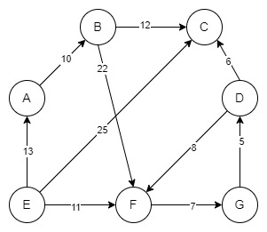
Від A до B є перевага, а вага дорівнює 5, що означає, що перехід від A до B коштуватиме нам 5.

A вказує на B, але на цьому графу B не має прямого ребра над A. Отже, ми не можемо travel від B до A.

Однак, якщо ми хочемо перейти від A до F, існує кілька шляхів. Шляхи ADF, ABF. ADF коштуватиме (10+11) або 21.

Тут шлях ABF буде коштувати (5+15) або 20. Тут ми додаємо вагу кожного ребра шляху.

## Двонаправлений граф
Двонаправлені та неорієнтовані графи мають спільну властивість. Тобто

Як правило, неорієнтований граф може мати одне ребро між двома вершинами.
Наприклад:

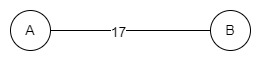

Тут перехід від A до D або D до A коштуватиме 17.

У двонаправленому графі ми можемо мати два ребра між двома вершинами.

Ось приклад:

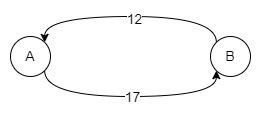
Перехід від A до D коштуватиме нам 17, але тraveперехід від D до A коштуватиме нам 12. Отже, ми не можемо призначити дві різні ваги, якщо це неорієнтований граф.

## Нескінченний граф
Граф міститиме нескінченну кількість ребер і вузлів. Якщо граф нескінченний і він також є зв’язним графом, то він також міститиме нескінченну кількість ребер. Тут розширені ребра означають, що більше ребер можуть бути з’єднані з цими вузлами через ребра.

Ось приклад нескінченного графа:

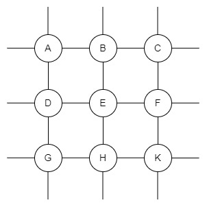

## Нульовий граф
Нульовий граф містить лише вузли або вершини, але без ребер. Якщо задано граф G = (V, E), де V — вершини, а E — ребра, він буде нульовим, якщо кількість ребер E дорівнює нулю.

Ось приклад нульового графа:

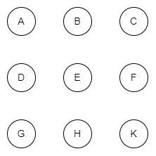

## Тривіальний граф
Структура даних графа вважається тривіальною, якщо є лише одна вершина або вузол без ребер.

Ось приклад тривіального графа:

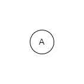

## Мультиграф (псевдограф)
Граф називається мультиграфом, якщо між двома вершинами присутні кілька ребер або вершина має петлю. Термін «Петля» в структурі даних графа означає ребро, що вказує на той самий вузол або вершину. Мультиграф може бути спрямованим і неорієнтованим.

Ось приклад Multi Graph:

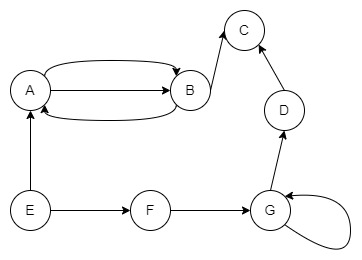

Є два ребра від B до A. Крім того, вершина E має автопетлю. Наведений вище граф є орієнтованим графом без ваг на ребрах.

## Повний граф
Граф є повним, якщо кожна вершина має орієнтовані або неорієнтовані ребра з усіма іншими вершинами.

Припустимо, що є загальна кількість вершин V і кожна вершина має рівно V-1 ребра. Тоді цей граф буде називатися повним графом. У цьому типі графа кожна вершина з’єднана з усіма іншими вершинами через ребра.

Ось приклад повного графа з п’ятьма вершинами:

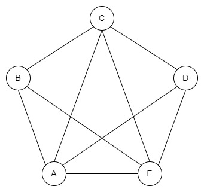

Ви бачите на зображенні, що загальна кількість вузлів дорівнює п’яти, і всі вузли мають рівно чотири ребра.

Ось приклад неповного графа з п’ятьма вершинами:

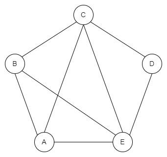

## Зв'язний граф
Граф називається зв’язаним графом, якщо ми починаємо з вузла або вершини і travel усі вузли від початкового вузла. Для цього між кожною парою вузлів або вершин має бути хоча б одне ребро.

Ось приклад підключеного графа:

Ось деяке пояснення наведеного вище «повного прикладу графа».

Якщо припустити, що між C і F немає межі, ми не можемо travel від A до G. Однак ребро C до F дозволяє нам travel до будь-якого вузла з заданого вузла.
Повний граф є зв’язаним графом, оскільки ми можемо переходити від вузла до будь-якого іншого вузла в даному графу.

Приклад графу, який не є зв'язним

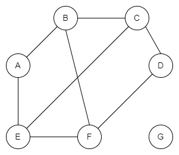

## Циклічний граф
Граф називається циклічним, якщо в ньому є один або більше циклів.

Ось приклад циклічного графа:

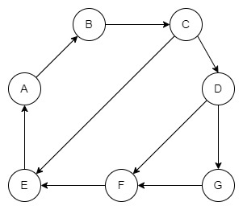

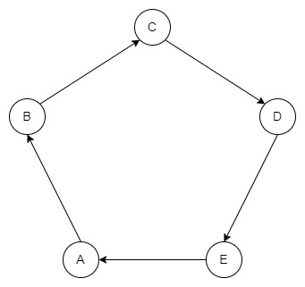

Тут вершини A, B і C утворюють цикл.

Граф може мати кілька циклів усередині.

## Спрямований ациклічний граф (DAG)
Граф називається спрямованим ациклічним графом або DAG, якщо всередині графа немає циклів. DAG важливий під час виконання Топологічне сортування або знайти наказ про виконання. DAG також важливий для створення систем планування або сканування залежностей ресурсів тощо. Однак наведений вище граф не містить жодного циклу.

Ось простий приклад спрямованого ациклічного графа (DAG):

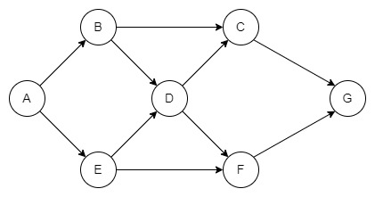

## Дводольний граф
Ці види діаграми це спеціальні види графів, де вершини призначаються двом множинам.

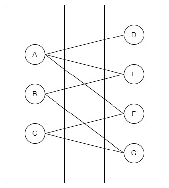

Дводольний граф повинен відповідати правилу:

Два набори вершин повинні бути різними, що означає, що всі вершини повинні бути розділені на дві групи або набори.
Один і той самий набір Вершини не повинні утворювати жодних ребер.
Дводольний граф

## Граф Ейлера
Структури даних графа вважаються графом Ейлера, якщо всі вершини мають парний ступінь. Термін ступінь вершин означає кількість ребер, що вказують на певну вершину або виходять з неї.

Ось приклад графа Ейлера:

Граф Ейлера

Усі вершини мають парні ступені. Вершини A, D, E і H мають два ступені. Тут вузол C має чотири ступені, що є парним.

## Граф Гамільтона
Граф Гамільтона — це граф з’єднання, у якому ви можете відвідати всі вершини від заданої вершини без revрозміщення того самого вузла або використання того самого краю. Цей тип зв’язаного графа відомий як «граф Гамільтона». Шлях, який ви відвідуєте, щоб перевірити, чи є даний граф графом Гамільтона, відомий як гамільтонів шлях.

Ось простий приклад графа Гамільтона:

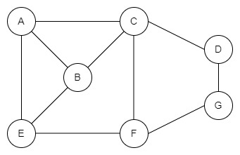

На цьому зображенні ми можемо відвідати всі вершини з будь-якого вузла на наведеному вище графу. Одним із шляхів може бути ADCHBE. Також можна знайти цикл Гамільтона. Цикл Гамільтона починається і закінчується в одній вершині. Отже, цикл Гамільтона буде ADCHBEA.

## Теми для самостійного вивчення

1.  Принципи роботи алгоритмів групи CRC
2.  Принципи роботи алгоритмів групи MD
3.  Принципи роботи алгоритмів групи SHA
4.  Недоліки алгоритмів групи MD

## Контрольні питання

1.  Що таке хеш-функція?
2.  Яке призначення хеш-функцій?
3.  Які алгоритми хешування ви знаєте?
4.  В чому головна відмінність процесів хешування та шифрування?