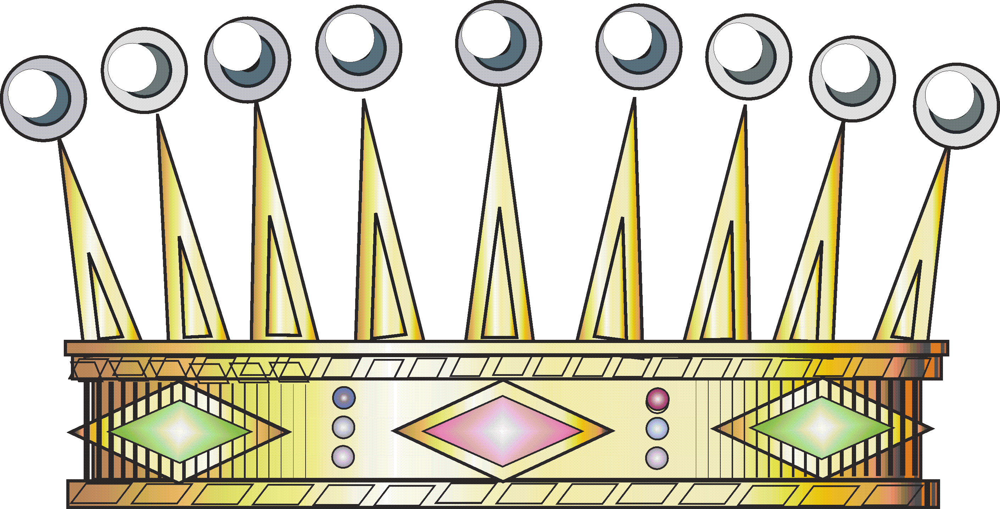

[Перелік лекцій](README.md)

# Динамічні структури даних. Графи

## Графи

Граф — це нелінійна, багатозв’язна динамічна структура даних, яка складається з множини вершин (вузлів) та множини ребер (дуг), що з’єднують пари вершин. Вершини містять інформацію, а ребра визначають зв’язки між ними.

Графи широко використовуються для моделювання різноманітних задач: пошук найкоротших шляхів, маршрутизація, соціальні мережі, аналіз зв’язків, планування, організація даних тощо.

**Формально:** граф G визначається як G = (V, E), де V — множина вершин, E — множина ребер.

### Основні властивості графів

- Кожна вершина може мати довільну кількість зв’язків (ребер).
- Ребра можуть бути спрямованими (орієнтованими) або неорієнтованими.
- Ребра можуть мати вагу (вартість переходу).
- Граф може бути зв’язним або незв’язним, містити цикли або бути ациклічним.

### Типи графів

- **Орієнтований граф (діграф):** ребра мають напрямок.
- **Неорієнтований граф:** ребра не мають напрямку.
- **Зважений граф:** ребра мають вагу (вартість).
- **Мультиграф:** між парою вершин може бути кілька ребер.
- **Псевдограф:** допускає петлі (ребра, що починаються і закінчуються в одній вершині).
- **Двонаправлений граф:** між парою вершин можуть бути ребра в обох напрямках з різними вагами.
- **Циклічний/Ациклічний граф:** містить/не містить циклів.
- **Дерево:** зв’язний ациклічний граф без циклів.
- **DAG (Directed Acyclic Graph):** орієнтований ациклічний граф.

### Основні терміни

| Термін             | Опис                                                                                                     |
|--------------------|---------------------------------------------------------------------------------------------------------|
| Вершина (вузол)    | Елемент графа, що містить інформацію.                                                                   |
| Ребро (дуга)       | Зв’язок між двома вершинами.                                                                            |
| Ступінь вершини    | Кількість ребер, що виходять з/входять у вершину.                                                       |
| Суміжність         | Вершини називаються суміжними, якщо між ними існує ребро.                                               |
| Автопетля          | Ребро, що з’єднує вершину саму з собою.                                                                 |
| Зважене ребро      | Ребро з числовим значенням (вагою).                                                                     |

### Представлення графів у пам’яті

- **Матриця суміжності:** двовимірний масив, де елемент [i][j] вказує на наявність (і вагу) ребра між вершинами i та j.
- **Списки суміжності:** для кожної вершини зберігається список суміжних вершин (або пар "вершина-вага").
- **Списки ребер:** перелік усіх ребер графа.

Вибір представлення залежить від щільності графа та характеру операцій (пошук, додавання, видалення).

### Застосування графів

- Пошук найкоротших шляхів (алгоритми Дейкстри, Беллмана-Форда, A*).
- Мережі (соціальні, транспортні, комп’ютерні).
- Аналіз зв’язків, маршрутизація, планування.
- Побудова ієрархій, організація даних, компілятори (графи залежностей).
- Розв’язання задач у штучному інтелекті, біоінформатиці, логістиці.

### Основні алгоритми роботи з графами

- **Обхід у глибину (DFS)** та **обхід у ширину (BFS)**.
- **Пошук найкоротшого шляху** (Dijkstra, Bellman-Ford, Floyd-Warshall).
- **Пошук компонент зв’язності**.
- **Топологічне сортування** (для DAG).
- **Пошук мінімального остовного дерева** (алгоритми Крускала, Прима).

### Приклади типів графів

## Неорієнтований граф
Неорієнтований граф містить ребра без вказівників. Це означає, що ми не можемоravel навпаки між двома вершинами.

Ось простий приклад неорієнтованого графа.

Ребра не містять напрямків.

Це приклад неорієнтованого графа, який має кінцеву кількість вершин і ребер без вагових коефіцієнтів.

## Орієнтований граф
Ребра орієнтованого графа містять стрілки, які означають напрямок. Стрілка визначає, де вказується або закінчується край.

Ось приклад орієнтованого графа.

Ми можемо перейти від вузла A до D.

Однак ми не можемо переходити від вузла D до вузла A, оскільки край вказує від A до D.

Оскільки граф не має ваг, тraveling від вершини A до D буде коштувати стільки ж, скільки traveлінг від D до F.

## Зважений граф
Граф, який містить ваги або витрати на краях, називається зваженим графом. Числове значення зазвичай представляє вартість переміщення від однієї вершини до іншої. Як спрямований, так і неорієнтований граф можуть мати ваги на своїх краях.

Ось приклад зваженого графа (спрямованого).

Ось приклад неорієнтованого графа з вагами:

Тут край має вагу, але не має напрямку. Отже, це означає traveпроїзд від вершини A до D коштуватиме 10 і навпаки.

Від A до B є перевага, а вага дорівнює 5, що означає, що перехід від A до B коштуватиме нам 5.

A вказує на B, але на цьому графу B не має прямого ребра над A. Отже, ми не можемо travel від B до A.

Однак, якщо ми хочемо перейти від A до F, існує кілька шляхів. Шляхи ADF, ABF. ADF коштуватиме (10+11) або 21.

Тут шлях ABF буде коштувати (5+15) або 20. Тут ми додаємо вагу кожного ребра шляху.

## Двонаправлений граф
Двонаправлені та неорієнтовані графи мають спільну властивість. Тобто

Як правило, неорієнтований граф може мати одне ребро між двома вершинами.
Наприклад:

Тут перехід від A до D або D до A коштуватиме 17.

У двонаправленому графі ми можемо мати два ребра між двома вершинами.

Ось приклад:

Перехід від A до D коштуватиме нам 17, але тraveперехід від D до A коштуватиме нам 12. Отже, ми не можемо призначити дві різні ваги, якщо це неорієнтований граф.

## Нескінченний граф
Граф міститиме нескінченну кількість ребер і вузлів. Якщо граф нескінченний і він також є зв’язним графом, то він також міститиме нескінченну кількість ребер. Тут розширені ребра означають, що більше ребер можуть бути з’єднані з цими вузлами через ребра.

Ось приклад нескінченного графа:

## Нульовий граф
Нульовий граф містить лише вузли або вершини, але без ребер. Якщо задано граф G = (V, E), де V — вершини, а E — ребра, він буде нульовим, якщо кількість ребер E дорівнює нулю.

Ось приклад нульового графа:

## Тривіальний граф
Структура даних графа вважається тривіальною, якщо є лише одна вершина або вузол без ребер.

Ось приклад тривіального графа:

## Мультиграф (псевдограф)
Граф називається мультиграфом, якщо між двома вершинами присутні кілька ребер або вершина має петлю. Термін «Петля» в структурі даних графа означає ребро, що вказує на той самий вузол або вершину. Мультиграф може бути спрямованим і неорієнтованим.

Ось приклад Multi Graph:

Є два ребра від B до A. Крім того, вершина E має автопетлю. Наведений вище граф є орієнтованим графом без ваг на ребрах.

## Повний граф
Граф є повним, якщо кожна вершина має орієнтовані або неорієнтовані ребра з усіма іншими вершинами.

Припустимо, що є загальна кількість вершин V і кожна вершина має рівно V-1 ребра. Тоді цей граф буде називатися повним графом. У цьому типі графа кожна вершина з’єднана з усіма іншими вершинами через ребра.

Ось приклад повного графа з п’ятьма вершинами:

Ви бачите на зображенні, що загальна кількість вузлів дорівнює п’яти, і всі вузли мають рівно чотири ребра.

Ось приклад неповного графа з п’ятьма вершинами:

## Зв'язний граф
Граф називається зв’язаним графом, якщо ми починаємо з вузла або вершини і travel усі вузли від початкового вузла. Для цього між кожною парою вузлів або вершин має бути хоча б одне ребро.

Ось приклад підключеного графа:

Ось деяке пояснення наведеного вище «повного прикладу графа».

Якщо припустити, що між C і F немає межі, ми не можемо travel від A до G. Однак ребро C до F дозволяє нам travel до будь-якого вузла з заданого вузла.
Повний граф є зв’язаним графом, оскільки ми можемо переходити від вузла до будь-якого іншого вузла в даному графу.

Приклад графу, який не є зв'язним

## Циклічний граф
Граф називається циклічним, якщо в ньому є один або більше циклів.

Ось приклад циклічного графа:

Тут вершини A, B і C утворюють цикл.

Граф може мати кілька циклів усередині.

## Спрямований ациклічний граф (DAG)
Граф називається спрямованим ациклічним графом або DAG, якщо всередині графа немає циклів. DAG важливий під час виконання Топологічне сортування або знайти наказ про виконання. DAG також важливий для створення систем планування або сканування залежностей ресурсів тощо. Однак наведений вище граф не містить жодного циклу.

Ось простий приклад спрямованого ациклічного графа (DAG):

## Дводольний граф
Ці види діаграми це спеціальні види графів, де вершини призначаються двом множинам.

Дводольний граф повинен відповідати правилу:

Два набори вершин повинні бути різними, що означає, що всі вершини повинні бути розділені на дві групи або набори.
Один і той самий набір Вершини не повинні утворювати жодних ребер.
Дводольний граф

## Граф Ейлера
Структури даних графа вважаються графом Ейлера, якщо всі вершини мають парний ступінь. Термін ступінь вершин означає кількість ребер, що вказують на певну вершину або виходять з неї.

Ось приклад графа Ейлера:

Граф Ейлера

Усі вершини мають парні ступені. Вершини A, D, E і H мають два ступені. Тут вузол C має чотири ступені, що є парним.

## Граф Гамільтона
Граф Гамільтона — це граф з’єднання, у якому ви можете відвідати всі вершини від заданої вершини без revрозміщення того самого вузла або використання того самого краю. Цей тип зв’язаного графа відомий як «граф Гамільтона». Шлях, який ви відвідуєте, щоб перевірити, чи є даний граф графом Гамільтона, відомий як гамільтонів шлях.

Ось простий приклад графа Гамільтона:

На цьому зображенні ми можемо відвідати всі вершини з будь-якого вузла на наведеному вище графу. Одним із шляхів може бути ADCHBE. Також можна знайти цикл Гамільтона. Цикл Гамільтона починається і закінчується в одній вершині. Отже, цикл Гамільтона буде ADCHBEA.

## Теми для самостійного вивчення

1. Основи представлення графів у пам’яті: матриця суміжності, списки суміжності.
2. Алгоритми обходу графів: DFS, BFS.
3. Алгоритми пошуку найкоротших шляхів (Дейкстра, Беллмана-Форда, A*).
4. Алгоритми пошуку мінімального остовного дерева (Крускала, Прима).
5. Топологічне сортування та застосування DAG.
6. Реалізація графів у C/C++.

## Контрольні питання

1. Що таке граф як структура даних? Які основні типи графів існують?
2. Які способи представлення графів у пам’яті комп’ютера ви знаєте? Які їх переваги та недоліки?
3. Що таке матриця суміжності та список суміжності? Коли доцільно використовувати кожен з них?
4. Які основні терміни та властивості графів (вершина, ребро, ступінь, цикл, зв’язність)?
5. Як реалізується обхід графа у глибину (DFS) та у ширину (BFS)? Для чого вони використовуються?
6. Що таке зважений граф? Як зберігати ваги ребер у різних представленнях графа?
7. Які задачі можна розв’язувати за допомогою графів? Наведіть приклади.
8. Що таке орієнтований та неорієнтований граф? Як вони відрізняються у реалізації?
9. Які існують алгоритми пошуку найкоротших шляхів у графах? У чому їх особливості?
10. Які типові помилки виникають при реалізації графів та алгоритмів на графах?