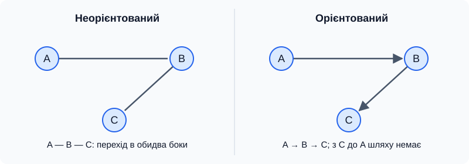
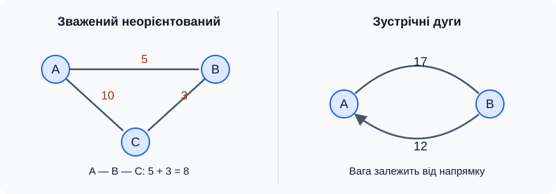
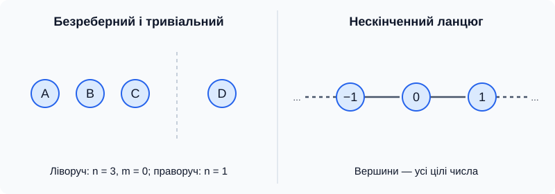
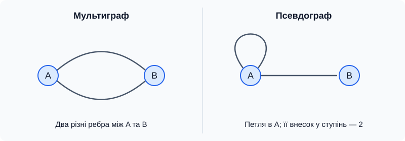
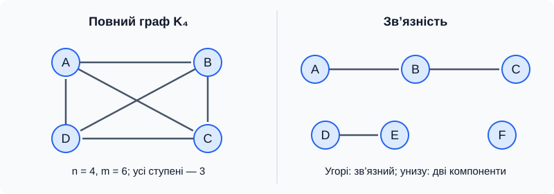
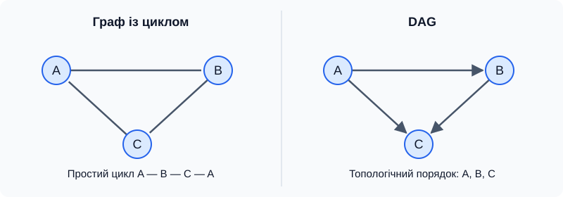
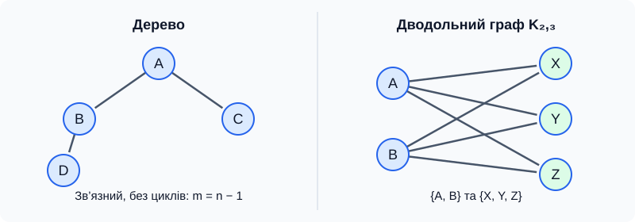
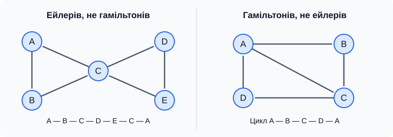
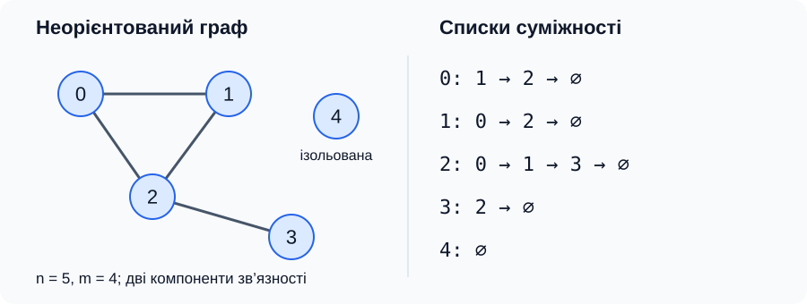

[Перелік лекцій](../README.md)

# Лекція №5. Динамічні структури даних. Графи

**Тема за робочою програмою:** «Динамічні структури. Графи». **Тривалість:** 2 години.

## Мета та очікувані результати

Навчитися моделювати зв’язки графом і вибирати його подання в пам’яті. Після заняття студент має розрізняти види графів, будувати матрицю та списки суміжності, пояснювати DFS і BFS, оцінювати витрати пам’яті та звільняти динамічні вузли у C++.

## Граф як модель зв’язків

**Граф G = (V, E)** складається з множини вершин V та ребер E, що задають зв’язки між ними. Позначимо n — кількість вершин, m — кількість ребер. Вершинами можуть бути міста, а ребрами — дороги. Граф є математичною моделлю: його реалізація може використовувати масиви або динамічні зв’язні структури.

У **неорієнтованому графі** ребро {u, v} дозволяє перехід в обидва боки. В **орієнтованому графі** дуга (u, v) веде від u до v; зворотна дуга може бути відсутня. Дві зустрічні дуги можуть мати різні ваги. **Вага** описує довжину, час або вартість; зваженим може бути граф будь-якої орієнтації.

| Поняття | Значення |
| --- | --- |
| Суміжні вершини | Між ними є ребро |
| Інцидентність | Ребро інцидентне своїм кінцевим вершинам |
| Петля | Ребро, обидва кінці якого збігаються |
| Паралельні ребра | Кілька ребер між тією самою парою вершин |
| Ступінь deg(v) | Кількість кінців неорієнтованих ребер у v; петля дає внесок 2 |
| Півстепені входу й виходу | Кількості дуг, що входять у вершину та виходять із неї |

**Простий граф** не має петель і паралельних ребер. У розділах про подання в пам’яті та у програмі C++ розглядаємо скінченний простий неорієнтований граф; огляд нижче охоплює й інші види.

## Шляхи, зв’язність і різновиди графів

Маршрут — послідовність вершин, сусідні елементи якої сполучені ребрами; для дуг дотримуємося напрямку. Простий шлях не повторює вершин. Довжина шляху — число ребер, його вага — сума ваг ребер. Простий цикл повертається до початкової вершини без інших повторень вершин; у простому неорієнтованому графі він містить щонайменше три ребра.

Неорієнтований граф **зв’язний**, якщо між кожною парою вершин існує шлях. Пряме ребро між кожною парою не потрібне. Максимальні за включенням зв’язні частини — компоненти зв’язності. Ізольована вершина утворює окрему компоненту.

| Вид графа | Умова або властивість |
| --- | --- |
| Повний простий неорієнтований | Кожна пара різних вершин має ребро; m = n(n − 1)/2 |
| Дерево | Непорожній зв’язний неорієнтований граф без циклів; m = n − 1 |
| DAG | Орієнтований граф без орієнтованих циклів; допускає топологічне впорядкування |
| Дводольний | Вершини розбиваються на дві неперетинні частини, ребра йдуть лише між частинами |
| Безреберний | m = 0; може містити ізольовані вершини |

## Види графів та ілюстрації

Класифікації описують різні властивості й не виключають одна одну. Той самий граф може бути одночасно неорієнтованим, зваженим, зв’язним і дводольним. Під час моделювання слід окремо визначити напрямки, ваги, допустимість петель і паралельних ребер.

### Неорієнтований та орієнтований графи

У неорієнтованому графі {A, B} і {B, A} позначають те саме ребро. Наприклад, воно моделює двосторонню дорогу. На лівій частині рисунка 1 можна пройти з A до C через B і повернутися тим самим маршрутом.

В орієнтованому графі (A, B) та (B, A) — різні дуги. На правій частині рисунка є шлях A → B → C, але немає шляху C → A. Така модель підходить для односторонніх доріг, посилань між вебсторінками або залежностей завдань.

*Рисунок 1 — Ребро без стрілки допускає обидва напрямки переходу; дуга має заданий напрямок.*

### Зважений граф і зустрічні дуги

У зваженому графі кожному ребру або дузі призначено числову вагу. На рисунку 2 пряме ребро A–C має вагу 10, а шлях A–B–C — вагу 5 + 3 = 8. Отже, найменша кількість ребер не завжди означає найменшу сумарну вагу. У незваженій моделі всі переходи вважають рівноцінними.

Назву «двонаправлений граф» у попередній версії лекції використано для графа із зустрічними дугами. Тут описуємо його як **орієнтований граф із дугами в обох напрямках**: це точніше визначає модель. На рисунку A → B має вагу 17, B → A — 12. Одне неорієнтоване ребро зі звичайною скалярною вагою такої асиметрії не передає.

*Рисунок 2 — Вага шляху є сумою ваг його ребер; зустрічні дуги можуть мати різну вартість.*

### Скінченний, нескінченний, безреберний і тривіальний графи

**Скінченний граф** має скінченні множини вершин і ребер. Саме такі графи ми явно зберігаємо у масивах і списках. **Нескінченний граф** має нескінченно багато вершин або ребер. Приклад — вершини, позначені всіма цілими числами, з ребрами між сусідніми числами. На рисунку 3 зображено лише фрагмент; пунктир означає продовження. Програма може працювати з обмеженим фрагментом або породжувати сусідів за правилом, але не зберігати весь нескінченний граф явно.

**Безреберний граф** має m = 0. Якщо він містить n > 0 вершин, усі вони ізольовані, а компонент зв’язності n. **Тривіальний граф** складається з однієї вершини без ребер. Його відрізняємо від графа без вершин: V = ∅, E = ∅. Терміни «нульовий» і «порожній» у джерелах неоднозначні, тому в цій лекції завжди уточнюємо, чого саме немає — ребер чи вершин.

*Рисунок 3 — Безреберний граф на трьох вершинах, тривіальний граф та нескінченний ланцюг.*

### Мультиграф і псевдограф

**Мультиграф** дозволяє паралельні ребра: наприклад, два різні автобусні маршрути між тими самими зупинками. Кожне ребро зберігає власну ідентичність, навіть коли кінці збігаються. **Псевдографом** тут називаємо неорієнтований граф, у якому дозволені також петлі. Петля починається і закінчується в одній вершині та додає 2 до її ступеня.

Домовленості щодо цих назв у літературі різняться: іноді мультиграфам також дозволяють петлі. Тому у специфікації програми явно зазначають обидві умови. У прикладі на рисунку 4 ступені вершин мультиграфа дорівнюють 2 і 2; у псевдографі — 3 для A та 1 для B. Булева матриця суміжності не передає кількості паралельних ребер: потрібні лічильники або окремі записи ребер.

*Рисунок 4 — Паралельні ребра та петля є різними властивостями графа.*

### Повний, зв’язний та незв’язний графи

**Повний простий неорієнтований граф Kₙ** має ребро між кожною парою різних вершин. Кожна вершина має ступінь n − 1, а ребер n(n − 1)/2. Ділення на 2 враховує, що пара A, B не відрізняється від B, A. На рисунку 5 граф K₄ має шість ребер. Перетин діагоналей без позначеного вузла не є додатковою вершиною.

**Зв’язність** вимагає шляху, а не безпосереднього ребра між кожною парою. Тому ланцюг A–B–C зв’язний, хоча ребра A–C немає і граф не повний. Граф із ребром D–E та ізольованою F незв’язний і має дві компоненти. Повний граф із n ≥ 1 завжди зв’язний; обернене твердження хибне.

Для орієнтованих графів розрізняють **сильну зв’язність** — кожна вершина досяжна з кожної іншої за напрямками дуг — і **слабку зв’язність**, коли зв’язним є граф після усунення напрямків. Ланцюг A → B → C на рисунку 1 слабко, але не сильно зв’язний.

*Рисунок 5 — Повнота є сильнішою умовою, ніж зв’язність; ізольована вершина утворює компоненту.*

### Граф із циклами, ациклічний граф і DAG

Граф **містить цикл**, якщо можна повернутися до початкової вершини, дотримуючись умов циклу. Трикутник A–B–C–A на рисунку 6 — простий неорієнтований цикл. В ациклічному графі циклів немає. Сам факт можливості пройти ребро туди й назад не утворює простого циклу неорієнтованого графа: ребро тоді повторюється.

**DAG (Directed Acyclic Graph)** — орієнтований граф без орієнтованих циклів. На рисунку дуги A → B, B → C, A → C не дозволяють повернутися до старту, хоча після усунення напрямків утвориться трикутник. Топологічний порядок розміщує початок кожної дуги раніше за її кінець; тут це A, B, C. Для скінченного орієнтованого графа такий порядок існує тоді й лише тоді, коли граф є DAG. Це основа планування завдань із залежностями.

*Рисунок 6 — Наявність циклу в орієнтованому графі залежить від напрямків дуг.*

### Дерево, ліс і дводольний граф

**Дерево** — непорожній зв’язний неорієнтований граф без циклів. Між кожною парою вершин у ньому існує рівно один простий шлях. Дерево з n вершинами має n − 1 ребро. **Ліс** — неорієнтований граф без циклів; кожна його компонента є деревом. Докладніше дерева розглянуто в [лекції №6](../lec-06/README.md).

У **дводольному графі** множину вершин розбивають на дві неперетинні частини так, що кожне ребро сполучає вершини різних частин. Ребер усередині частини немає. Наприклад, одна частина — працівники, друга — завдання; ребро означає можливість виконання завдання працівником. На рисунку 7 кожна вершина {A, B} з’єднана з кожною вершиною {X, Y, Z}: це повний дводольний граф K₂,₃, який має 2 · 3 = 6 ребер. Він не є повним графом K₅.

Неорієнтований граф є дводольним тоді й лише тоді, коли не містить циклів непарної довжини. Зокрема, трикутник не дводольний, а будь-яке дерево — дводольне: вершини можна розділити за парністю відстані від вибраного кореня.

*Рисунок 7 — Дерево та дводольний граф; кольори праворуч позначають дві частини вершин.*

### Ейлерів і гамільтонів графи

**Ейлерів цикл** — замкнений маршрут, який проходить кожне ребро рівно один раз; вершини можуть повторюватися. Тут ейлеровим називаємо граф, що має такий цикл. Для неорієнтованого графа з хоча б одним ребром критерій такий: усі вершини ненульового ступеня належать одній компоненті й мають парні ступені. Самої парності недостатньо: два окремі трикутники неможливо обійти одним маршрутом. Незамкнений ейлерів шлях існує за тієї самої умови зв’язності та рівно двох вершинах непарного ступеня — вони є його кінцями.

На лівій частині рисунка 8 є ейлерів цикл A–B–C–D–E–C–A: усі шість ребер використано по одному разу. Ступінь C дорівнює 4, решти вершин — 2. Такі задачі виникають, коли потрібно пройти кожною дорогою мережі.

**Гамільтонів цикл** проходить через усі вершини рівно по одному разу та повертається до початкової; використання всіх ребер не потрібне. Гамільтонів граф має такий цикл. Гамільтонів шлях відвідує всі вершини без повторень, але не зобов’язаний замикатися: його наявність ще не робить граф гамільтоновим.

Праворуч цикл A–B–C–D–A гамільтонів, хоча діагональ A–C не використано. Ейлерового циклу тут немає, бо A та C мають непарний ступінь 3. Лівий граф, навпаки, не має гамільтонового циклу: для обходу обох трикутників із поверненням довелося б повторно пройти спільну вершину C. Отже, ейлеровість і гамільтоновість — різні властивості.

*Рисунок 8 — Лівий граф ейлерів, але не гамільтонів; правий — гамільтонів, але не ейлерів.*

## Подання графа в пам’яті

Нехай  V = {0, 1, 2, 3, 4}, E = {{0, 1}, {0, 2}, {1, 2}, {2, 3}} . Вершина 4 ізольована, тому компонент дві. Ступені: 2, 2, 3, 1, 0; їх сума 8 = 2m.

*Рисунок 9 — Граф та списки суміжності; кожне ребро записане двічі.*

**Матриця суміжності** A має n × n елементів: A[u][v] = 1 за наявності ребра, інакше 0. Для нашого графа:

| Вершина | 0 | 1 | 2 | 3 | 4 |
| --- | --- | --- | --- | --- | --- |
| 0 | 0 | 1 | 1 | 0 | 0 |
| 1 | 1 | 0 | 1 | 0 | 0 |
| 2 | 1 | 1 | 0 | 1 | 0 |
| 3 | 0 | 0 | 1 | 0 | 0 |
| 4 | 0 | 0 | 0 | 0 | 0 |

Матриця симетрична, діагональ нульова. Для ваг не слід позначати відсутність ребра нулем, якщо нульова вага допустима: потрібна окрема ознака наявності.

**Списки суміжності** зберігають для кожної вершини її сусідів. У зв’язному поданні масив `head` містить адреси перших вузлів, кожен вузол — номер сусіда та адресу наступного вузла. **Список ребер** містить пари кінців, за потреби з вагою; він зручний для перегляду всіх ребер.

| Операція / ресурс | Матриця | Невпорядковані списки суміжності |
| --- | --- | --- |
| Пам’ять | O(n²) | O(n + m) |
| Перевірка ребра (u, v) | O(1) | O(deg(u) + 1) |
| Перелік сусідів u | O(n) | O(deg(u) + 1) |
| Додавання без пошуку дубліката | O(1) | O(1) |

## Обходи DFS і BFS

**DFS, обхід у глибину:** позначити вершину відвіданою, далі рекурсивно обійти кожного ще не відвіданого сусіда. Позначку ставлять до переходів, інакше цикл спричинить повторні виклики. Рекурсію можна замінити явним стеком.

**BFS, обхід у ширину:** позначити початкову вершину та додати її в чергу. Поки черга не порожня, вилучати вершину й додавати її невідвіданих сусідів, позначаючи їх одразу при додаванні. Черга обробляє вершини за неспаданням відстані від старту, тому BFS знаходить найкоротші шляхи за числом ребер у незваженому графі.

За перегляду сусідів у порядку зростання DFS і BFS зі старту 0 тут дають 0, 1, 2, 3. Проте DFS відкриває 2 з вершини 1, а BFS — з вершини 0. Відстані BFS: 0, 1, 1, 2; вершина 4 недосяжна. Інший порядок сусідів може змінити порядок обходу, але не відстані BFS.

Коректність: позначена вершина не відкривається повторно, а всі сусіди кожної відкритої вершини перевіряються. Отже, будуть знайдені всі досяжні вершини. Для всього незв’язного графа запускають обхід із кожної ще не відвіданої вершини. Зі списками суміжності загальний час O(n + m), з матрицею — O(n²); додаткова пам’ять O(n). Для довільних ваг BFS не гарантує мінімальної вартості шляху.

## Приклад C++: динамічні списки суміжності

Програма без введення даних будує граф рисунка 9 та виводить сусідів. `addEdge` відхиляє петлі, дублікати й індекси поза межами. Якщо додати введення, перед викликом слід перевіряти успішність `std::cin >> u >> v`.

[Код прикладу C++: graph-adjacency-list.cpp](src/graph-adjacency-list.cpp)

Очікувані рядки: `0: 2 1`, `1: 2 0`, `2: 3 1 0`, `3: 2`, `4:`. Вставлення на початок змінює порядок сусідів, але зберігає ребра.

`new Node*[n]{}` створює масив нульових покажчиків; `new Node` — окремий вузол. `p->vertex` рівнозначне `(*p).vertex`; `nullptr` не розіменовують. Два вузли ребра приєднуються лише після виділення обох. При відмові `new (std::nothrow)` повертає нульовий покажчик.

Кожному вузлу відповідає `delete`, масиву — `delete[]`. `Node**&` дозволяє обнулити покажчик викликача. Очищення має час O(n + m), додаткову пам’ять O(1); повторний виклик безпечний. Порожній граф можна подати як `n = 0`, `head = nullptr`. Власник передає правильний розмір масиву й не копіює його для незалежного видалення.

## Питання для самоперевірки

1. Чому зв’язний граф не обов’язково повний?
2. Побудуйте списки й матрицю після видалення ребра {2, 3}.
3. Чому ребро має два вузли списків, а дуга потребує одного?
4. Коли BFS знаходить найкоротший шлях? Для чого потрібні позначки?
5. Що станеться при додаванні {0, 1}, {2, 2} або {0, 5} у прикладі?
6. Як програма обробляє ізольовану вершину та повторне очищення?
7. Чим безреберний граф відрізняється від графа без вершин і від тривіального графа?
8. Чому дві зустрічні дуги з різними вагами не можна замінити одним неорієнтованим ребром?
9. Як петля і паралельні ребра впливають на ступені вершин?
10. Чому DAG на рисунку 6 не є деревом після усунення напрямків?
11. Чим повний дводольний граф K₂,₃ відрізняється від повного графа K₅?
12. Відтворіть ейлерів і гамільтонів цикли рисунка 8. Які елементи графа не можна повторювати в кожному випадку?

## Джерела

1. Cormen T. H., Leiserson C. E., Rivest R. L., Stein C. *Introduction to Algorithms*. 4th ed. MIT Press, 2022. Подання графів та базові обходи. [Сторінка видання](https://mitpress.mit.edu/9780262046305/introduction-to-algorithms/).
2. Weiss M. A. *Data Structures and Algorithm Analysis in C++*. Навчальні реалізації структур і алгоритмів. [Матеріали автора до четвертого видання](https://users.cs.fiu.edu/~weiss/dsaa_c++4/code/).
3. Sedgewick R., Wayne K. *Algorithms, 4th Edition*. [4.1. Undirected Graphs](https://algs4.cs.princeton.edu/41graph/). Термінологія, подання, DFS і BFS.
4. Morin P. *Open Data Structures (in C++)*. [12. Graphs](https://opendatastructures.org/ods-cpp/12_Graphs.html). Матриці, списки суміжності та обходи.
5. Demaine E. MIT OpenCourseWare. [Lecture 13: Breadth-First Search (BFS)](https://ocw.mit.edu/courses/6-006-introduction-to-algorithms-fall-2011/resources/lecture-13-breadth-first-search-bfs/). Курс *Introduction to Algorithms*, 2011; пошук у ширину та найкоротші шляхи.
6. Sedgewick R., Wayne K. *Algorithms, 4th Edition*. [4.2. Directed Graphs](https://algs4.cs.princeton.edu/42digraph/). Орієнтовані графи, DAG, топологічний порядок і сильна зв’язність.
7. Weisstein E. W. [Eulerian Graph](https://mathworld.wolfram.com/EulerianGraph.html). *MathWorld — A Wolfram Resource*. Ейлерові графи та умови існування циклу.
8. Weisstein E. W. [Hamiltonian Graph](https://mathworld.wolfram.com/HamiltonianGraph.html). *MathWorld — A Wolfram Resource*. Гамільтонові графи.
9. Weisstein E. W. [Null Graph](https://mathworld.wolfram.com/NullGraph.html). *MathWorld — A Wolfram Resource*. Неоднозначність терміна «нульовий граф».
