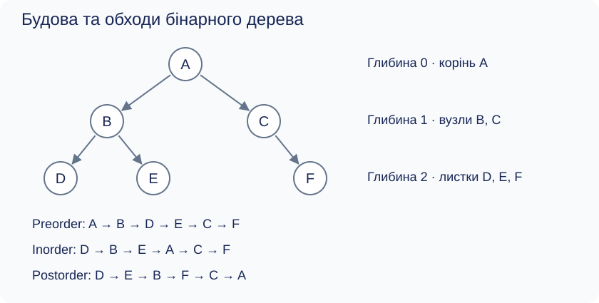
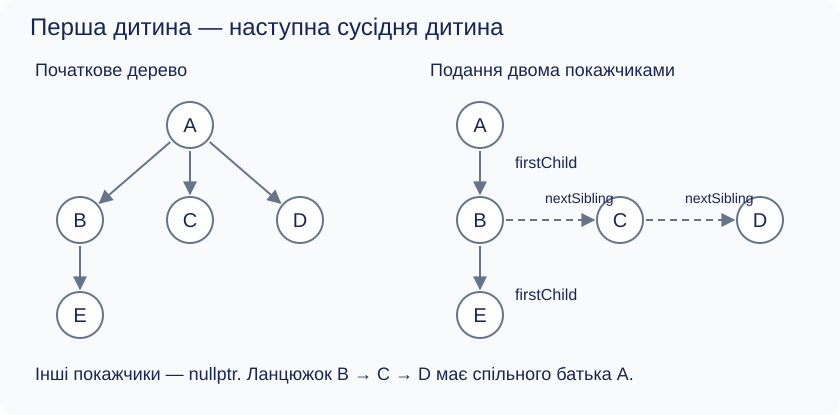

[Перелік лекцій](../README.md)

# Лекція 6. Динамічні структури даних. Дерева

## Мета та результати

Навчитися описувати ієрархічні дані деревом, розрізняти його логічну будову та подання в пам’яті. Після опрацювання лекції студент має пояснювати терміни «корінь», «піддерево», «висота», виконувати три обходи бінарного дерева й безпечно звільняти його вузли в C++.

## Дерево та його елементи

У теорії графів **дерево** — зв’язний неорієнтований граф без циклів. Між будь-якими двома вершинами існує рівно один простий шлях; дерево з n ≥ 1 вершинами має n − 1 ребро. Вибір **кореня** перетворює його на кореневе дерево: зв’язки можна спрямувати від батьків до дітей. У програмі допускаємо також порожнє дерево, корінь якого дорівнює `nullptr`.

Кожен вузол, крім кореня, має одного **батька**. **Предки** — усі вузли на шляху від кореня до нього, без самого вузла; батько є найближчим предком. Діти одного батька — **сусідні діти (siblings)**. **Листок** не має дітей, а **внутрішній вузол** має хоча б одну дитину; корінь також може бути внутрішнім вузлом. Піддерево містить вибраний вузол і всіх його нащадків.

**Глибину** вимірюємо кількістю ребер від кореня: глибина кореня — 0. **Висота** вузла — найбільша кількість ребер від нього до листка, висота дерева — висота кореня. Листок має висоту 0; для порожнього дерева домовимося брати −1. Кількість дітей не слід плутати зі степенем вершини неорієнтованого графа, який у некореневого вузла враховує також ребро до батька.



*Рисунок 1 — Будова дерева та результати обходів. Глибина E дорівнює 2, висота B — 1, висота дерева — 2.*

**Упорядковане кореневе дерево** має визначений порядок дітей кожного вузла. Це не означає сортування значень. **Ліс** — сукупність дерев, які не мають спільних вершин; після вилучення кореня з непорожнього дерева його піддерева утворюють ліс.

## Бінарні дерева та їх різновиди

У **m-арному дереві** вузол має не більше m дітей. У **бінарному (двійковому) дереві** розрізняють дві позиції: ліву та праву. Одна дитина може бути як лівою, так і правою. Обмеження кількості дітей не встановлює жодного порядку значень ключів.

Український термін «повне» в різних джерелах неоднозначний, тому використовуватимемо уточнення:

| Різновид | Точна умова |
| --- | --- |
| Строге (full, proper) | Кожен вузол має 0 або 2 дітей |
| Заповнене зліва (complete) | Усі рівні, крім останнього, заповнені; останній заповнюється зліва без пропусків |
| Досконале (perfect) | Кожен внутрішній вузол має двох дітей, усі листки на одній глибині |

Досконале дерево висоти h містить 2^(h + 1) − 1 вузлів. Довільне бінарне дерево на глибині d має не більше 2^d вузлів. Строге дерево не обов’язково заповнене зліва; заповнене зліва може мати вузол з однією дитиною. На рисунку 1 дерево не є строгим або заповненим зліва: перед F пропущено ліву позицію.

## Подання в пам’яті

Динамічне виділення пам’яті не означає обов’язкової несуміжності елементів: динамічний масив має суміжні комірки. У **зв’язному поданні** вузли виділяють окремо та з’єднують покажчиками. Їхні адреси не обчислюють за порядковим номером. Плата за гнучкість — пам’ять для зв’язків і потенційно гірша локальність доступу.

У бінарного вузла достатньо поля даних і двох покажчиків. Правило «один батько» стосується ребер дерева; кілька змінних можуть містити адресу одного вузла.

Заповнене зліва дерево зручно зберігати в масиві з індексами від 0: діти позиції i мають індекси 2i + 1 та 2i + 2, батько при i > 0 — (i − 1) / 2 з цілочисельним діленням. Дитина існує лише за індексом, меншим за кількість вузлів; при обчисленні індексу слід уникати переповнення типу. Для розрідженого дерева таке подання може марнувати багато комірок.

Довільне дерево можна зберігати списками дітей або двома зв’язками **«перша дитина — наступна сусідня дитина»**. Це можливість, а не обов’язкова умова роботи з m-арними деревами.



*Рисунок 2 — Суцільна стрілка веде до першої дитини, пунктирна — до наступної дитини того самого батька.*

На рисунку 2 `A.firstChild = B`, `B.nextSibling = C`, `C.nextSibling = D`, `B.firstChild = E`. Решта зв’язків порожні. Правий зв’язок тут не веде до довільного сусіда на рівні: діти різних батьків не утворюють спільного ланцюжка. Таке кодування не гарантує ні строгості, ні збалансованості отриманого бінарного подання.

## Обходи дерева

Обхід відвідує кожен вузол рівно один раз. Для порожнього піддерева дія відсутня. У таблиці К — обробка кореня поточного піддерева, Л і П — повний рекурсивний обхід лівого й правого піддерев тим самим способом.

| Обхід | Порядок | Результат для рисунка 1 | Застосування |
| --- | --- | --- | --- |
| Прямий, preorder | К → Л → П | A B D E C F | Копіювання структури |
| Симетричний, inorder | Л → К → П | D B E A C F | Впорядкований вивід ключів BST |
| Зворотний, postorder | Л → П → К | D E B F C A | Видалення піддерев |

Симетричний обхід сортує ключі лише за наявності властивості дерева пошуку. У звичайному дереві пошук значення може вимагати перегляду всіх n вузлів. Вибирати лише одну гілку за порівнянням ключів можна у [двійковому дереві пошуку](../lec-07/README.md).

Обходи мають час O(n) та додаткову пам’ять O(h + 1) для стека викликів. Коректність: піддерева не перетинаються, кожне обходиться повністю, корінь обробляється один раз. Обхід у ширину використовує чергу: після вузла додає його наявних дітей. Час також O(n), пам’ять — O(w), де w — найбільша ширина дерева.

## Приклад C++: обхід і очищення

Програма будує дерево рисунка 1 без введення даних. Результати наведені в таблиці.

```cpp
#include <iostream>
#include <new>

struct Node {
    char value;
    Node* left;
    Node* right;
};

void preorder(const Node* p) {
    if (!p) return;
    std::cout << p->value << ' ';
    preorder(p->left);
    preorder(p->right);
}

void inorder(const Node* p) {
    if (!p) return;
    inorder(p->left);
    std::cout << p->value << ' ';
    inorder(p->right);
}

void postorder(const Node* p) {
    if (!p) return;
    postorder(p->left);
    postorder(p->right);
    std::cout << p->value << ' ';
}

void clear(Node*& p) {
    if (!p) return;
    clear(p->left);
    clear(p->right);
    delete p;
    p = nullptr;
}

int main() {
    Node* root = nullptr;
    try {
        root = new Node{'A', nullptr, nullptr};
        root->left = new Node{'B', nullptr, nullptr};
        root->right = new Node{'C', nullptr, nullptr};
        root->left->left = new Node{'D', nullptr, nullptr};
        root->left->right = new Node{'E', nullptr, nullptr};
        root->right->right = new Node{'F', nullptr, nullptr};
    } catch (const std::bad_alloc&) {
        clear(root);
        std::cerr << "Allocation failed\n";
        return 1;
    }
    preorder(root); std::cout << '\n';
    inorder(root); std::cout << '\n';
    postorder(root); std::cout << '\n';
    clear(root);
    clear(root); // Повторне очищення порожнього дерева безпечне.
}
```

`new Node` створює один вузол і повертає його адресу; `p->value` означає доступ до поля через покажчик, тобто `(*p).value`. `nullptr` позначає відсутність вузла, його не розіменовують. `Node*&` дозволяє змінити сам покажчик викликача. Кожному успішному `new` відповідає один `delete`; `delete[]` тут не підходить, бо масиви не виділялися.

Батька видаляють після дітей, інакше адреси піддерев можна втратити. Після `clear` сторонні копії адрес вузлів стали б невалідними. Алгоритм передбачає дерево без циклів і спільних піддерев. Для дуже високих дерев рекурсія може вичерпати стек; навчальний приклад навмисно малий.

## Питання для самоперевірки

1. Чим висота відрізняється від глибини?
2. Чи кожна динамічна структура є зв’язною?
3. Чи кожне строге дерево заповнене зліва?
4. Куди веде `nextSibling`?
5. Відтворіть обходи без вузла F.
6. Що виведуть обходи для порожнього дерева та одного вузла?
7. Чому очищення має порядок postorder?

## Джерела

1. Cormen T. H., Leiserson C. E., Rivest R. L., Stein C. *Introduction to Algorithms*. 4th ed. MIT Press, 2022. Подання кореневих дерев. [Сторінка видання](https://mitpress.mit.edu/9780262046305/introduction-to-algorithms/).
2. Knuth D. E. *The Art of Computer Programming. Vol. 1: Fundamental Algorithms*. 3rd ed. Addison-Wesley, 1997. Дерева та зв’язні структури. [Сторінка автора](https://www-cs-faculty.stanford.edu/~knuth/taocp.html).
3. Morin P. *Open Data Structures (in C++)*. [6.1. A Basic Binary Tree](https://opendatastructures.org/ods-cpp/6_1_Basic_Binary_Tree.html). Подання, рекурсія, обходи.
4. Carnegie Mellon University. [Tree Data Structure](https://www.cs.cmu.edu/~clo/www/CMU/DataStructures/Lessons/lesson4_1.htm). Термінологія й подання «перша дитина — наступна сусідня дитина».
5. Sedgewick R., Wayne K. *Algorithms, 4th Edition*. [3.2. Binary Search Trees](https://algs4.cs.princeton.edu/32bst/). Відмінність дерева пошуку від довільного бінарного дерева.
