[Перелік лекцій](../README.md)

# Лекція 6. Динамічні структури даних. Дерева

## Мета та результати

Навчитися описувати ієрархічні дані деревом, розрізняти його логічну будову та подання в пам’яті. Після опрацювання лекції студент має пояснювати терміни «корінь», «піддерево», «висота», порівнювати форми бінарних дерев та інваріанти спеціалізованих дерев, обирати різновид відповідно до задачі, виконувати обходи й безпечно звільняти вузли в C++. Це навчальні цілі заняття, а не додаткові офіційні результати робочої програми.

## Для чого потрібні дерева

Масив описує послідовність, а дерево — ієрархію. Наприклад, каталог містить підкаталоги й файли, розділ документа — підрозділи, синтаксична конструкція — вкладені вирази. Дерево дозволяє працювати з цілим піддеревом як з окремою частиною: обчислити його розмір, скопіювати або вилучити. Вибір структури починають із питання про зв’язки між даними та потрібні операції.

Один і той самий рисунок може представляти різні задачі. Якщо вузли — каталоги, ребро означає вкладення; якщо вузли — рішення, ребро означає перехід за відповіддю; якщо вузли — ключі, потрібне додаткове правило їх розміщення. Геометрична форма сама по собі не визначає алгоритм пошуку.

Дерево відрізняється від довільного графа відсутністю циклів і єдиністю шляху. Якщо два каталоги посилаються на спільний об’єкт, усю систему посилань уже не можна без перевірки вважати деревом. Це суттєво для рекурсивного обходу й видалення: спільний об’єкт не можна звільняти двічі.

## Дерево та його елементи

У теорії графів **дерево** — зв’язний неорієнтований граф без циклів. Між будь-якими двома вершинами існує рівно один простий шлях; дерево з n ≥ 1 вершинами має n − 1 ребро. Вибір **кореня** перетворює його на кореневе дерево: зв’язки можна спрямувати від батьків до дітей. У програмі допускаємо також порожнє дерево, корінь якого дорівнює `nullptr`.

Кожен вузол, крім кореня, має одного **батька**. **Предки** — усі вузли на шляху від кореня до нього, без самого вузла; батько є найближчим предком. Діти одного батька — **сусідні діти (siblings)**. **Листок** не має дітей, а **внутрішній вузол** має хоча б одну дитину; корінь також може бути внутрішнім вузлом. Піддерево містить вибраний вузол і всіх його нащадків.

**Глибину** вимірюємо кількістю ребер від кореня: глибина кореня — 0. **Висота** вузла — найбільша кількість ребер від нього до листка, висота дерева — висота кореня. Листок має висоту 0; для порожнього дерева домовимося брати −1. Кількість дітей не слід плутати зі степенем вершини неорієнтованого графа, який у некореневого вузла враховує також ребро до батька.

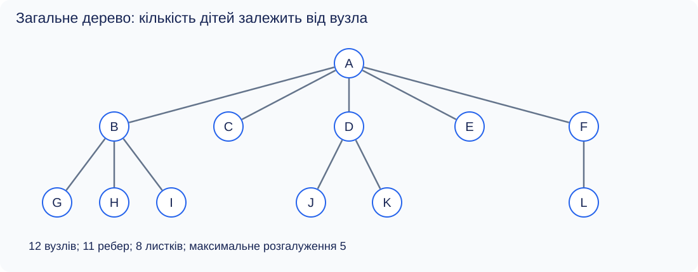

*Рисунок 1 — Загальне кореневе дерево: A має п’ять дітей, B — три, D — дві, F — одну. Глибина G дорівнює 2, висота B — 1, висота дерева — 2.*

**Упорядковане кореневе дерево** має визначений порядок дітей кожного вузла. Це не означає сортування значень. **Ліс** — сукупність дерев, які не мають спільних вершин; після вилучення кореня з непорожнього дерева його піддерева утворюють ліс.

### Властивості та рекурсивна будова

Для непорожнього дерева еквівалентні такі характеристики: зв’язність і відсутність циклів; єдиний простий шлях між кожною парою вершин; зв’язність і рівно n − 1 ребро. Самої кількості ребер недостатньо: незв’язний граф може мати n − 1 ребро та містити цикл. Вилучення будь-якого ребра дерева розділяє його на дві компоненти, а додавання ребра між різними його вершинами утворює один цикл.

Кореневе дерево можна визначити рекурсивно: це корінь і набір його піддерев. Кожне піддерево має таку саму будову, тому алгоритм для всього дерева природно складається з алгоритмів для дітей. Порожнє дерево є базовим випадком у програмі; у графовому означенні дерева зазвичай розглядають непорожні графи.

**Ширина рівня** — кількість вузлів на певній глибині; найбільшу ширину дерева позначимо w. Висота характеризує найдовший шлях, ширина — кількість вузлів, які обхід у ширину може одночасно очікувати в черзі. Дерева з однаковою кількістю вузлів можуть мати зовсім різні висоту й ширину.

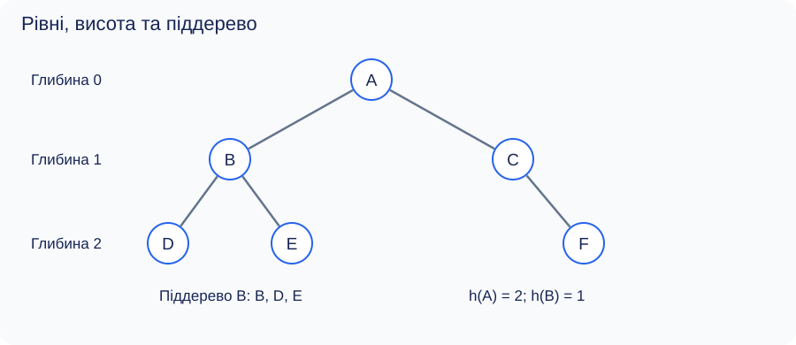

*Рисунок 2 — Глибина рахується від кореня, висота — до найвіддаленішого листка. Піддерево B містить B, G, H та I.*

## Загальні дерева та дерева з великим розгалуженням

### Кількість дітей і порядок піддерев

У **загальному кореневому дереві** кількість дітей не обмежують наперед однаковою сталою для всіх вузлів. Конкретне скінченне дерево завжди має найбільшу кількість дітей, але це характеристика цього дерева, а не обов’язкове обмеження моделі. Вузол може мати одну, три, десять або сотні дітей. У рисунку 1 максимальна кількість дітей дорівнює 5, проте інші внутрішні вузли мають 3, 2 та 1 дитину.

**Степенем розгалуження вузла** тут називатимемо кількість його дітей, а максимальним розгалуженням дерева — найбільше з цих чисел. У графовій термінології степінь некореневої вершини додатково враховує ребро до батька. Для B у рисунку 1 ці величини дорівнюють відповідно 3 та 4. У листка кількість дітей 0, а графовий степінь зазвичай 1; дерево з єдиного кореня є винятком.

Належність до одного рівня не робить вузли дітьми одного батька. G, H, I — діти B, а J, K — діти D. Зв’язок «наступна сусідня дитина» має залишатися всередині конкретного набору дітей. Піддерево містить усіх нащадків вибраного вузла, а не довільно виділений фрагмент рисунка.

У **впорядкованому дереві** кожний вузол має визначену послідовність дітей. Для розділів документа порядок важливий: «Вступ, Теорія, Приклади» відрізняється від «Приклади, Вступ, Теорія». У невпорядкованій моделі набору підрозділів організації перестановка дітей на рисунку не змінює підпорядкування. Упорядкованість піддерев не означає впорядкованості ключів за величиною.

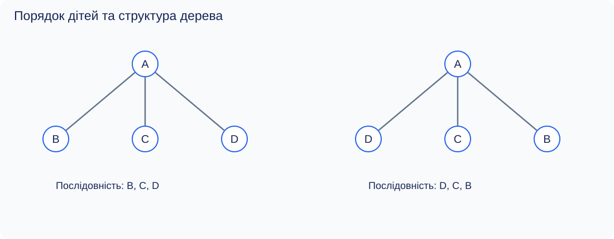

*Рисунок 3 — Перестановка B та D змінює впорядковане дерево; для невпорядкованого дерева це два зображення тієї самої структури.*

### m-арні дерева та їхні форми

**m-арне дерево** допускає не більше m дітей у вузла. Для m = 3 воно трійкове, для m = 4 — четвіркове. Загальне дерево рисунка 1 можна розглядати як 5-арне, якщо запровадити саме таку верхню межу. Термін «багатошляхове» підкреслює можливість більш ніж двох напрямків переходу; для дерева пошуку додатково потрібні правила вибору напрямку.

Треба визначити, чи мають діти фіксовані позиції. У позиційному трійковому дереві «перша дитина відсутня, друга є» відрізняється від «перша є, друга відсутня». У загальному впорядкованому дереві зберігають послідовність наявних дітей без обов’язкових порожніх місць. Ця відмінність впливає на масив покажчиків та індекси дітей.

**Строге m-арне дерево** має в кожного вузла 0 або рівно m дітей. **Досконале m-арне дерево** є строгим, і всі його листки лежать на одній глибині. Для позиційного m-арного дерева можна також визначити **заповнення зліва**: усі попередні рівні заповнені, а позиції останнього займаються послідовно без пропусків. Довільна ієрархія каталогів цих вимог зазвичай не дотримується.

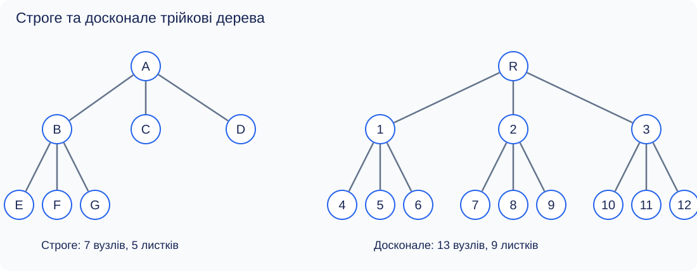

*Рисунок 4 — В обох дерев внутрішні вузли мають по три дитини. Ліве строге, але не досконале; праве досконале та має 13 вузлів.*

Для m ≥ 2 на глибині d є не більше m^d вузлів. Досконале m-арне дерево висоти h містить n = 1 + m + … + m^h = (m^(h + 1) − 1)/(m − 1) вузлів та L = m^h листків. Для строгого m-арного дерева з I внутрішніми вузлами маємо mI = n − 1, а отже L = (m − 1)I + 1. Ці формули потребують зазначених умов; сама наявність вузла з багатьма дітьми їх не забезпечує.

### Що змінює сильне розгалуження

За однакової кількості вузлів більше розгалуження дозволяє отримати меншу висоту. Досконале трійкове дерево висоти 2 містить 13 вузлів; бінарне дерево такої висоти — лише 7. Проте загальне дерево з дозволеними десятьма дітьми може залишитися ланцюжком: верхня межа розгалуження не змушує вузли її використовувати. Для коротких шляхів потрібні також вимоги до заповнення або балансування.

Зменшення висоти не означає автоматичного прискорення будь-якої операції. Щоб знайти потрібну дитину за назвою у невпорядкованому списку з k дітей, може знадобитися O(k) порівнянь. У багатошляховому дереві пошуку напрямок визначають за розділювачами ключів; у trie — за символом. Загальна ієрархія без таких правил може вимагати обходу всіх n вузлів, навіть за висоти 1.

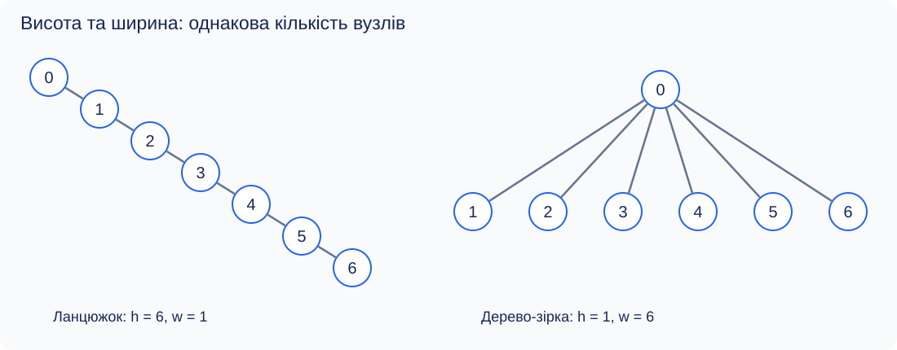

*Рисунок 5 — Обидва дерева мають 7 вузлів. Ланцюжок має h = 6, w = 1; дерево-зірка — h = 1, w = 6.*

Сильне розгалуження зменшує довжину шляхів, але збільшує можливу ширину й обсяг черги BFS. У дереві-зірці після обробки кореня в черзі опиняються всі n − 1 дітей. Для рекурсивного DFS глибина стека мала, якщо дітей обробляють послідовно. Самі вузли та всі зв’язки дерева потребують O(n) пам’яті незалежно від форми.

## Подання загального дерева в пам’яті

### Масиви покажчиків і списки дітей

У вузлі загального дерева зберігають дані та набір адрес дітей. Для фіксованого невеликого m можна мати m полів або масив із m покажчиків; порожні позиції дорівнюють `nullptr`. Це дає доступ до заданої позиції за O(1), але резервує місця навіть у листках. Якщо m велике, більшість полів можуть залишатися порожніми.

Інший варіант — **динамічний масив адрес наявних дітей** із кількістю та місткістю. Самі вузли виділяють окремо, а масив містить лише покажчики на них. Доступ за коректним індексом O(1); вставлення між дітьми потребує зсувів O(k). Зростання місткості може вимагати нового масиву та копіювання адрес. Для масиву покажчиків `new Node*[capacity]` має парний `delete[]`; кожному окремому `new Node` відповідає `delete`. Звільнення масиву адрес не звільняє вузли, на які він указує.

**Зв’язний список дітей** зберігає адреси дітей у послідовності елементів списку. Додавання після відомого елемента O(1), але пошук i-ї дитини O(k) у найгіршому випадку. На кожний зв’язок потрібен елемент списку; кількість таких зв’язків у дереві n − 1. Слід розрізняти службовий елемент списку й сам вузол дерева, щоб правильно звільняти обидва типи об’єктів.

*Рисунок 6 — Масив і список описують один набір дітей A. Комірки містять адреси вузлів B–F; самі вузли дерева існують окремо.*

| Подання дітей вузла з k дітьми | Доступ до i-ї дитини | Додавання | Особливість |
| --- | --- | --- | --- |
| m фіксованих позицій | O(1) | O(1) у відому вільну позицію | Резервується m покажчиків у вузлі |
| Динамічний масив наявних адрес | O(1) | У кінець O(k) при перевиділенні; амортизовано O(1) за геометричного зростання | Зсуви при вставленні всередину |
| Однозв’язний список дітей | O(k) | O(1) після відомого елемента | Потрібні додаткові елементи списку |
| Перша дитина — наступна сусідня дитина | O(k) | O(1) після відомої дитини | Два покажчики в кожному вузлі дерева |

### Перша дитина — наступна сусідня дитина

Це подання загального впорядкованого дерева використовує два поля: `firstChild` указує на першу дитину, `nextSibling` — на наступну дитину того самого батька. Кількість дітей при цьому не обмежена двома. Щоб перелічити дітей A, переходять до `A.firstChild`, а далі — вздовж `nextSibling` до `nullptr`.

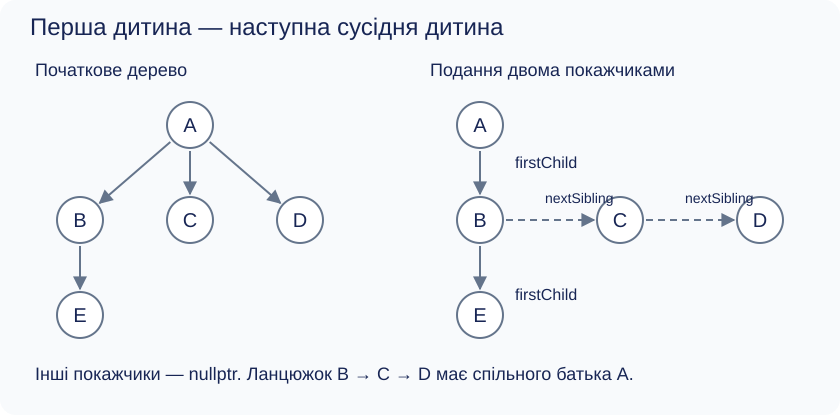

*Рисунок 7 — Суцільна стрілка веде до першої дитини, пунктирна — до наступної дитини того самого батька. Три дитини A кодуються двома типами зв’язків.*

На рисунку 7 `A.firstChild = B`, `B.nextSibling = C`, `C.nextSibling = D`, `B.firstChild = E`. Решта зв’язків порожні. C не є дитиною B, хоча B містить його адресу. Тому висота вихідного дерева визначається переходами до дітей, а не довжиною будь-якого ланцюжка покажчиків. Якщо механічно трактувати обидва поля як ліву й праву дитину, отримаємо інше бінарне кодування з іншими глибинами.

Для додавання в кінець набору дітей без покажчика на останню дитину треба пройти весь ланцюжок, тобто витратити O(k). Вилучення дитини потребує зміни зв’язку попередньої дитини або `firstChild` батька. Вузол вилученої дитини може мати власне піддерево: його необхідно або переприєднати за визначеним правилом, або повністю звільнити.

### Масив батьків і ліс

Для незмінної або індексованої ієрархії можна зберігати масив `parent`: для кожного вузла відомий індекс батька, а корінь має спеціальну позначку, наприклад −1 у відповідному знаковому типі. У рисунку 1 порядок A, B, C, D, E, F, G, H, I, J, K, L дає масив [−1, 0, 0, 0, 0, 0, 1, 1, 1, 3, 3, 5]. Це компактне подання зв’язків із пам’яттю O(n).

Рух до батька виконується за O(1), але без додаткового індексу пошук усіх дітей вузла потребує перегляду масиву за O(n). Не можна багаторазово застосовувати такий перегляд і оголошувати весь обхід лінійним: для n вузлів це може дати O(n²). Перевірка коректності включає допустимість індексів, рівно один корінь і відсутність циклів у ланцюжках батьків. Кілька коренів можуть представляти ліс.

Після вилучення A з рисунка 1 залишаються п’ять дерев із коренями B, C, D, E, F. Для обходу лісу можна обробляти кожен корінь окремо або додати службовий корінь. Службовий вузол змінює глибини й загальну кількість вузлів, тому його не слід непомітно включати в характеристики предметної ієрархії.

## Обходи загального дерева

### Прямий і зворотний обходи

Нехай діти впорядковані зліва направо, як у рисунку 1. **Прямий обхід (preorder)** спочатку обробляє поточний вузол, потім послідовно виконує прямий обхід кожного його піддерева. **Зворотний обхід (postorder)** спочатку повністю обходить усі піддерева в тому самому порядку, а потім обробляє вузол. Це означення працює для будь-якої кількості дітей.

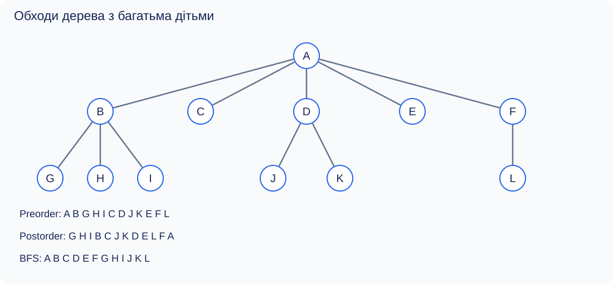

*Рисунок 8 — Порядок дітей зліва направо визначає порядок обходів. Літери відповідають загальному дереву рисунка 1.*

| Обхід | Послідовність для рисунка 1 | Приклад задачі |
| --- | --- | --- |
| Прямий | A B G H I C D J K E F L | Виведення заголовка каталогу перед його вмістом |
| Зворотний | G H I B C J K D E L F A | Підрахунок підсумків і звільнення вузлів після дітей |
| У ширину | A B C D E F G H I J K L | Перегляд ієрархії за рівнями |

Для загального дерева немає одного загальноприйнятого симетричного обходу, аналогічного «ліве піддерево — корінь — праве піддерево». Можна домовитися обробляти корінь між певними дітьми, але таку домовленість треба зазначити окремо. Прямий та зворотний обходи такого уточнення не потребують.

Коректність ґрунтується на тому, що піддерева дітей не перетинаються. Кожне з них обробляється рівно один раз, а поточний вузол — один раз до або після дітей. За подання, яке дозволяє послідовно перелічити дітей, кожен вузол і кожен зв’язок переглядаються сталу кількість разів: час O(n). Рекурсивний стек має O(h + 1) кадрів, якщо дітей обробляють циклом, а рекурсію використовують лише для переходу в піддерево.

Для подання `firstChild`/`nextSibling` рекурсивний виклик для кожного наступного сусіда може створити стек довжини O(n), навіть у дереві висоти 1. Щоб зберегти оцінку O(h + 1), у межах одного вузла дітей перебирають циклом уздовж `nextSibling`, а рекурсивно обходять кожну дитину. Структура алгоритму має значення так само, як структура даних.

### Обхід у ширину, розмір і очищення

Для **BFS** корінь додають у чергу; далі вилучають перший вузол, обробляють його й додають у кінець усіх його дітей. Інваріант: черга містить відкриті, але ще не оброблені вузли в порядку неспадання глибини. Вузол G не може випередити C, бо C уже додано під час обробки A, а G з’являється лише під час обробки B. Час O(n), пам’ять черги O(w).

Розмір піддерева дорівнює 1 плюс сумі розмірів усіх дочірніх піддерев. Для листка висота 0; для внутрішнього вузла — 1 плюс найбільша висота дитини. Кількість листків дорівнює 1 у листку та сумі результатів дітей у внутрішнього вузла. Порожнє дерево має розмір і кількість листків 0, висоту −1 за нашою домовленістю. Для рисунка 1 результат: 12 вузлів, 8 листків, висота 2.

Очищення має зворотний порядок: спочатку всі діти, потім службова пам’ять набору дітей і сам вузол. У поданні з `nextSibling` адресу наступної дитини зберігають до звільнення поточної, інакше прочитати її вже не можна. Піддерево однієї дитини не включає її наступних сусідів; функція видалення має чітко розрізняти очищення піддерева та цілого ланцюжка дерев.

Для порожньої структури обходи нічого не виводять. Для одного кореня всі означені обходи збігаються. При пошуку дитини за індексом перевіряють межі; при введенні кількості дітей — коректність числа й допустимий розмір виділення. Цикли, спільні дочірні вузли й невалідні адреси порушують модель дерева та роблять звичайне рекурсивне очищення небезпечним.

## Приклади дерев із великим розгалуженням

Каталог може містити багато файлів і підкаталогів; розгалуження кожного вузла визначається його вмістом. У змісті документа кількість підрозділів довільна, але порядок дітей суттєвий. У дереві класифікації дочірні вузли представляють підкатегорії, які можуть розгалужуватися нерівномірно. Для цих моделей природний загальний вузол із набором дітей.

У префіксному дереві число можливих напрямків залежить від алфавіту: для десяткових цифр до десяти, для інших символів — інше число. У B-дереві вузол містить багато розділювачів і має кілька дочірніх піддерев; велике розгалуження зменшує кількість переходів між блоками пам’яті. Ці спеціалізовані дерева розглянемо нижче: їхні правила пошуку доповнюють загальну ієрархічну будову.

Бінарне дерево — важливий окремий випадок m-арного дерева при m = 2. Воно зручне для вивчення рекурсії та пошуку, але обмеження двома дітьми не є загальною властивістю дерев.

## Бінарні дерева та їх різновиди

У **бінарному (двійковому) дереві** розрізняють дві позиції: ліву та праву. Одна дитина може бути як лівою, так і правою. Обмеження кількості дітей не встановлює жодного порядку значень ключів.

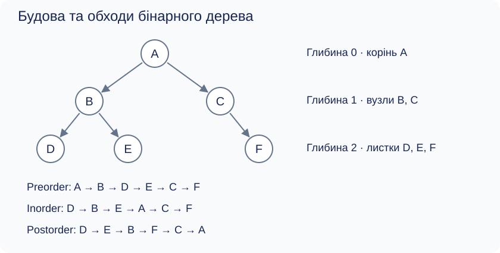

*Рисунок 9 — Будова дерева та результати обходів. Глибина E дорівнює 2, висота B — 1, висота дерева — 2.*

Український термін «повне» в різних джерелах неоднозначний, тому використовуватимемо уточнення:

| Різновид | Точна умова |
| --- | --- |
| Строге (full, proper) | Кожен вузол має 0 або 2 дітей |
| Заповнене зліва (complete) | Усі рівні, крім останнього, заповнені; останній заповнюється зліва без пропусків |
| Досконале (perfect) | Кожен внутрішній вузол має двох дітей, усі листки на одній глибині |

Досконале дерево висоти h містить 2^(h + 1) − 1 вузлів. Довільне бінарне дерево на глибині d має не більше 2^d вузлів. Строге дерево не обов’язково заповнене зліва; заповнене зліва може мати вузол з однією дитиною. На рисунку 9 дерево не є строгим або заповненим зліва: перед F пропущено ліву позицію.

### Форма дерева та межі висоти

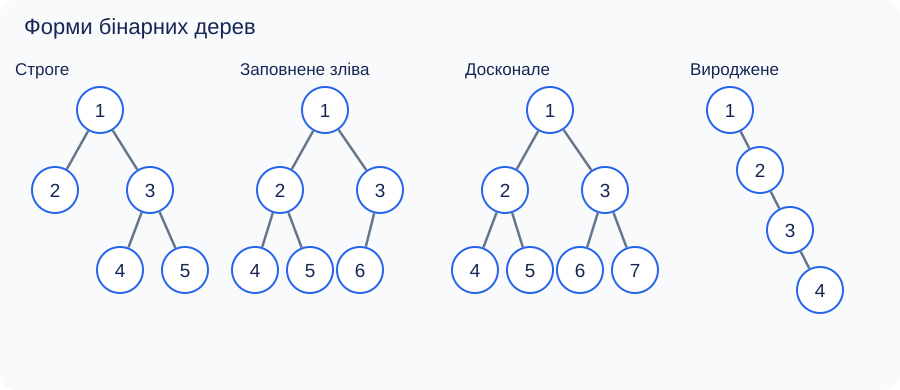

*Рисунок 10 — Чотири форми бінарних дерев. Строге дерево ліворуч має листки на різних рівнях; заповнене зліва має одну дитину в останнього внутрішнього вузла.*

**Вироджене дерево** має форму ланцюжка: кожен внутрішній вузол має лише одну дитину. Для n вузлів його висота n − 1, тож перевага коротких шляхів зникає. У бінарному дереві найменша можлива висота для заданого n ≥ 1 становить ⌈log₂(n + 1)⌉ − 1, найбільша — n − 1. Формула нижньої межі випливає з обмеження n ≤ 2^(h + 1) − 1.

Для строгого бінарного дерева кількість листків L на одиницю більша за кількість внутрішніх вузлів I: L = I + 1. Кожен внутрішній вузол дає два ребра, тому 2I = n − 1 = I + L − 1. Для досконалого дерева L = 2^h, n = 2^(h + 1) − 1. Ці формули не можна переносити на довільне бінарне дерево.

**Збалансованість** потребує точного критерію. Загалом прагнуть підтримувати висоту O(log n), але це не означає однакову кількість вузлів ліворуч і праворуч. Досконала форма є сильнішою вимогою, ніж потрібна для швидкого пошуку. Навіть коротке дерево не забезпечує швидкого пошуку довільного значення без інваріанта ключів.

## Дерева з додатковими інваріантами

### Двійкове дерево пошуку та самобалансовані дерева

У **BST (binary search tree)** для кожного вузла всі ключі лівого піддерева менші за його ключ, а правого — більші, якщо прийнято політику унікальних ключів. Для повторень треба окремо визначити правило. Умова поширюється на цілі піддерева. Пошук порівнює ключ з поточним вузлом і відкидає одну гілку; його час O(h + 1). Звичайне BST може виродитися після вставлення відсортованих ключів.

**AVL-дерево** — BST, у якому для кожного вузла висоти лівого й правого піддерев відрізняються не більше ніж на 1. Баланс-фактор можна визначити як h(ліве) − h(праве); допустимі значення −1, 0, 1. Після зміни дерева висоти оновлюють уздовж шляху до кореня, а порушення виправляють поворотами. Локальна умова AVL забезпечує логарифмічну висоту.

**Червоно-чорне дерево** також є BST, але зберігає колір вузлів. У звичайному формулюванні корінь чорний, порожні зовнішні листки вважають чорними, червоний вузол не має червоної дитини, а всі шляхи від вузла до порожніх листків мають однакову кількість чорних вузлів. Це обмежує висоту величиною O(log n). Баланс відновлюють перефарбуванням і поворотами; на рисунках нижче показано саме поворот, а не повну процедуру балансування.

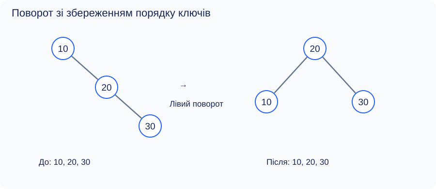

*Рисунок 11 — Лівий поворот змінює зв’язки, але зберігає порядок ключів у симетричному обході: 10, 20, 30.*

Поворот не сортує ключі й не створює нових вузлів: він перебудовує кілька покажчиків. Для загального випадку треба також переприєднати проміжне піддерево й оновити корінь зміненої частини. AVL та червоно-чорні дерева гарантують O(log n) для пошуку, вставлення й видалення; реалізація потребує збереження відповідного інваріанта. Основні операції звичайного BST розглянуто в [лекції 7](../lec-07/README.md).

### Двійкова купа

**Двійкова купа (binary heap)** має форму дерева, заповненого зліва. У мінімальній купі ключ батька не більший за ключі дітей; у максимальній — не менший. Мінімум мінімальної купи доступний у корені за O(1). Вставлення та вилучення мінімуму займають O(log n): елемент переміщують угору або вниз, відновлюючи локальну умову. Побудова купи з масиву знизу вгору має час O(n).

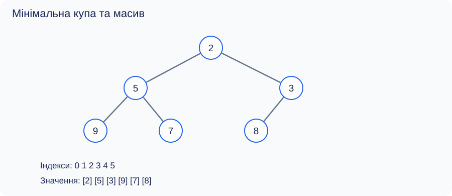

*Рисунок 12 — Мінімальна купа та масив [2, 5, 3, 9, 7, 8]. Правий нащадок 3 менший за лівого 5: це дозволено інваріантом купи.*

Купа не є BST: вона не встановлює порядок між піддеревами. Пошук довільного ключа у звичайній купі в найгіршому випадку O(n). Її застосовують для черги з пріоритетом, коли потрібен найменший або найбільший елемент, а не пошук за будь-яким ключем. Через заповнення зліва масивне подання не має пропусків.

### Багатошляхові дерева: 2–3, B та B+

У **2–3 дереві** внутрішній вузол містить один ключ і дві дитини або два впорядковані ключі й три дитини. Ключі розділяють допустимі діапазони піддерев, а всі листки лежать на одній глибині. Переповнений вузол розщеплюють із підняттям розділювача до батька. Така організація підтримує логарифмічну висоту.

**B-дерево** узагальнює багатошляховий пошук: вузол зберігає кілька відсортованих ключів, внутрішній вузол із k ключами має k + 1 дітей, усі листки — на одному рівні. Для мінімального степеня t ≥ 2 некореневий вузол містить від t − 1 до 2t − 1 ключів; корінь має окремі нижні межі. Це одна з домовленостей; термін «порядок B-дерева» в джерелах може позначати інший параметр.

Великий вузол можна узгодити з блоком зовнішньої пам’яті. Більше розгалуження скорочує кількість читань блоків уздовж шляху. Складність треба оцінювати з урахуванням пошуку ключа всередині вузла, а не лише висоти; за фіксованого t базові операції мають час O(log n).

У **B+ дереві** внутрішні вузли містять розділювачі й посилання на дітей, а записи або посилання на записи зосереджені в листках. Листки зазвичай з’єднані для послідовного перегляду діапазону. Значення розділювача може повторювати ключ листка: воно спрямовує пошук, а не є окремим записом.

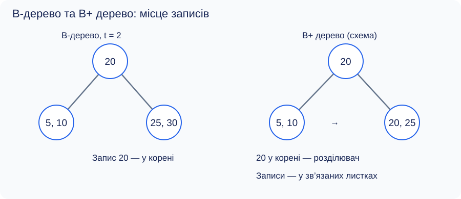

*Рисунок 13 — У B-дереві ключ 20 зберігається в корені; у схематичному B+ дереві запис 20 належить правому листку, а корінь містить його копію як розділювач.*

### Префіксні дерева

**Префіксне дерево (trie)** зберігає рядки через спільні префікси: ребро відповідає символу, шлях від кореня — префіксу. Кінець слова позначають окремо, бо слово може бути префіксом іншого. Наприклад, після вставлення `car`, `cat`, `cart` шлях `c → a` спільний, а вузол `r` є кінцем `car` і водночас має дитину `t` для `cart`.

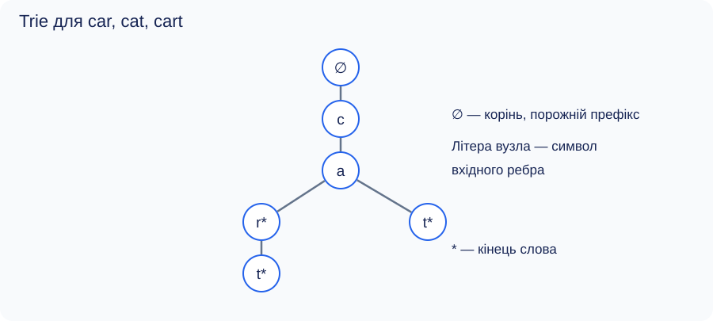

*Рисунок 14 — Зірочка позначає кінець слова. Наявність шляху до вузла a не означає, що ca збережено як слово.*

Пошук рядка довжини L займає O(L), якщо перехід за символом виконується за O(1). Для списку дітей або іншого способу пошуку ребра ця оцінка змінюється. Масив переходів забезпечує простий доступ, але може витрачати багато пам’яті для великого алфавіту. У стисненому префіксному дереві ланцюжки без розгалужень замінюють ребрами, підписаними фрагментами рядка. Trie корисне для автодоповнення й пошуку за префіксом.

### Дерева виразів і рішень

У **дереві виразу** листки містять операнди, внутрішні вузли — операції. Для `(a + b) * c` корінь — множення, його ліва дитина — додавання, права — c. Зворотний обхід обчислює операнди до операції; для правильного відтворення інфіксного запису потрібні дужки або правила пріоритетів. Кількість дітей визначається арністю операції: унарний мінус має одну дитину.

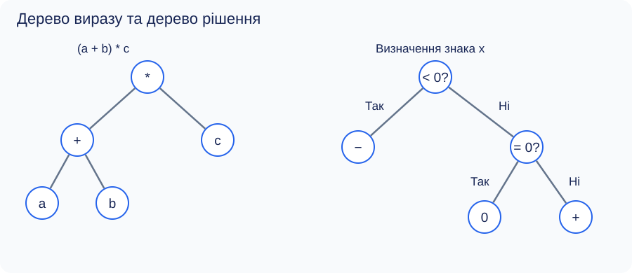

*Рисунок 15 — Дерево виразу задає порядок обчислень; дерево рішення задає переходи за результатами умов.*

У **дереві рішень** внутрішній вузол ставить питання, ребра відповідають можливим результатам, листок містить рішення. Для визначення знака числа спочатку перевіряють x < 0; якщо ні — x = 0. Вартість одного рішення залежить від довжини пройденого шляху та вартості умов. Дерева виразів і рішень класифікують за змістом вузлів, а не за правилом пошуку ключів.

| Задача | Доречний різновид | Основне правило |
| --- | --- | --- |
| Ієрархія каталогів | Загальне кореневе дерево | Один батько в моделі вкладення |
| Пошук і впорядкований перегляд ключів | BST, AVL, червоно-чорне | Діапазони ключів у піддеревах |
| Отримання елемента з найвищим пріоритетом | Купа | Порядок батька та дітей |
| Індекс із блочним доступом | B/B+ дерево | Багато ключів у вузлі, одна глибина листків |
| Пошук слів за префіксом | Trie | Символи або фрагменти на ребрах |
| Обчислення вкладених операцій | Дерево виразу | Арність і значення операцій |

Ці категорії можуть перетинатися. AVL є і бінарним деревом, і BST, і збалансованим деревом; купа є бінарною та заповненою зліва. Назва спеціалізованої структури означає сукупність вимог, які треба перевіряти окремо.

## Подання в пам’яті

Динамічне виділення пам’яті не означає обов’язкової несуміжності елементів: динамічний масив має суміжні комірки. У **зв’язному поданні** вузли виділяють окремо та з’єднують покажчиками. Їхні адреси не обчислюють за порядковим номером. Плата за гнучкість — пам’ять для зв’язків і потенційно гірша локальність доступу.

У бінарного вузла достатньо поля даних і двох покажчиків. Правило «один батько» стосується ребер дерева; кілька змінних можуть містити адресу одного вузла.

Заповнене зліва дерево зручно зберігати в масиві з індексами від 0: діти позиції i мають індекси 2i + 1 та 2i + 2, батько при i > 0 — (i − 1) / 2 з цілочисельним діленням. Дитина існує лише за індексом, меншим за кількість вузлів; при обчисленні індексу слід уникати переповнення типу. Для розрідженого дерева таке подання може марнувати багато комірок.

### Володіння вузлами та зміна структури

У зв’язному поданні адреса кореня є входом до структури. Кожний покажчик на дитину або дорівнює `nullptr`, або вказує на чинний вузол. Для звичайного дерева піддерева не перетинаються, а послідовність переходів до дітей не повертається до предка. Додатковий покажчик на батька можливий, але при обході дітей його не використовують як ще одну дитину.

Додавання вузла включає виділення пам’яті, ініціалізацію його полів і лише потім приєднання до батька. Якщо виділення не вдалося, наявна структура має залишитися придатною до очищення. Вилучення цілого піддерева потребує звільнення всіх його вузлів і обнулення покажчика, який вів до нього. Вилучення лише одного вузла зі збереженням його дітей потребує окремого правила переприєднання, залежного від виду дерева.

Копіювання покажчика `root` не копіює дерево: дві змінні отримують ту саму адресу. Якщо обидві вважати власниками й незалежно викликати очищення, виникне повторне звільнення. Для незалежної копії треба створити нові вузли та повторити зв’язки; її побудова має час і пам’ять O(n). Після видалення піддерева будь-які сторонні адреси його вузлів стають невалідними.

## Обходи бінарного дерева

Обхід відвідує кожен вузол рівно один раз. Для порожнього піддерева дія відсутня. У таблиці К — обробка кореня поточного піддерева, Л і П — повний рекурсивний обхід лівого й правого піддерев тим самим способом.

| Обхід | Порядок | Результат для рисунка 9 | Застосування |
| --- | --- | --- | --- |
| Прямий, preorder | К → Л → П | A B D E C F | Копіювання структури |
| Симетричний, inorder | Л → К → П | D B E A C F | Впорядкований вивід ключів BST |
| Зворотний, postorder | Л → П → К | D E B F C A | Видалення піддерев |

Симетричний обхід сортує ключі лише за наявності властивості дерева пошуку. У звичайному дереві пошук значення може вимагати перегляду всіх n вузлів. Вибирати лише одну гілку за порівнянням ключів можна у [двійковому дереві пошуку](../lec-07/README.md).

Обходи мають час O(n) та додаткову пам’ять O(h + 1) для стека викликів. Коректність: піддерева не перетинаються, кожне обходиться повністю, корінь обробляється один раз. Обхід у ширину використовує чергу: після вузла додає його наявних дітей. Час також O(n), пам’ять — O(w), де w — найбільша ширина дерева.

### Обчислення характеристик рекурсією

Кількість вузлів бінарного дерева визначають так: для порожнього піддерева результат 0; для непорожнього — 1 плюс розміри лівого й правого піддерев. Кількість листків: 0 для порожнього дерева, 1 для вузла без дітей, інакше сума результатів для піддерев. Висота: −1 для порожнього дерева, інакше 1 + максимум висот дітей. У рисунку 9 маємо 6 вузлів, 3 листки та висоту 2.

Коректність доводять індукцією за кількістю вузлів. Базові випадки визначено явно. Для непорожнього дерева припускаємо правильність результатів менших піддерев; додавання кореня або вибір довшого шляху дає правильний результат для всього дерева. Усі три алгоритми переглядають кожен вузол один раз: час O(n), допоміжна пам’ять O(h + 1).

### Обхід у ширину та граничні випадки

Для рисунка 9 обхід у ширину дає A, B, C, D, E, F. Спочатку черга містить A; після його вилучення — B, C; після B — C, D, E; після C — D, E, F. Додаємо тільки наявних дітей. Черга містить ще не оброблені вузли поточного та наступного рівнів, тому пам’ять оцінюється як O(w), хоча її поточний вміст не обов’язково збігається з одним рівнем.

Порожнє дерево дає порожні послідовності обходу, розмір 0, кількість листків 0 і висоту −1. Для одного вузла всі обходи збігаються, висота 0, листок один. Для ланцюжка з n вузлів висота n − 1: рекурсія використовує O(n) пам’яті стека. Для широкого дерева обхід у ширину може потребувати значно більшої черги, ніж стек обходу в глибину.

Відсутність множини відвіданих вузлів виправдана лише для коректного дерева та переходів від батьків до дітей. Цикл спричинить нескінченну рекурсію, а спільне піддерево — повторну обробку й небезпечне очищення. Заміна рекурсії явним стеком усуває залежність від глибини стека викликів, але сама по собі не виправляє неправильні зв’язки.

## Приклад C++: обхід і очищення

Програма будує дерево рисунка 9 без введення даних. Результати наведені в таблиці обходів. Відкрийте окремий файл і зберіть його як консольну програму у своєму середовищі C++. Інтерактивного введення й індексації масиву тут немає; перевірки `nullptr` захищають порожні піддерева, а обробник `std::bad_alloc` очищає вже створені вузли при відмові виділення пам’яті.

[Окремий приклад C++: tree-traversals.cpp](src/tree-traversals.cpp)

`new Node` створює один вузол і повертає його адресу; `p->value` означає доступ до поля через покажчик, тобто `(*p).value`. `nullptr` позначає відсутність вузла, його не розіменовують. `Node*&` дозволяє змінити сам покажчик викликача. Кожному успішному `new` відповідає один `delete`; `delete[]` тут не підходить, бо масиви не виділялися.

Батька видаляють після дітей, інакше адреси піддерев можна втратити. Після `clear` сторонні копії адрес вузлів стали б невалідними. Алгоритм передбачає дерево без циклів і спільних піддерев. Для дуже високих дерев рекурсія може вичерпати стек; навчальний приклад навмисно малий.

## Питання для самоперевірки

1. Чим висота відрізняється від глибини?
2. Чи кожна динамічна структура є зв’язною?
3. Чи кожне строге дерево заповнене зліва?
4. Куди веде `nextSibling`?
5. Відтворіть обходи без вузла F.
6. Що виведуть обходи для порожнього дерева та одного вузла?
7. Чому очищення має порядок postorder?
8. Побудуйте строге дерево, яке не є досконалим, і заповнене зліва дерево, яке не є строгим.
9. Чому звичайне BST може мати висоту n − 1? Яку додаткову умову встановлює AVL?
10. Чому в купі не можна шукати довільний ключ за правилом BST?
11. Де зберігаються записи в B+ дереві та навіщо з’єднують листки?
12. Чому trie потребує позначки кінця слова, навіть якщо шлях уже існує?
13. Відтворіть прямий та зворотний обходи дерева виразу рисунка 15. Де потрібні дужки?
14. Обчисліть розмір, кількість листків і висоту дерева рисунка 9 після вилучення піддерева B.
15. Чому копія адреси кореня не є незалежною копією дерева?
16. Скільки дітей може мати вузол загального дерева? Чим це відрізняється від m-арного дерева?
17. Для рисунка 1 визначте графовий степінь D, кількість його дітей і склад піддерева.
18. Чому два покажчики firstChild/nextSibling не обмежують кількість дітей двома?
19. Відтворіть обходи загального дерева після вилучення піддерева D.
20. Чому рекурсія вздовж nextSibling може потребувати лінійного стека у широкому дереві?
21. Скільки вузлів і листків має досконале четвіркове дерево висоти 2?
22. Порівняйте масив адрес дітей, список дітей і масив батьків для пошуку всіх дітей вузла.

## Джерела

1. Cormen T. H., Leiserson C. E., Rivest R. L., Stein C. *Introduction to Algorithms*. 4th ed. MIT Press, 2022. Кореневі дерева, купи, дерева пошуку. [Сторінка видання](https://mitpress.mit.edu/9780262046305/introduction-to-algorithms/).
2. Knuth D. E. *The Art of Computer Programming. Vol. 1: Fundamental Algorithms*. 3rd ed. Addison-Wesley, 1997. Дерева й зв’язні структури. [Сторінка автора](https://www-cs-faculty.stanford.edu/~knuth/taocp.html).
3. Weiss M. A. *Data Structures and Algorithm Analysis in C++*. 4th ed. Pearson, 2014. Дерева, AVL, купи та реалізації C++. [Матеріали автора](https://users.cs.fiu.edu/~weiss/dsaa_c++4/code/).
4. Morin P. *Open Data Structures (in C++)*. [6. Binary Trees](https://opendatastructures.org/ods-cpp/6_Binary_Trees.html). Термінологія, подання й обходи.
5. Sedgewick R., Wayne K. *Algorithms, 4th Edition*. [3.2. Binary Search Trees](https://algs4.cs.princeton.edu/32bst/). Порядок ключів, пошук і залежність від висоти.
6. Sedgewick R., Wayne K. *Algorithms, 4th Edition*. [3.3. Balanced Search Trees](https://algs4.cs.princeton.edu/33balanced/). 2–3 дерева, червоно-чорні дерева та повороти.
7. Sedgewick R., Wayne K. *Algorithms, 4th Edition*. [2.4. Priority Queues](https://algs4.cs.princeton.edu/24pq/). Двійкові купи, масивне подання й операції з пріоритетами.
8. Morin P. *Open Data Structures (in C++)*. [14.2. B-Trees](https://opendatastructures.org/ods-cpp/14_2_B_Trees.html). Багатошляхові дерева та блочний доступ.
9. Sedgewick R., Wayne K. *Algorithms, 4th Edition*. [5.2. Tries](https://algs4.cs.princeton.edu/52trie/). Префіксні дерева, пошук рядків і робота з префіксами.

10. Carnegie Mellon University. [Tree Data Structure](https://www.cs.cmu.edu/~clo/www/CMU/DataStructures/Lessons/lesson4_1.htm). Загальні дерева, набори дітей і подання «перша дитина — наступна сусідня дитина».
