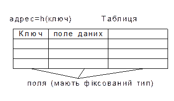
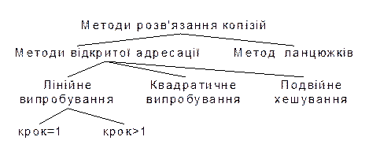
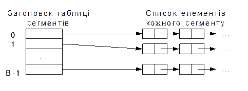
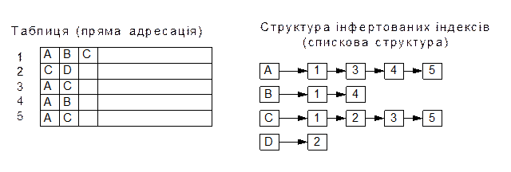
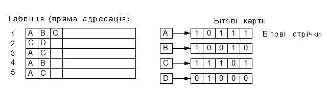

[Перелік лекцій](README.md)

# Двійкові дерева пошуку

## Зміст

1.  [Термінологія](#h01)
2.  [Теми для самостійного вивчення](#h101)
3.  [Контрольні питання](#h102)

## Хешування даних

Для прискорення доступу до даних можна використовувати попереднє їх впорядкування у відповідності зі значеннями ключів. При цьому можуть використовуватися методи пошуку в упорядкованих структурах даних, наприклад, метод дихотомічного пошуку, що суттєво скорочує час пошуку даних за значенням ключа. Проте при додаванні нового запису потрібно дані знову впорядкувати. Втрати часу на повторне впорядкування можуть значно перевищувати виграш від скорочення часу пошуку. Тому для скорочення часу доступу до даних використовується так зване випадкове впорядкування або хешування. При цьому дані організуються у вигляді таблиці за допомогою хеш-функції _h_, яка використовується для „обчислення” адреси за значенням ключа.



Узагальнена схема хеш-таблиці

У попередній главі описувався алгоритм інтерполяційного пошуку, який використовує інтерполяцію для пришвидшення пошуку. Порівнюючи шукане значення зі значеннями елементів у відомих точках, цей алгоритм може визначити імовірне розміщення шуканого елемента. По суті, він створює функцію, яка встановлює відповідність між шуканим значенням і індексом позиції, в якій він повинен знаходитися. Якщо перше передбачення помилкове, то алгоритм знову використовує цю функцію, передбачаючи нове розміщення, і так далі, до тих пір, поки шуканий елемент не буде знайдено.

Хешування використовує аналогічний підхід, відображаючи елементи в хеш-таблиці. Алгоритм хешування використовує деяку функцію, яка визначає імовірне розміщення елемента в таблиці на основі значення шуканого елементу.

Ідеальною хеш-функцією є така хеш-функція, яка для будь-яких двох неоднакових ключів дає неоднакові адреси. Підібрати таку функцію можна у випадку, якщо всі можливі значення ключів відомі наперед. Така організація даних носить назву „досконале хешування”.

Наприклад, потрібно запам'ятати декілька записів, кожен з яких має унікальний ключ зі значенням від 1 до 100. Для цього можна створити масив з 100 комірками і присвоїти кожній комірці нульовий ключ. Щоб добавити в масив новий запис, дані з нього просто копіюються у відповідну комірку масиву. Щоб добавити запис з ключем 37, дані з нього копіюються в 37 позицію в масиві. Щоб знайти запис з певним ключем – вибирається відповідна комірка масиву. Для вилучення запису ключу відповідної комірки масиву просто присвоюється нульове значення. Використовуючи цю схему, можна добавити, знайти і вилучити елемент із масиву за один крок.

У випадку наперед невизначеної множини значень ключів і обмеженні розміру таблиці підбір досконалої функції складний. Тому часто використовують хеш-функції, які не гарантують виконанні умови.

Наприклад, база даних співробітників може використовувати в якості ключа ідентифікаційний номер. Теоретично можна було б створити масив, кожна комірка якого відповідала б одному з можливих чисел; але на практиці для цього не вистачить пам'яті або дискового простору. Якщо для зберігання одного запису потрібно 1 КБ пам'яті, то такий масив зайняв би 1 ТБ (мільйон МБ) пам'яті. Навіть якщо можна було б виділити такий об'єм пам'яті, така схема була б дуже неекономною. Якщо штат фірми менше 10 мільйонів співробітників, то більше 99 процентів масиву буде пустою.

Щоб вирішити цю проблему, схеми хешування відображають потенційно велику кількість можливих ключів на достатньо компактну хеш-таблицю. Якщо на фірмі працює 700 співробітників, можна створити хеш-таблицю з 1000 комірок. Схема хешування встановлює відповідність між 700 записами про співробітників і 1000 позиціями в таблиці. Наприклад, можна розміщати записи в таблиці у відповідності з трьома першими цифрами ідентифікаційного номеру. При цьому запис про співробітника з номером 123456789 буде знаходитися в 123 комірці таблиці.

Очевидно, що оскільки існує більше можливих значень ключа, ніж комірок в таблиці, то деякі значення ключів можуть відповідати одним і тим коміркам таблиці. Даний випадок носить назву „колізія”, а такі ключі називаються „ключі-синоніми”.

Щоб уникнути цієї потенційної проблеми, схема хешування повинна включати в себе алгоритм вирішення конфліктів, який визначає послідовність дій у випадку, якщо ключ відповідає позиції в таблиці, яка вже зайнята іншим записом.

Усі методи використовують для вирішення конфліктів приблизно однаковий підхід. Вони спочатку встановлюють відповідність між ключем запису і розміщенням в хеш-таблиці. Якщо ця комірка вже зайнята, вони відображають ключ на іншу комірку таблиці. Якщо вона також вже зайнята, то процес повторюється знову до тих пір, поки нарешті алгоритм не знайде пусту комірку в таблиці. Послідовність позицій, які перевіряються при пошуку або вставці елемента в хеш-таблицю, називається тестовою послідовністю.

В результаті, для реалізації хешування необхідні три речі:

Структура даних (хеш-таблиця) для зберігання даних;

Функція хешування, яка встановлює відповідність між значеннями ключа і розміщенням в таблиці;

Алгоритм вирішення конфліктів, який визначає послідовність дій, якщо декілька ключів відповідають одній комірці таблиці.

### Методи розв'язання колізій

Для розв'язання колізій використовуються різноманітні методи, які в основному зводяться до методів „ланцюжків” і „відкритої адресації”.



Методи розв'язання колізій

Методом ланцюжків називається метод, в якому для розв'язання колізій у всі записи вводяться покажчики, які використовуються для організації списків – „ланцюжків переповнення”. У випадку виникнення колізій при заповненні таблиці в список для потрібної адреси хеш-таблиці додається ще один елемент.

Пошук в хеш-таблиці з ланцюжками переповнення здійснюється наступним чином. Спочатку обчислюється адреса за значенням ключа. Потім здійснюється послідовний пошук в списку, який зв'язаний з обчисленою адресою.

Процедура вилучення з таблиці зводиться до пошуку елемента в його вилучення з ланцюжка переповнення.

Схематичне зображення хеш-таблиці при такому методі розв'язання колізій приведене на наступному рисунку.



Розв'язання колізій хеш-таблиці

Якщо сегменти приблизно однакові за розміром, то у цьому випадку списки усіх сегментів повинні бути найбільш короткими при даній кількості сегментів. Якщо вихідна множина складається з _N_ елементів, тоді середня довжина списків буде рівна _N/B_ елементів. Якщо можна оцінити _N_ і вибрати _B_ якомога ближчим до цієї величини, то в списку буде один-два елементи. Тоді час доступу до елемента множини буде малою постійною величиною, яка залежить від _N_.

Одна з переваг цього методу хешування полягає в тому, що при його використанні хеш-таблиці ніколи не переповнюються. При цьому вставка і пошук елементів завжди виконується дуже просто, навіть якщо елементів в таблиці дуже багато. Із хеш-таблиці, яка використовує зв'язування, також просто вилучати елементи, при цьому елемент просто вилучається з відповідного зв'язного списку.

Один із недоліків зв'язування полягає в тому, що якщо кількість зв'язних списків недостатньо велика, то розмір списків може стати великим, при цьому для вставки чи пошуку елемента необхідно буде перевірити велику кількість елементів списку.

Метод відкритої адресації полягає в тому, щоб, користуючись якимось алгоритмом, який забезпечує перебір елементів таблиці, переглядати їх в пошуках вільного місця для нового запису.

Лінійне випробування зводиться до послідовного перебору елементів таблиці з деяким фіксованим кроком

`a=h(key) + c*i` ,

де i – номер спроби розв'язати колізію. При кроці рівному одиниці відбувається послідовний перебір усіх елементів після поточного.

Квадратичне випробування відрізняється від лінійного тим, що крок перебору елементів нелінійно залежить від номеру спроби знайти вільний елемент

`a = h(key 2) + c*i + d*i2`

Завдяки нелінійності такої адресації зменшується кількість спроб при великій кількості ключів-синонімів. Проте навіть відносно невелика кількість спроб може швидко привести до виходу за адресний простір невеликої таблиці внаслідок квадратичної залежності адреси від номеру спроби.

Ще один різновид методу відкритої адресації, яка називається подвійним хешуванням, базується на нелінійній адресації, яка досягається за рахунок сумування значень основної і додаткової хеш-функцій.

`a=h1(key) + i*h2(key)`.

Розглянемо алгоритми вставки і пошуку для методу лінійного випробування.

**Вставка:**

1. `i = 0`

2. `a = h(key) + i*c`

3. Якщо `t(a) = вільно`, то `t(a) = key`, записати елемент і зупинитися

4. `i = i + 1`, перейти до кроку 2

**Пошук:**

1. `i = 0`

2. `a = h(key) + i*c`

3. Якщо `t(a) = key`, то зупинитися – елемент знайдено

4. Якщо `t(a) = вільно`, то зупинитися – елемент не знайдено

5. `i = i + 1`, перейти до кроку 2

Аналогічно можна було б сформулювати алгоритми добавлення і пошуку елементів для будь-якої схеми відкритої адресації. Відмінності будуть лише у виразі, який використовується для обчислення адреси (крок 2).

З процедурою вилучення справа складається не так просто, так як вона в даному випадку не буде оберненою до процедури вставки. Справа в тому, що елементи таблиці знаходяться в двох станах: вільно і зайнято. Якщо вилучити елемент, перевівши його в стан вільно, то після такого вилучення алгоритм пошуку буде працювати некоректно. Нехай ключ елемента, який вилучається, має в таблиці ключі синоніми. У цьому випадку, якщо за ним в результаті розв'язання колізій були розміщені елементи з іншими ключами, то пошук цих елементів після вилучення завжди буде давати негативний результат, так як алгоритм пошуку зупиняється на першому елементі, який знаходиться в стані вільно.

Скоректувати цю ситуацію можна різними способами. Самий простий із них полягає в тому, щоб проводити пошук елемента не до першого вільного місця, а до кінця таблиці. Проте така модифікація алгоритму зведе нанівець весь виграш в прискоренні доступу до даних, який досягається в результаті хешування.

Інший спосіб зводиться до того, щоб відслідкувати адреси всіх ключів-синонімів для ключа елемента, що вилучається, і при необхідності розмістити відповідні записи в таблиці. Швидкість пошуку після такої операції не зменшиться, але затрати часу на саме розміщення елементів можуть виявитися значними.

Існує підхід, який не має перерахованих недоліків. Його суть полягає в тому, що для елементів хеш-таблиці добавляється стан „вилучено”. Даний стан в процесі пошуку інтерпретується, як зайнято, а в процесі запису як вільно.

Тепер можна сформулювати алгоритми вставки, пошуку і вилучення для хеш-таблиці, яка має три стани елементів.

**Вставка:**

1. `i = 0`

2. `a = h(key) + i*c`

3. Якщо `t(a) = вільно` або `t(a) = вилучено`, то `t(a) = key`, записати елемент і стоп

4. `i = i + 1`, перейти до кроку 2

**Вилучення:**

1. `i = 0`

2. `a = h(key) + i*c`

3. Якщо `t(a) = key`, то `t(a) = вилучено`, стоп елемент вилучений

4. Якщо `t(a) = вільно`, то стоп елемент не знайдено

5. `i = i + 1`, перейти до кроку 2

**Пошук:**

1. `i = 0`

2. `a = h(key) + i*c`

3. Якщо `t(a) = key`, то стоп – елемент знайдено

4. Якщо `t(a) = свободно`, то стоп – елемент не знайдено

5. `i = i + 1`, перейти до кроку 2

Алгоритм пошуку для хеш-таблиці, яка має три стани, практично не відрізняється від алгоритму пошуку без врахування вилучення. Різниця полягає в тому, що при організації самої таблиці необхідно відмічати вільні і вилучені елементи. Це можна зробити, зарезервувавши два значення ключового поля. Інший варіант реалізації може передбачати введення додаткового поля, в якому фіксується стан елемента. Довжина такого поля може складати всього два біти, що достатньо для фіксації одного з трьох станів.

### Переповнення таблиці і повторне хешування

Очевидно, що в міру заповнення хеш-таблиці будуть відбуватися колізії і в результаті їх розв'язання методами відкритої адресації чергова адреса може вийти за межі адресного простору таблиці. Щоб це явище відбувалося рідше, можна піти на збільшення розмірів таблиці у порівнянні з діапазоном адрес, які обчислюються хеш-функцією.

З однієї сторони це приведе до скорочення кількості колізій і прискоренню роботи з хеш-таблицею, а з іншої – до нераціональних витрат адресного простору. Навіть при збільшенні таблиці в два рази у порівнянні з областю значень хеш-функції нема гарантій того, що в результаті колізій адреса не перевищить розмір таблиці. При цьому в початковій частині таблиця може залишатися достатньо вільних елементів. Тому на практиці використовують циклічний перехід на початок таблиці.

Розглянемо даний спосіб на прикладі методу лінійного випробування. При обчисленні адреси чергового елементу можна обмежити адресу, взявши в якості такої остачу від цілочисельного ділення адреси на довжину таблиці _N_.

**Вставка:**

1. `i = 0`

2. `a = (h(key) + c*i) % N`

3. Якщо `t(a) = вільно` або `t(a) = вилучено` то `t(a) = key`, записати елемент і стоп

4. `i = i + 1`, перейти до кроку 2

В даному алгоритмі не враховується можливість багатократного перевищення адресного простору. Більш коректним буде алгоритм, який використовує зсув адреси на 1 елемент у випадку кожного повторного перевищення адресного простору. Це підвищує імовірність знаходження вільного елемента у випадку повторних циклічних переходів до початку таблиці.

**Вставка:**

1. `i = 0`

2. `a = ((h(key) + c*i) / n + (h(key) + c*i) % n) % n`

3. Якщо `t(a) = вільно` або `t(a) = вилучено`, `то t(a) = key`, записати елемент і стоп

4. `i = i + 1`, перейти до кроку 2

Розглядаючи можливість виходу за межі адресного простору таблиці, ми не враховували фактори наповненості таблиці й вдалого вибору хеш-функції. При великій наповненості таблиці виникають часті колізії і циклічні переходи на початок таблиці. При невдалому виборі хеш-функції відбуваються аналогічні явища. В найгіршому випадку при повному заповнені таблиці алгоритми циклічного пошуку вільного місця приведуть до зациклювання. Тому при використанні хеш-таблиць необхідно старатися уникати дуже густого заповнення таблиць. Звичайно довжину таблиці вибирають із розрахунку дворазового перевищення передбачуваної максимальної кількості записів. Не завжди при організації хешування можна правильно оцінити потрібну довжину таблиці, тому у випадку великої наповненості таблиці може знадобитися рехешування. У цьому випадку збільшують довжину таблиці, змінюють хеш-функцію і впорядковують дані.

Проводити окрему оцінку густини заповнення таблиці після кожної операції вставки недоцільно, тому можна проводити таку оцінку непрямим способом – за кількістю колізій під час однієї вставки. Достатньо визначити деякий поріг кількості колізій, при перевищенні якого потрібно провести рехешування. Крім того, така перевірка гарантує неможливість зациклювання алгоритму у випадку повторного перегляду елементів таблиці. Розглянемо алгоритм вставки, який реалізує описаний підхід.

**Вставка:**

1. `i = 0`

2. `a = ((h(key) + c*i) / n + (h(key) + c*i) % n) % n`

3. Якщо `t(a) = вільно` або `t(a) = вилучено`, то `t(a) = key`, записати елемент і стоп

4. Якщо `i > m` , то стоп – потрібно рехешування

5. `i = i + 1`, перейти до кроку 2

В даному алгоритмі номер ітерації порівнюється з пороговим числом m. Варто зауважити, що алгоритми вставки, пошуку і вилучення повинні використовувати ідентичне утворення адреси чергового запису.

**Вилучення:**

1. `i = 0`

2. `a = ((h(key) + c*i) / n + (h(key) + c*i) % n) % n`

3. Якщо `t(a) = key`, то `t(a) = вилучено` і стоп елемент вилучено

4. Якщо `t(a) = вільно` або `i > m`, то стоп – елемент не знайдено

5. `i = i + 1`, перейти до кроку 2

**Пошук:**

1. `i = 0`

2. `a = ((h(key) + c*i) / n + (h(key) + c*i) % n) % n`

3. Якщо `t(a) = key`, то стоп – елемент знайдено

4. Якщо `t(a) = вільно` або `i > m`, то стоп – елемент не знайдено

5. `i = i + 1`, перейти до кроку 2

### Оцінка якості хеш-функції

Як вже було відмічено, дуже важливий правильний вибір хеш-функції. При вдалій побудові хеш-функції таблиця заповнюється більш рівномірно, зменшується кількість колізій і зменшується час виконання операцій пошуку, вставки і вилучення. Для того щоб попередньо оцінити якість хеш-функції можна провести імітаційне моделювання.

Моделювання проводиться наступним чином. Формується вектор цілих чисел, довжина якого співпадає з довжиною хеш-таблиці. Випадково генерується достатньо велика кількість ключів, для кожного ключа обчислюється хеш-функція. В елементах вектора підраховується кількість генерацій даної адреси. За результатами такого моделювання можна побудувати графік розподілу значень хеш-функції. Для отримання коректних оцінок кількість генерованих ключів повинна в декілька разів перевищувати довжину таблиці.

Якщо кількість елементів таблиці достатньо велика, то графік будується не для окремих адрес, а для груп адрес. Великі нерівномірності засвідчують високу імовірність колізій в окремих місцях таблиці. Зрозуміло, така оцінка є наближеною, але вона дозволяє попередньо оцінити якість хеш-функції і уникнути грубих помилок при її побудові.

Оцінка буде більше точною, якщо генеровані ключі будуть більш близькими до реальних ключів, які використовуються при заповненні хеш-таблиці. Для символьних ключів дуже важливо добитися відповідності генерованих кодів символів тим кодам символів, які є в реальному ключі. Для цього потрібно проаналізувати, які символи можуть бути використані в ключі.

Наприклад, якщо ключ представляє собою прізвище українською мовою, то будуть використані українські букви. Причому перший символ може бути великою буквою, а інші – малими. Якщо ключ представляє собою номерний знак автомобіля, то також нескладно визначити допустимі коди символів в певних позиціях ключа.

Розглянемо більш загальний випадок. Нехай необхідно генерувати ключ із _m_ символів з кодами в неперервному діапазоні від _n1_ до _n2_.
```cpp
for (i=0; i<m; i++)
	str[i]=(char)(rand()%(n2-n1)+n1);
```		

На практиці можливі варіанти, коли символи в одних позиціях ключа можуть належати до різних діапазонів кодів, причому між цими діапазонами може існувати розрив. Наприклад генерація ключа з _m_ символів з кодами в діапазоні від _n1_ до _n4_ (діапазон має розрив від _n2_ до _n3_).
```cpp
for (int i=0; i<m; i++){
	x = rand() % ((n4-n3)+(n2-n1));
	if (x<=(n2-n1) )
		str[i] = (char)(x+n1);
	else
		str[i] = (char)(x+n1+n3-n2);
	}
```
Розглянемо ще один конкретний приклад. Нехай відомо, що ключ складається з 7 символів. Із них три перші символи – великі латинські букви, далі йдуть дві цифри, інші – малі латинські.

Приклад: довжина ключа 7 символів;

3 великі латинські (коди 65-90);

2 цифри (коди 48-57);

2 малі латинські (коди 97-122).
```cpp
char key[7];

for (i=0; i<3; i++) key[i] = (char)(rand()%(90-65)+65);
for (i=3; i<5; i++) key[i] = (char)(rand()%(57-48)+57);
for (i=5; i<7; i++) key[i] = (char)(rand{}%(122-97)+97);
```

## Організація даних для прискорення пошуку за вторинними ключами

До тепер розглядалися способи пошуку в таблиці за ключами, які дозволяють однозначно ідентифікувати запис. Такі ключі називають первинними ключами. Можливий варіант організації таблиці, при якому окремий ключ не дозволяє однозначно ідентифікувати запис. Така ситуація часто зустрічається в базах даних. Ідентифікація запису здійснюється за деякою сукупністю ключів. Ключі, які не дозволяють однозначно ідентифікувати запис в таблиці, називаються вторинними ключами.

Навіть при наявності первинного ключа, для пошуку запису можуть використовуватися вторинні. Наприклад, пошукові системи Internet часто організовані як набори записів, які відповідають Web-сторінкам. В якості вторинних ключів для пошуку виступають ключові слова, а сама задача пошуку зводиться до вибірки з таблиці деякої множини записів, які містять потрібні вторинні ключі.

### Інвертовані індекси

Розглянемо метод організації таблиці з інвертованими індексами. Для таблиці будується окремий набір даних, який містить так звані інвертовані індекси. Допоміжний набір містить для кожного значення вторинного ключа відсортований список адрес записів таблиці, які містять даний ключ.

Пошук здійснюється у допоміжній структурі достатньо швидко, так як фактично відсутня необхідність звернення до основної структури даних. Ділянка пам'яті, яка використовується для індексів, є відносно невеликою у порівнянні з іншими методами організації таблиць.



Зберігання інвертованих індексів

Недоліками даної системи є великі затрати часу на складання допоміжної структури даних і її поновлення. Причому ці затрати зростають зі збільшенням об'єму бази даних.

Система інвертованих індексів є досить зручною й ефективною при організації пошуку в великих таблицях.

### Бітові карти

Для таблиць невеликого об'єму використовують організацію допоміжної структури даних у вигляді бітових карт. Для кожного значення вторинного ключа записів основного набору даних записується послідовність бітів. Довжина послідовності бітів рівна кількості записів. Кожен біт в бітовій карті відповідає одному значенню вторинного ключа і одному запису. Одиниця означає наявність ключа в запису, а нуль – відсутність.

Основною перевагою такої організації є дуже проста й ефективна організація обробки складних запитів, які можуть об'єднувати значення ключів різними логічними предикатами. У цьому випадку пошук зводиться до виконання логічних операцій запиту безпосередньо над бітовими стрічками й інтерпретації результуючої бітової стрічки. Іншою перевагою є простота поновлення карти при добавленні записів.



### Зберігання бітових карт

До недоліків бітових карт варто віднести збільшення довжини стрічки пропорційно довжині файлу. При цьому наповненість карти одиницями зменшується зі збільшенням довжини файлу. Для великої довжини таблиці і ключів, які рідко зустрічаються, бітова карта перетворюється в велику розріджену матрицю, яка складається, в основному, з одних нулів.

## Теми для самостійного вивчення

1.  Принципи роботи алгоритмів групи CRC
2.  Принципи роботи алгоритмів групи MD
3.  Принципи роботи алгоритмів групи SHA
4.  Недоліки алгоритмів групи MD

## Контрольні питання

1.  Що таке хеш-функція?
2.  Яке призначення хеш-функцій?
3.  Які алгоритми хешування ви знаєте?
4.  В чому головна відмінність процесів хешування та шифрування?