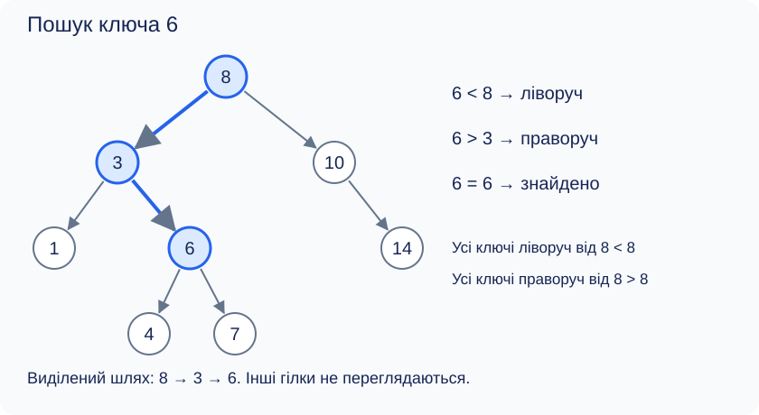
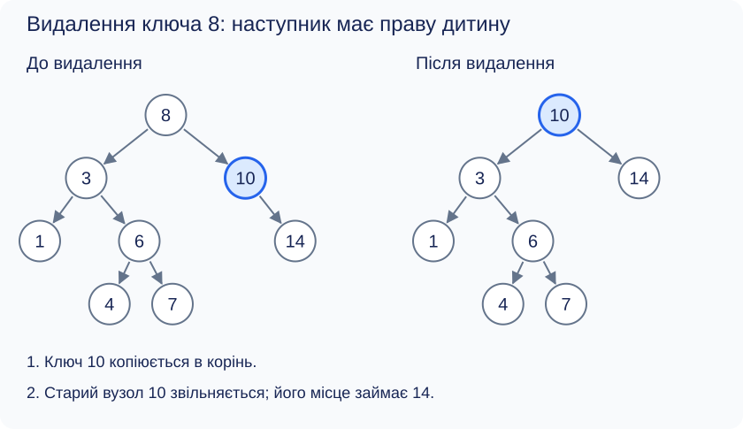

[Перелік лекцій](../README.md)

# Лекція 7. Двійкові дерева пошуку

## Мета та результати

Навчитися зберігати множину ключів у двійковому дереві пошуку (BST, binary search tree). Після лекції студент має пояснювати інваріант BST, виконувати пошук, вставлення та видалення, оцінювати їхню складність через висоту дерева й реалізовувати операції з покажчиками в C++.

## Властивість дерева пошуку

Задача: зберігати цілі ключі, шукати їх і виводити за зростанням. На відміну від [довільного бінарного дерева](../lec-06/README.md), BST має для **кожного вузла** такий інваріант: усі ключі лівого піддерева менші за його ключ, усі ключі правого — більші. Самі піддерева також задовольняють цю умову.

У цій лекції ключі унікальні: повторне вставлення нічого не змінює. Інша можлива політика — зберігати лічильник повторень, але її треба визначити перед реалізацією. 

Порівняти лише батька з безпосередніми дітьми недостатньо. Наприклад, корінь 8 має ліву дитину 3, а вузол 3 — праву дитину 10. Локальні порівняння правильні, але 10 порушує межу лівого піддерева кореня. Для перевірки BST можна передавати допустимі межі ключів або перевіряти строге зростання симетричного обходу.



*Рисунок 1 — BST після вставлення 8, 3, 10, 1, 6, 14, 4, 7. Виділено шлях пошуку ключа 6.*

## Пошук і вставлення

Порівнюємо шуканий ключ із поточним вузлом. Рівність означає успіх; менший ключ шукаємо ліворуч, більший — праворуч. `nullptr` означає, що ключа немає. Інваріант циклу: якщо ключ існує, він міститься в поточному піддереві. Відкинута гілка не може містити його завдяки властивості BST.

Для 6 шлях на рисунку 1 — 8 → 3 → 6. Для відсутнього 5 — 8 → 3 → 6 → 4 → порожній правий зв’язок. Пошук повертає адресу знайденого вузла або `nullptr`. 

Вставлення повторює пошук. Новий листок приєднують замість порожнього зв’язку; у порожньому дереві він стає коренем. Так, 5 стане правою дитиною 4. Порівняння на шляху гарантують, що новий ключ задовольняє обмеження всіх предків. Дублікат не створює нового вузла. 

Мінімум непорожнього BST знаходять рухом ліворуч до останнього вузла, максимум — праворуч. Симетричний обхід дає зростаючу послідовність: спочатку всі менші ключі, потім корінь, далі всі більші. Для рисунка 1 результат — `1 3 4 6 7 8 10 14`.

## Видалення вузла

Якщо ключ відсутній, дерево не змінюється. Для знайденого вузла є три випадки:

| Діти вузла | Дія зі зв’язком, що веде до вузла |
| --- | --- |
| Немає | Замінити на `nullptr`, звільнити вузол |
| Одна дитина | Замінити адресою дитини, звільнити старий вузол |
| Дві дитини | Скопіювати ключ наступника, потім видалити вузол наступника |

**Наступник** — найменший вузол правого піддерева. Він не має лівої дитини, але може мати праву, яку треба зберегти. Його ключ більший за всі ключі лівого піддерева видаленого вузла й менший за решту ключів правого, тому заміна зберігає інваріант. Для вузлів із даними копіюють і відповідне значення.



*Рисунок 2 — Видалення вузла з двома дітьми. Наступник 10 має праву дитину 14; її зв’язок зберігається.*

На рисунку видаляється ключ 8, але фізично звільняється старий вузол 10. Не можна просто виконати `delete` і залишити батьківський покажчик: він стане невалідним. Потрібно оновлювати також корінь, якщо видаляється кореневий вузол з нулем або однією дитиною.

## Приклад C++: власна реалізація BST

Програма будує дерево рисунка 1. Введіть один цілий ключ для пошуку та видалення; перевіряється весь рядок, зокрема вихід за діапазон `int` і зайві символи. `Node*&` дозволяє змінити корінь або покажчик на дитину.

```cpp
#include <iostream>
#include <sstream>
#include <string>
#include <new>

struct Node {
    int key;
    Node* left;
    Node* right;
};

const Node* find(const Node* p, int key) {
    while (p && p->key != key)
        p = key < p->key ? p->left : p->right;
    return p;
}

bool insert(Node*& p, int key) {
    if (!p) {
        p = new Node{key, nullptr, nullptr};
        return true;
    }
    if (key == p->key) return false;
    if (key < p->key) return insert(p->left, key);
    return insert(p->right, key);
}

bool erase(Node*& p, int key) {
    if (!p) return false;
    if (key < p->key) return erase(p->left, key);
    if (key > p->key) return erase(p->right, key);
    if (p->left && p->right) {
        Node* successor = p->right;
        while (successor->left) successor = successor->left;
        p->key = successor->key;
        return erase(p->right, successor->key);
    }
    Node* old = p;
    p = p->left ? p->left : p->right;
    delete old;
    return true;
}

void inorder(const Node* p) {
    if (!p) return;
    inorder(p->left);
    std::cout << p->key << ' ';
    inorder(p->right);
}

void clear(Node*& p) {
    if (!p) return;
    clear(p->left);
    clear(p->right);
    delete p;
    p = nullptr;
}

int main() {
    std::cout << "Enter one integer key: ";
    std::string line;
    if (!std::getline(std::cin, line)) {
        std::cerr << "Input failed\n";
        return 1;
    }
    std::istringstream input(line);
    int key;
    char extra;
    if (!(input >> key) || (input >> extra)) {
        std::cerr << "Invalid integer\n";
        return 1;
    }
    Node* root = nullptr;
    const int values[] = {8, 3, 10, 1, 6, 14, 4, 7};
    try {
        for (int value : values) insert(root, value);
    } catch (const std::bad_alloc&) {
        clear(root);
        std::cerr << "Allocation failed\n";
        return 1;
    }
    std::cout << (find(root, key) ? "Found\n" : "Not found\n");
    std::cout << (erase(root, key) ? "Removed\n" : "Unchanged\n");
    inorder(root);
    std::cout << '\n';
    clear(root);
}
```

`new` виділяє один вузол, `delete` звільняє саме його; `nullptr` позначає порожнє піддерево. Присвоєння в `insert` виконується лише після успішного виділення пам’яті, тому при винятку вже створена частина дерева лишається доступною для очищення. `const Node*` у пошуку дозволяє читати вузол, але не змінювати його через цей покажчик. Збережені адреси не слід використовувати після видалення відповідних вузлів.

## Складність і балансування

Нехай n — кількість вузлів, h — висота в ребрах. Кожен крок пошуку відкидає піддерево, але не обов’язково половину вузлів. У таблиці — верхні оцінки для непорожнього дерева; порожнє обробляється за O(1).

| Операція в прикладі | Час | Додаткова пам’ять |
| --- | --- | --- |
| Ітеративний пошук | O(h + 1) | O(1) |
| Рекурсивне вставлення, видалення | O(h + 1) | O(h + 1) |
| Обхід, очищення | O(n) | O(h + 1) |

Вузли дерева займають O(n) пам’яті. Якщо h = O(log n), пошук та зміни мають час O(log n). Проте вставлення 1, 2, 3, 4, 5 утворює правий ланцюжок із h = 4: найгірший час однієї операції — O(n), а побудови послідовними вставленнями — O(n²). Рекурсія на довгому ланцюжку може вичерпати стек.

AVL- та червоно-чорні дерева підтримують обмеження висоти за допомогою додаткових умов і обертань, зберігаючи порядок ключів. Вони гарантують логарифмічний час пошуку та змін; наш приклад не виконує балансування. Симетричний обхід залишається лінійним навіть у збалансованому дереві, бо друкує кожен ключ.

## Перевірка результату та самоперевірка

Для введення `8` очікуємо `Found`, `Removed` та `1 3 4 6 7 10 14`. Для `5` — `Not found`, `Unchanged` та початкову послідовність. `abc`, `8x`, порожній рядок і число поза діапазоном `int` мають завершити програму з повідомленням про помилку.

Окремо перевірте функції на порожньому дереві, одному вузлі, повторному ключі та видаленні листка, вузла з однією дитиною й кореня. Після кожної зміни симетричний обхід має лишатися строго зростаючим; після очищення корінь дорівнює `nullptr`.

1. Чому порівняти ключ лише з дітьми недостатньо?
2. Куди вставиться 5 на рисунку 1?
3. Чому наступник не має лівої дитини?
4. Як `erase` видаляє єдиний вузол?
5. Чому BST не гарантує O(log n)?
6. Як зберігати повтори ключів?

## Джерела

1. Cormen T. H., Leiserson C. E., Rivest R. L., Stein C. *Introduction to Algorithms*. 4th ed. MIT Press, 2022. Двійкові дерева пошуку. [Сторінка видання](https://mitpress.mit.edu/9780262046305/introduction-to-algorithms/).
2. Knuth D. E. *The Art of Computer Programming. Vol. 3: Sorting and Searching*. 2nd ed. Addison-Wesley, 1998. Пошук у деревах. [Сторінка автора](https://www-cs-faculty.stanford.edu/~knuth/taocp.html).
3. Morin P. *Open Data Structures (in C++)*. [6.2. An Unbalanced Binary Search Tree](https://opendatastructures.org/ods-cpp/6_2_Unbalanced_Binary_Searc.html). Інваріант та операції BST.
4. Sedgewick R., Wayne K. *Algorithms, 4th Edition*. [3.2. Binary Search Trees](https://algs4.cs.princeton.edu/32bst/) та [3.3. Balanced Search Trees](https://algs4.cs.princeton.edu/33balanced/). Пошук, видалення, роль балансування.
5. Carnegie Mellon University. [Tree Data Structure](https://www.cs.cmu.edu/~clo/www/CMU/DataStructures/Lessons/lesson4_1.htm). Висота дерева та симетричний порядок ключів.
