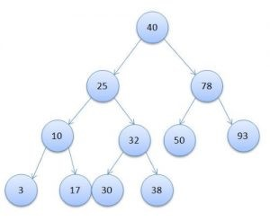
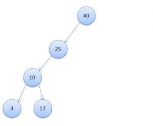

[Перелік лекцій](README.md)

# Індекси

## Що таке індекс бази даних і навіщо він потрібен?
Щоб зрозуміти навіщо потрібні індекси в базі даних і що він собою являє, зараз розглянемо простий приклад.
Уявіть собі, що у вас є поличка для книг.  При цьому спочатку ця поличка з книгами порожня.  Книги вам щось приносять, то забирають, то роблять в них якісь коригування (наприклад, мемуари або може бути чернетки) тощо.
Так як поличка маленька, то ви якось не особливо замислювалися про якусь систему класифікації, а просто вставляєте книги в будь-порожні місця.
Кожен раз коли-то вам чи комусь необхідно знайти певну книгу, виникає необхідність переглядати всі книги з самого початку полички до першої-ліпшої (якщо потрібна тільки одна книга) або повністю все (якщо потрібно зібрати всі копії).  В принципі, для однієї полички це вельми необтяжливо.
Тепер, уявіть собі, що мова йде не про одну поличці, а про величезному приміщенні, де знаходяться тисячі книг.
Тут-то ви і починаєте замислюватися про те, що непогано б ввести якусь систему класифікації, наприклад, за назвою книги.  Звичайно, повністю сортувати всі ці тисячі книг в алфавітному порядку ви не збираєтеся, плюс з цим виникло б купа інших питань (як додати книгу в уже заповнену полку та інші).
Тому ви поступаєте простіше, ви берете каталог, де можна додавати листочки.  При цьому кожну сторінку виділяєте тільки під одну назву книги, а самі сторінки в своєму розпорядженні в каталозі в порядку зростання назв.  Зміст цих сторінок дуже просто - ви записуєте в якому стелажі, на якій полиці і який за рахунком є книга.  Якщо книг кілька, то рядків в цій сторінці стає кілька.
Таким чином, щоб знайти одну або всі потрібні книги за назвою, вам досить відкрити цей каталог і швидко пролестнуть до потрібної сторінки, а потім пройтися по всіх зазначених стелажів.  При цьому для спрощення, ви так само можете перші літери назв так само індексувати.  Тобто додаєте наклейку на кожну першу сторінку з вказаною літерою (таким чином можете відразу перейти, наприклад, до букви «Р», що не гортаючи всі назви до неї).
Звичайно, для підтримки такої системи потрібен додатковий час, але все ж воно істотно менше, ніж спроба знайти наосліп книгу з тисячі (пара хвилин проти декількох годин і більше).

Так ось, в даному прикладі, якщо переносити це в базу даних:
Приміщення - це таблиця в базі даних.  Якщо трохи простіше, то будь-який скопище однотипних даних (тих же книг), по суті, являє собою таблицю.
Пошук книги - це sql-запити отримання даних.  При цьому важливо відзначити, що самі по собі вони не змінюються.  Тобто вам як потрібно було знайти «термодинаміки», так і залишилося за потрібне знайти «термодинаміки».  Інша справа, як ви будете це здійснювати - прочісуючи тисячі книг або відкривши каталог.
Каталог - це і є спрощений варіант індексу в базі даних.  Тобто, індекс це набір додаткових даних, записаних в зручному вигляді, який дозволяє істотно швидше здійснювати пошук, хоч і вимагає додаткових зусиль для підтримування його актуальності.
Ім'я книги (сторінка) - це ключ в індексі.  Те унікальне значення, яке може посилатися як на одну якусь запис, так і на кілька.  Варто відзначити, що навіть якщо записів для кожного значення буде кілька, це все одно швидше, ніж повний перебір всіх даних.
Якщо підсумувати, то можна побачити, що наявність індексу може бути дуже вигідним.  Наприклад, для однієї домашньої полички з десятком книг - індекс в общем-то не сильно потрібен, а от коли мова заходить про більш великих обсягах, то індекс буде вельми корисним.
Так само можна помітити, що додавання індексу не вимагає того, щоб самі sql-запити були переписані, так як останні є лише вираженням на спрощеному мовою для бази даних.  Якщо продовжити аналогію, то це як попросити когось знайти вам «Флора і фауна».  При цьому яким чином і скільки цей хтось буде шукати книгу, буде вирішувати сам ця людина.  В даному прикладі «знайти книгу» - це sql-запит, а цей «хтось» це база даних.

## Які бувають індекси?
Взагалі, в залежності від типів баз даних, індекси можуть бути дуже різними і реалізуватися за рахунок специфічних математичних механізмів.  Але, найбільш частим є деревовидний індекс, так як підтримувати такий індекс відносно просто і максимальна швидкість пошуку в ньому становить логарифм за кількістю максимальної кількості дочірніх вузлом від загальної кількості записів (плюс мінус деякі технічні моменти).
Трохи поясню.

Дерево (деревовидний індекс) - це спеціального виду структура, у якій є коренева вершина і у кожного вузла може бути кілька дочірніх вузлів.  При цьому кожен вузол зустрічається тільки один раз і може мати всього один батьківський вузол.  Виглядає це так:
  
Як бачите, дуже схоже на перевернуте звичайне зелене дерево, у якого гілки ростуть не вгору, а вниз.
Максимальна кількість дочірніх вузлів, як ймовірно вже здогадалися по картинці, це та кількість дочірніх вузлів, більше якого у одного вузла не може бути.
Тепер поясню звідки береться логарифм.  Справа в тому, що дерево зазвичай заповнюється за певними правилами.  Наприклад, якщо у вузла максимально може бути всього два дочірніх вузла (так зване бінарне дерево), то зазвичай лівий дочірній вузол має значення менше поточного, а правий більшого значення.  Тому якщо вам потрібно знайти, наприклад, число 30 в дереві з малюнка трохи вище, то вам знадобиться всього 4 порівняння (40 - 25 - 32 - 30).  Саме через цю особливість пошуку і береться логарифм (так як кожне порівняння скорочує кількість перевірених елементів в два рази).  При цьому зазвичай значення логарифма округлюють в більшу сторону.
Так само зазначу, що така швидкість досягається за рахунок того, що дерево будується спеціальним чином, щоб не виникало таких ситуацій, як на картинці нижче, де максимальна швидкість пошуку буде порівнянна з простим перебором всіх записів.
 
Як бачите, щоб тут знайти запис з ключем «3» знадобиться 4 порівняння (40 - 25 - 10 - 3), хоча всього записів 5.
Практично у всіх базах даних, існує поділ по унікальності:
Унікальний індекс - це такий індекс, у якого все значення зустрічаються тільки один раз.  Проводячи аналогію, коли кожна книга присутня тільки в одному екземплярі і ніколи назви книг не збігаються.
Неунікальний індекс - це такий індекс, у якого значення можуть повторюватися.  Проводячи аналогію, існують книги з одними і тими ж назвами, але різними авторами, або ж просто зустрічаються копії.
Важливо відзначити, що якщо для таблиці створюється унікальний індекс, то це означає, що при спробі додати запис зі значенням, яке вже зустрічалося, або ж змінити значення якоїсь записи на існуюче, то база даних не дозволить зробити таку дію і буде лаятися (  видавати помилки).  У випадку ж з неунікальним індексом таких проблем немає.
Так само варто знати, що індекси діляться за кількістю що входять в них полів:
Звичайні індекси - складаються з одного поля.  Тут, ймовірно, все зрозуміло.  Звичайний каталог сторінок.

Складові індекси - будуються по декількох полях, при цьому розташування полів є важливим.
Трохи докладніше про складові індекси.  Розглянемо аналогію з тими ж книгами.  До цього індекс будувався тільки за назвою.  Тепер же представимо, що книги з однаковими назвами часто зустрічаються.  У такій ситуації, легко може вийде, що сторінка каталогу буде складатися з координат сотень книг (десятки авторів і у кожного по десять копій).  Бігати їх усіх перевіряти - так само чимала кількість часу.  Тому замість того, щоб сторінка просто перераховувала усі місцезнаходження книг, можна зробити так, щоб сторінки з іменами книг вказували на додаткові каталоги, де аналогічним чином проіндексовані автори.
Трохи спрощуючи, пошук буде виглядає приблизно так.
1.	Спочатку ви шукайте в каталозі з іменами необхідну сторінку з назвою.
2.	Потім в цій сторінці дивіться, де знаходиться відповідний каталог з авторами.
3.	Берете цей каталог і вже в ньому знаходите сторінку, де вказано місце розташування всіх книг з цим автором і назвою.
При цьому важливо розуміти, що для кожної назви буде створюватися власний каталог авторів.  Тобто в зворотному порядку, на жаль, запитом не знайдено здійснити.  Якщо ж потрібно шукати спочатку по автору, а вже потім за назвами книг, то необхідно створювати окремий складовою каталог (складений індекс)
Існують і інші моменти, але найчастіше досить знати хоча б ці базові знання.

## Теми для самостійного вивчення

1.  Принципи роботи алгоритмів групи CRC
2.  Принципи роботи алгоритмів групи MD
3.  Принципи роботи алгоритмів групи SHA
4.  Недоліки алгоритмів групи MD

## Контрольні питання

1.  Що таке хеш-функція?
2.  Яке призначення хеш-функцій?
3.  Які алгоритми хешування ви знаєте?
4.  В чому головна відмінність процесів хешування та шифрування?