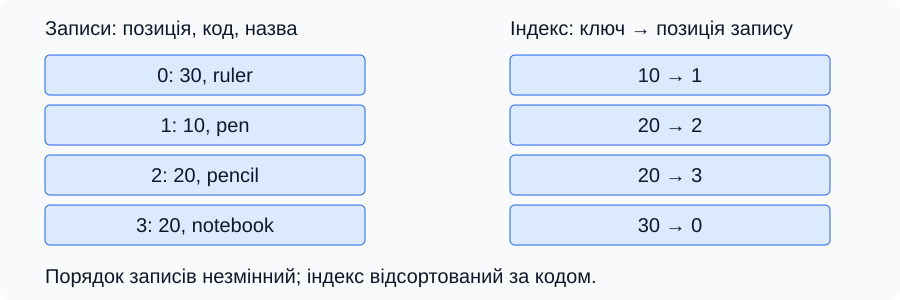
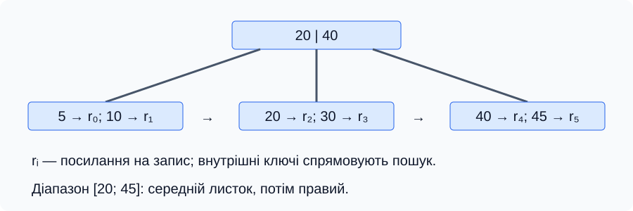
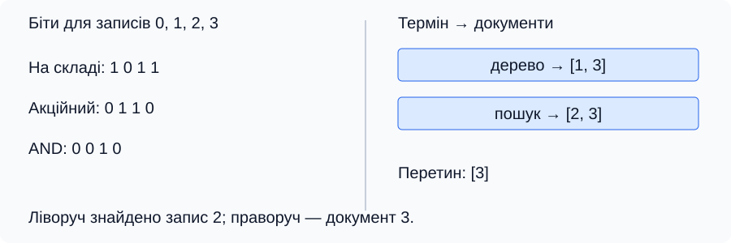

[Перелік лекцій](../README.md)

# Лекція №8. Індекси

**Тема за робочою програмою:** «Індекси». **Тривалість:** 2 години.

## Мета та очікувані результати

Навчитися вибирати допоміжну структуру для швидкого доступу до даних. Після заняття студент має пояснювати зв’язок ключа із записом, порівнювати впорядковані, хешовані, бітові, інвертовані та просторові індекси, оцінювати ціну їх підтримки й реалізовувати простий індекс на C++.

## Для чого потрібен індекс

**Індекс** — допоміжна структура, яка за пошуковим ключем дозволяє знайти запис або множину записів. Ключем може бути код товару, дата, слово документа чи координати. Індекс застосовують у пам’яті програми, файлах, пошукових системах і базах даних. Його не слід плутати з індексом елемента масиву — цілим номером позиції.

Без індексу пошук серед n невпорядкованих записів потребує O(n) перевірок у найгіршому випадку. Індекс зберігає ключі та посилання: покажчики в оперативній пам’яті, ідентифікатори записів або файлові зміщення. Адресу C++ не можна зберегти у файлі як універсальне посилання для наступного запуску програми.

Нехай записи товарів мають коди 30, 10, 20, 20. Впорядкуємо окремі індексні елементи, залишивши записи на місцях. Отримаємо 10 → запис 1, 20 → запис 2, 20 → запис 3, 30 → запис 0. Двійковий пошук знаходить початок групи ключів 20, після чого послідовно читаємо обидва результати.

*Рисунок 1 — Індекс упорядковує доступ до записів, не змінюючи їхнього розташування.*

За прискорення читання платимо додатковою пам’яттю та роботою під час вставлення, видалення й оновлення. Індекс не гарантує, що кожен запит стане швидшим: для малої таблиці чи вибірки більшості записів послідовне читання може бути дешевшим.

## Ознаки класифікації

| Ознака | Різновиди та зміст |
| --- | --- |
| Унікальність | Унікальний ключ відповідає не більш ніж одному запису; неунікальний допускає групу записів |
| Кількість полів | Простий індекс використовує одне поле; складений — впорядкований набір полів |
| Повнота покриття | Щільний індекс представляє кожен запис або кожен ключ із переліком записів; розріджений — лише вибрані межі блоків |
| Організація доступу | Впорядкована, хешована, бітова, інвертована, просторова |

Ці ознаки незалежні: складений індекс може бути унікальним або неунікальним. У СУБД унікальний індекс також може забезпечувати обмеження даних, тому його створення здатне відхилити наявні дублікати. Правила для NULL залежать від системи та налаштувань.

Розріджений впорядкований індекс працює разом із відповідним порядком блоків даних: спочатку знаходимо блок за його граничним ключем, потім шукаємо всередині. Довільне вилучення елементів зі щільного індексу такої властивості не створює.

Складений ключ `(група, прізвище)` порівнюють лексикографічно: спочатку групу, за рівності — прізвище. Записи однієї групи утворюють суцільну ділянку, але однакові прізвища різних груп можуть бути розкидані. Тому порядок полів визначають за запитами. Відсутність умови на перше поле не означає абсолютної неможливості використання індексу: окремі СУБД мають додаткові стратегії, зокрема skip scan.

## Впорядковані індекси: масив, B-дерево та B+дерево

**Впорядкований масив** індексних елементів простий у реалізації. Пошук першого збігу займає O(log n), видача k збігів — O(log n + k). Вставлення в середину потребує O(n) зсувів. Така структура зручна для даних, які рідко змінюють і часто читають.

[Двійкове дерево пошуку](../lec-07/README.md) має не більш ніж двох дітей у вузла, тоді як **B-дерево** містить багато ключів і дочірніх посилань у кожному вузлі. Ключі розділяють діапазони дітей; усі листки лежать на одному рівні. Вузол зазвичай узгоджують із розміром сторінки зберігання, щоб зменшити число дорогих читань. B не слід подавати як однозначне скорочення слова Balanced.

Під час вставлення переповнений вузол розщеплюють; після видалення можливі перерозподіл ключів або злиття. У стандартному B-дереві записи чи посилання на них можуть бути і у внутрішніх вузлах, і в листках. За розгалуження порядку b висота становить O(log_b n), що визначає число переходів між сторінками; роботу всередині сторінки враховують окремо.

У **B+дереві** всі індексні записи з посиланнями на дані розташовані в листках, а внутрішні вузли містять розділові ключі й посилання на дітей. Отже, твердження «ключі є лише в листках» неправильне: розділові ключі є і вище. Зв’язані листки дають змогу після пошуку нижньої межі послідовно читати діапазон.

*Рисунок 2 — Для діапазону [20; 45] знаходимо листок із 20 і продовжуємо читання вздовж листків до 45.*

## Хеш-індекс

Хеш-функція перетворює ключ на номер кошика. Різні ключі можуть потрапити в один кошик — це **колізія**, тому після обчислення хешу потрібне порівняння самих ключів і спосіб розв’язання колізій. Для якісного розподілу та контрольованого коефіцієнта заповнення очікуваний час точного пошуку — O(1), найгірший — O(n). Повернення k результатів додатково потребує O(k).

Хешування не зберігає порядок ключів: сусідні числа не зобов’язані потрапляти в сусідні кошики. Тому воно не забезпечує ефективного впорядкованого обходу чи пошуку діапазону. Не можна стверджувати, що хеш-індекс завжди швидший за дерево: мають значення колізії, кешування, розмір ключів і тип запиту.

## Бітові карти та інвертований індекс

**Бітовий індекс** для кожного значення ознаки зберігає послідовність бітів: біт i дорівнює 1, якщо запис i має це значення. Для чотирьох товарів ознака «є на складі» може мати карту `1 0 1 1`, а «акційний» — `0 1 1 0`. Побітове AND дає `0 0 1 0`: обом умовам відповідає лише запис 2.

*Рисунок 3 — Бітова карта позначає належність записів, інвертований індекс перелічує документи для кожного терміна.*

Для d різних значень і n записів нестиснуті карти займають приблизно d · n бітів. Це привабливо для ознак із небагатьма значеннями. Обробка двох карт потребує O(⌈n/w⌉) операцій над машинними словами по w бітів; видачу знайдених записів рахують додатково. Стиснення може змінити витрати.

**Інвертований індекс** відображає термін у впорядкований список ідентифікаторів документів, де він трапляється. Якщо «дерево» → [1, 3], а «пошук» → [2, 3], запит «дерево AND пошук» дає документ 3. Перетин двох списків довжин p і q двома покажчиками виконується за O(p + q). Для пошуку фраз потрібні також позиції слів; самого переліку документів недостатньо.

## Просторові індекси та спеціалізовані методи

**R-дерево** групує просторові об’єкти за обмежувальними прямокутниками. Під час пошуку перевіряють прямокутники груп: якщо група не перетинає область запиту, її можна пропустити. Прямокутники можуть перекриватися, тому доводиться обходити кілька гілок. Висота дерева сама по собі не гарантує O(log n) для всього запиту; у найгіршому випадку переглядають O(n) об’єктів. Для складних фігур після відбору за прямокутником потрібна точна геометрична перевірка.

У PostgreSQL назви методів уточнюють можливості індексації:

| Метод | Призначення |
| --- | --- |
| B-tree | Рівність, діапазони, впорядковане читання |
| Hash | Порівняння на рівність |
| GiST | Інфраструктура для різних стратегій, зокрема просторового пошуку |
| SP-GiST | Окрема інфраструктура для розбиття простору, наприклад k-d дерев |
| GIN | Інвертований індекс для складених значень, зокрема масивів і текстових документів |
| BRIN | Узагальнення значень діапазонів фізичних блоків |

GIN та SP-GiST не є різновидами GiST. Доступні операції залежать від класу операторів. Наявність індексу не змушує планувальник застосовувати його: рішення залежить від оцінки вартості. Для оцінювання запиту в СУБД аналізують план через EXPLAIN, обсяг прочитаних даних і час виконання.

## Навчальний приклад C++

[Програма ordered-index.cpp](src/ordered-index.cpp) створює чотири записи з кодами 30, 10, 20, 20 та динамічний масив пар «ключ — покажчик на запис». Власне сортування вставками впорядковує лише індекс. Двійковий пошук повертає першу позицію, ключ якої не менший за запитаний, після чого програма виводить усі збіги.

Інваріант пошуку: у напіввідкритому проміжку [left; right) ще може бути потрібна межа; усі елементи лівіше left менші за ключ, усі від right до кінця — не менші. Порівняння середнього елемента скорочує проміжок, не втрачаючи межу. При left = right межу знайдено; перш ніж розіменовувати елемент, перевіряємо, чи позиція менша за n.

Побудова навчального індексу має час O(n²) через сортування вставками й пам’ять O(n); пошук усіх збігів — O(log n + k) та O(1) додаткової пам’яті. Для великих масивів доцільне сортування за O(n log n), але воно не змінює принцип індексації.

`new[]` виділяє обидва масиви, `delete[]` звільняє їх. Індексні покажчики не володіють окремими записами: викликати для них `delete` не можна. Спочатку видаляємо індекс, потім масив записів. Якщо записи перемістити, видалити чи змінити їхні ключі, індекс слід відповідно оновити; інакше адреси або порядок ключів стануть невалідними.

Для введення 20 очікуються рядки `20 pencil` і `20 notebook`; для 99 — `Not found`, для нечислового вводу — повідомлення про помилку. Перевірте також крайні ключі 10 і 30. Функції допускають порожнє подання `nullptr, 0`; його пошук не розіменовує покажчик. Відмова виділення пам’яті обробляється без витоку.

## Питання для самоперевірки

1. Чим індекс записів відрізняється від номера елемента масиву?
2. Чому індекс прискорює читання, але збільшує ціну оновлення?
3. Як порядок полів складеного ключа впливає на пошук?
4. Де зберігаються ключі та індексні записи у B+дереві?
5. За яких умов хеш-пошук має очікувану складність O(1)?
6. Як знайти документи, що містять обидва задані слова?
7. Чому R-дерево може вимагати перегляду кількох гілок?
8. Що зламається, якщо змінити код товару без оновлення індексу?

## Джерела

1. Cormen T. H., Leiserson C. E., Rivest R. L., Stein C. *Introduction to Algorithms*. 4th ed. MIT Press, 2022. B-дерева, хешування, пошук. [Сторінка видання](https://mitpress.mit.edu/9780262046305/introduction-to-algorithms/).
2. Morin P. *Open Data Structures (in C++)*. [14.2. B-Trees](https://opendatastructures.org/ods-cpp/14_2_B_Trees.html). Блокове зберігання та операції B-дерева.
3. PostgreSQL Global Development Group. [Index Types](https://www.postgresql.org/docs/current/indexes-types.html). Методи B-tree, Hash, GiST, SP-GiST, GIN, BRIN.
4. PostgreSQL Global Development Group. [Multicolumn Indexes](https://www.postgresql.org/docs/current/indexes-multicolumn.html). Порядок полів і використання складених індексів.
5. Manning C. D., Raghavan P., Schütze H. *Introduction to Information Retrieval*. Cambridge University Press, 2008. [Boolean retrieval](https://nlp.stanford.edu/IR-book/html/htmledition/boolean-retrieval-1.html). Бітові матриці, інвертовані індекси та перетин списків.
6. SQLite. [The SQLite R*Tree Module](https://www.sqlite.org/rtree.html). Просторова індексація та пошук за обмежувальними прямокутниками.
