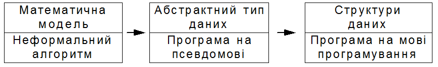

[Перелік лекцій](README.md)

# Побудова алгоритмів

## Формалізація алгоритмів

Процес створення комп'ютерної програми для вирішення будь-якої практичної задачі складається з декількох етапів:

1.  формалізація і створення технічного завдання на вихідну задачу;
2.  розробка алгоритму вирішення задачі;
3.  написання, тестування, наладка і документування програми;
4.  отримання розв'язку вихідної задачі шляхом виконання програми.

Половина справи зроблена, якщо знати, що поставлена задача має вирішення. В першому наближенні більшість задач, які зустрічаються на практиці, не мають чіткого й однозначного опису. Певні задачі взагалі неможливо сформулювати в термінах, які допускають комп'ютерне вирішення. Навіть якщо допустити, що задача може бути вирішена на комп'ютері, часто для її формального опису потрібна велика кількість різноманітних параметрів. І лише в ході додаткових експериментів можна знайти інтервали зміни цих параметрів.

Якщо певні аспекти вирішуваної задачі можна виразити в термінах якої-небудь формальної моделі, то це, безумовно, необхідно зробити, так як в цьому випадку в рамках цієї моделі можна взнати, чи існують методи й алгоритми вирішення задачі. Навіть якщо такі методи й алгоритми не існують на сьогоднішній день, то застосування засобів і властивостей формальної моделі допоможе в побудові вирішення вихідної задачі.

Практично будь-яку галузь математики або інших наук можна застосувати до побудови моделі певного класу задач. Для задач, числових за своєю природою, можна побудувати моделі на основі загальних математичних конструкцій, таких як системи лінійних рівнянь, диференціальні рівняння. Для задач з символьними або текстовими даними можна застосувати моделі символьних послідовностей або формальних граматик. Вирішення таких задач містить етапи компіляції і інформаційного пошуку.

Коли побудована чи підібрана потрібна модель вихідної задачі, то природно шукати її вирішення в термінах цієї моделі. На цьому етапі основна мета полягає в побудові розв'язку в формі алгоритму, який складається з скінченої послідовності інструкцій, кожна з яких має чіткий зміст і може бути виконана з скінченими обчислювальними затратами за скінчений час. Інструкції можуть виконуватися в алгоритмі будь-яку кількість раз, при цьому вони самі визначають цю кількість повторень. Проте вимагається, щоб при будь-яких вхідних даних алгоритм завершився після виконання скінченої кількості інструкцій. Таким чином, програма, яка написана на основі розробленого алгоритму, при будь-яких початкових даних ніколи не повинна приводити до нескінченних циклічних обчислень.

Є ще один аспект у визначення алгоритмів. Алгоритмічні інструкції повинні мати „чіткий зміст” і виконуватися з „скінченими обчислювальними затратами”. Природно, те, що зрозуміло одній людині і має для неї „чіткий зміст”, може зовсім інакше представлятися іншій. Те ж саме можна сказати про поняття „скінчених затрат”: на практиці часто важко довести, що при будь-яких вихідних даних виконання послідовності інструкцій завершиться, навіть якщо чітко розуміти зміст кожної інструкції. У цій ситуації, враховуючи всі аргументи за і проти, було б корисним спробувати досягнути узгодження про „скінченні затрати” у відношенні до послідовності інструкцій, які складають алгоритм.

## Покрокове проектування алгоритмів

Оскільки для вирішення вихідної задачі застосовують деяку математичну модель, то тим самим можна формалізувати алгоритм вирішення в термінах цієї моделі. У початкових версіях алгоритму часто застосовуються узагальнені оператори, які потім перевизначаться у вигляді більш дрібних, чітко визначених інструкцій. Але для перетворення неформальних алгоритмів у комп'ютерні програми необхідно пройти через декілька етапів формалізації (цей процес називають покроковою деталізацією), поки не отримають програму, яка повністю складається з формальних операторів мови програмування.

В основу процесу проектування програми з розбиттям її на достатню кількість дрібних кроків можна покласти наступну послідовність дій:

Вихідним станом процесу проектування є більш-менш точне формулювання мети алгоритму, або конкретніше – результату, який повинен бути отриманий при його виконанні. Формулювання проводиться на природній мові.

Проводиться збір фактів, які стосуються будь-яких характеристик алгоритму, і робиться спроба їх представлення засобами мови.

Створюється образна модель процесу, який відбувається, використовуються графічні та інші способи представлення, образні „картинки”, які дозволяють краще зрозуміти виконання алгоритму в динаміці.

В образній моделі виділяється найбільш суттєва частина, для якої підбирається найбільш точне словесне формулювання.

Проводиться визначення змінних, які необхідні для формального представлення даного кроку алгоритму.

Вибирається одна з конструкцій – проста послідовність дій, умовна конструкція або циклу. Складні частини вибраної формальної конструкції (умова, заголовок циклу) залишаються в словесному формулюванні.

Для інших неформалізованих частин алгоритму, які залишились у словесному формулюванні – перерахована послідовність дій повторюється.

Зовнішня сторона такого процесу проектування програми полягає в тому, що одне словесне формулювання алгоритму замінюється на одну з трьох можливих конструкцій мови, елементи якої продовжують залишатися в неформальному, словесному формулюванні. Проте, це зовнішня сторона процесу. Насправді, кожне словесне формулювання алгоритму містить важливий перехід, який виконується в голові програміста і не може бути формалізованим – перехід від мети (результату) роботи програми до послідовності дій, які приводять до потрібного результату. Тобто алгоритм вже формулюється, але тільки з використанням образного мислення і природної мови.

Схематично узагальнений процес програмування можна представити наступною схемою.

Узагальнена схема процесу програмування

На першому етапі створюється модель вихідної задачі, для чого застосовуються відповідні математичні моделі. На цьому етапі для знаходження рішення також будується неформальний алгоритм.

На наступному етапі алгоритм записується на псевдомові – композиції конструкцій мови програмування і менш формальних і узагальнених операторів на простій мові. Продовженням цього етапу є заміна неформальних операторів послідовністю більш детальних і формальних операторів. З цієї точки зору програма на псевдомові повинна бути достатньо детальною, так як в ній фіксуються (визначаються) різні типи даних, над якими виконуються оператори. Потім створюються абстрактні типи даних для кожного зафіксованого типу даних (за винятком елементарних типів даних, таких як цілі й дійсні числа або символьні стрічки) шляхом завдання імен функцій для кожного оператора, який працює з даними абстрактного типа, і заміни їх (операторів) викликом відповідних функцій.

Третій етап процесу – програмування – забезпечує реалізацію кожного абстрактного типа даних і створення функцій для виконання різних операторів над даними цих типів. На цьому етапі також замінюються всі неформальні оператори псевдомови на код мови програмування. Результатом цього етапу повинна бути виконувана програма. Після її наладки отримують працюючу програму.

## Характеристики алгоритму

Охарактеризуємо поняття алгоритму не формально, а дескриптивно за допомогою таблиці:

Як бачимо, алгоритм – це механізм, який не тільки повинен гарантувати те, що вирішення колись буде знайдене, але й те, що буде знайдене саме оптимальне, тобто найкраще вирішення. Крім того, алгоритм повинен мати наступні п'ять якостей:

*   Обмеженість в часі – робота алгоритму обов'язково повинна завершитись через деякий розумний період часу.
*   Правильність – алгоритм повинен знаходити правильне, а не будь-яке рішення.
*   Детермінованість – скільки б разів не виконувався алгоритм з однаковими вхідними даними, результат повинен бути однаковим.
*   Скінченність – опис роботи алгоритму повинен мати скінчену кількість кроків.
*   Однозначність – кожний крок алгоритму повинен інтерпретуватися однозначно.

Як видно з таблиці, евристика – це пряма протилежність класичному алгоритму, так як вона не дає ніяких гарантій на те, що рішення буде знайдене, так само, як і на те, що воно буде оптимальним. Між ними є два перехідні стани, назв яким, на жаль, ще не придумали, і тому їх називають приблизними алгоритмами (рішення гарантоване, але його оптимальність – ні) і імовірнісні алгоритми (рішення не гарантоване, але якщо воно буде знайдене, то обов'язково буде оптимальним).

## Теми для самостійного вивчення

1.  Принципи роботи алгоритмів групи CRC
2.  Принципи роботи алгоритмів групи MD
3.  Принципи роботи алгоритмів групи SHA
4.  Недоліки алгоритмів групи MD

## Контрольні питання

1.  Що таке хеш-функція?
2.  Яке призначення хеш-функцій?
3.  Які алгоритми хешування ви знаєте?
4.  В чому головна відмінність процесів хешування та шифрування?