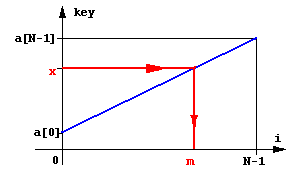
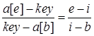
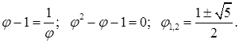
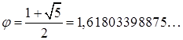
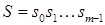

[Перелік лекцій](README.md)

# Алгоритми пошуку

## Зміст
 
1.  [Термінологія](#h01)
2.  [Теми для самостійного вивчення](#h101)
3.  [Контрольні питання](#h102)

Одна з тих дій, які найбільш часто зустрічаються в програмуванні – пошук. Існує декілька основних варіантів пошуку, і для них створено багато різноманітних алгоритмів.

Задача пошуку – відшукати елемент, ключ якого рівний заданому „аргументу пошуку”. Отриманий в результаті цього індекс забезпечує доступ до усіх полів виявленого елемента.

## Послідовний (лінійний) пошук

Найпростішим методом пошуку елемента, який знаходиться в неврегульованому наборі даних, за значенням його ключа є послідовний перегляд кожного елемента набору, який продовжується до тих пір, поки не буде знайдений потрібний елемент. Якщо переглянуто весь набір, і елемент не знайдений – значить, шуканий ключ відсутній в наборі. Цей метод ще називають методом повного перебору.

Для послідовного пошуку в середньому потрібно `N/2` порівнянь. Таким чином, порядок алгоритму – лінійний – `O(N)`.

Програмна ілюстрація лінійного пошуку в неврегульованому масиві приведена в наступному прикладі, де `a` – початковий масив, key – ключ, який шукається; функція повертає індекс знайденого елемента.
 `cpp
int LinSearch(int *a, int key){
	int i = 0;
	while ( (i<N) && (a[i] != key) )
		i++;
	return i;
	}
 `
Якщо елемент знайдено, то він знайдений разом з мінімально можливим індексом, тобто це перший з таких елементів. Рівність `i=N` засвідчує, що елемент відсутній.

Єдина модифікація цього алгоритму, яку можна зробити, – позбавитися перевірки номера елементу масиву в заголовку циклу (`i<N`) за рахунок збільшення масиву на один елемент у кінці, значення якого перед пошуком встановлюють рівним шуканому ключу – `key` – так званий „бар’єр”.
 `cpp
int LinSearch(int *a, int key)
	{
	a[N] = key;
	i = 0;
	while (a[i] != key)
i++;
	return i;    	// i<N – повернення номера
елемента
}
 `
## Бінарний пошук


Очевидно, що інших способів пришвидшення пошуку не існує, якщо, звичайно, немає ще якої-небудь інформації про дані, серед яких ведеться пошук. Алгоритм пошук може бути значно ефективнішим, якщо дані будуть впорядковані.

Іншим, відносно простим, методом доступу до елемента є метод бінарного (дихотомічного) пошуку, який виконується в явно впорядкованій послідовності елементів. Записи в таблицю заносяться в лексикографічному (символьні ключі) або чисельно (числові ключі) зростаючому порядку. Для досягнення впорядкованості може бути використаний котрийсь з методів сортування, які розглянемо пізніше.

Оскільки шуканий елемент швидше за все знаходиться „десь в середині”, перевіримо саме середній елемент: `a[N / 2] == key`? Якщо це так, то знайдено те, що потрібно. Якщо `a[N / 2] < key` , то значення `i = N / 2` є замалим і шуканий елемент знаходиться „праворуч”, а якщо `a[N / 2] >` `key`, то „ліворуч”, тобто на позиціях `0 … i`.

Для того, щоб знайти потрібний запис в таблиці, у гіршому випадку потрібно `log2(N)` порівнянь. Це значно краще, ніж при послідовному пошуку.

Приведемо ілюстрація бінарного пошуку на прикладі.
 `cpp
int BinSearch(int *a, int key)
	{
	int b, e, i;
	b = 0; e = N-1;      	// початкові значення меж<
	bool Found = false;  	// прапорець
	while ( (b < e) && !Found) // цикл,
поки інтервал пошуку не звузиться до 0
{
i = ( b + e ) / 2; // середина інтервалу
if ( a[i] == key )
Found = true;      	// ключ знайдений
else
if ( a[i] < key )
b = i + 1;   	// пошук в правому підінтервалі
else
e = i - 1;   	// пошук в лівому підінтервалі
 }
	return i;
}
 `
Максимальна кількість порівнянь для цього алгоритму рівна `log2(N)`. Таким чином, приведений алгоритм суттєво виграє у порівнянні з лінійним пошуком.

Ефективність дещо покращиться, якщо поміняти місцями заголовки умовних операторів. Перевірку на рівність можна виконувати в другу чергу, так як вона зустрічається лише одноразово і приводить до завершення роботи. Але більш суттєвий виграш дасть відмова від завершення пошуку при фіксації знаходження елемента.
 `cpp
int BinSearch(int *a, int key){
	int b, e, i;
	b = 0; e = N-1;
	while (b<e){
i = (b + e) / 2;
  	if (а[m] < x)
b = i + 1;
  	else
e = i - 1;
	}
	return i
}
 `
Завершення циклу гарантовано. Це пояснюється наступним. На початку кожного кроку `b < e`. Для середнього арифметичного `i` справедлива умова `b <= i< e`. Значить, різниця `e - b` дійсно спадає, тому що або `b` збільшується при присвоєнні йому значення `i+1`, або `e` зменшується при присвоєнні йому значення `i-1`. При `b<= i` повторення циклу закінчується.

Виконання умови `b \= e` ще не засвідчує знаходження потрібного елемента. Тут потрібна додаткова перевірка. Також, необхідно враховувати, що елемент `a[e]` у порівняннях ніколи не бере участі. Значить, і тут необхідна додаткова перевірка на рівність `a[e]= key`. Але ці перевірки виконуються однократно.

Алгоритм бінарного пошуку можна представити і трохи інакше, використовуючи рекурсивний опис. В цьому випадку граничні індекси інтервалу `b` і `e` є параметрами алгоритму. Рекурсивна процедура бінарного пошуку представлена в наступній програмі. Для виконання пошуку необхідно при виклику процедури задати значення її формальних параметрів `b` і `е` – `0` і `N-1` відповідно, де `b`, `e` – граничні індекси області пошуку.
```cpp
int BinSearch(int *a, int key, int & b, int
& e)
{
	int i;
	if ( b > e )
  	return -1;     	// перевірка ширини інтервалу
else
{
i = ( b + e ) / 2; 	// середина інтервалу
if ( a[i] == key )
return i;        	// ключ знайдений,
повернення індексу
else
if ( a[i] < key )  	// пошук в правому
підінтервалі
return BinSearch(a, key, i+1, e);
    	else             	// пошук в лівому
підінтервалі
 return BinSearch(a, key, b, i-1);
	}
}
```
Відомо, також, декілька модифікацій алгоритму бінарного пошуку, які виконуються на деревах.

## Метод інтерполяції

Якщо немає ніякої додаткової інформації про значення ключів, крім факту їхнього впорядкування, то можна припустити, що значення `key` збільшуються від `a[0]` до `a[N-1]` більш-менш „рівномірно”. Це означає, що значення середнього елементу `a[N / 2]` буде близьким до середнього арифметичного між найбільшим та найменшим значенням. Але, якщо шукане значення `key` відрізняється від вказаного, то є деякий сенс для перевірки брати не середній елемент, а „середньо-пропорційний”, тобто такий, номер якого пропорційний значенню `key`:

Програмна реалізація такого варіанту пошуку матиме вигляд:
```cpp
int BinSearch(int *a, int key)
	{
	int b, e, i;
	b = 0; e = N-1;      	// початкові значення меж
while ( b < e )      	// цикл, поки інтервал пошуку не звузиться до 0
{
	i = b + (key – a[b])*(e-b) / (a[e] – a[b]);
  	if ( a[i] == key )
return i;      	// ключ знайдений - повернення
індексу
else
if ( a[i] < key )
b = i + 1;   	// пошук в правому підінтервалі
else
 e = i - 1;   	// пошук в лівому підінтервалі
}
	return -1;     	// ключ не знайдений
}
```
Вираз для поточного значення `i` одержано з пропорційності відрізків на рисунку:



В середньому цей алгоритм має працювати швидше за бінарний пошук, але у найгіршому випадку буде працювати набагато довше.

## Метод „золотого перерізу”

Деякий ефект дає використання так званого „золотого перерізу”. Це число , що має властивість:



Доданій корінь  і є золотим перерізом.

Згідно цього алгоритму відрізок `b` … `e` слід ділити не навпіл, як у бінарному алгоритмі, а на відрізки, пропорційні  та 1, в залежності від того, до якого краю ближче `key`. Замість оператора

i = …; у програму бінарного пошуку слід внести наступний фрагмент, попередньо визначивши константу **Phi**:

```cpp
if a[e] - key < key - a[b]
	i = b + (e - b) * (Phi - 1);
else
i = e - (e - b) * (Phi - 1) + 1;
```
## Алгоритми пошуку послідовностей

Даний клас задача відноситься до задачі пошуку слів у тексті. Нехай масив `a[N]` вважається масивом символів останній елемент якого – 0:

char a[N]; у якому слід знайти заданий рядок символів:  довжиною `m`.

### Прямий алгоритм пошуку

Одним з найпростіших методів пошуку є послідовне порівняння першого символу `s` з символами масиву `a`. Якщо наявний збіг, тоді порівнюються другі, треті,... символи аж до повного збігу рядка `s` з частиною вектору такої ж довжини, або до незбігу у деякому символі. Тоді пошук продовжується з наступного символу масиву `a` та першого символу рядку `s`. Це визначається елементарною програмою:
```cpp
i = 0;   	// номер символу масиву a
while (i < N - lenghts)
{
	j = 0;	// номер символу рядка s
while ((s[j] == a[i+j]) && (j<lenghts)
j++;
	if (j==lenghts)
return i;  	// успіх
}
```
Якщо збіги відбуватимуться досить часто, то час роботи програми може бути досить значним.

Існує варіант удосконалення цього алгоритму – це починати пошук після часткового збігу не з наступного елементу масиву, а з символу, наступного після тих, що переглядалися, якщо у рядку `s` немає фрагментів, що повторюються.
```cpp
j = 0; // j - номер символа у a
	found = false;
while (!found)
{
	i = 0;	// i - номер символа у s
while ((s[i] == a[j]) && (s[i] != ‘/0’)
{
	i++;
  	j++;
	};
	if (s[i] == ‘/0’
found = true;
	else
	j -= i-1;
};
```
### Алгоритм Кнута, Моріса, Пратта

Д. Кнут, Д. Моріс і В. Пратт винайшли алгоритм, який фактично потребує лише `N` порівнянь навіть в самому поганому випадку. Новий алгоритм базується на тому, що після часткового збігу початкової частини слова з відповідними символами тексту фактично відома пройдена частина тексту і можна „обчислити” деякі відомості (на основі самого слова), за допомогою яких потім можна швидко пересунутися текстом. Приведений приклад пошуку слова ABCABD показує принцип роботи такого алгоритму. Символи, які пройшли порівняння, – підкреслені. Зверніть увагу: при кожному незбігу пари символів слово зсовується на всю пройдену відстань, оскільки менші зсуви не можуть привести до повного збігу.
```
ABCABCABAABCABD
---------------
 ABCABD
---------------
     ABCABD
---------------
      ABCABD
---------------
        ABCABD
---------------
         ABCABD
```
Основною відмінністю КМП-алгоритму від алгоритму прямого пошуку є здійснення зсуву слова не на один символ на кожному кроці алгоритму, а на деяку змінну кількість символів. Таким чином, перед тим як виконувати черговий зсув, потрібно визначити величину зсуву. Для підвищення ефективності алгоритму необхідно, щоб зсув на кожному кроці був би якомога більшим.

Якщо `j` визначає позицію в слові, в якій міститься перший символ, який не збігається (як в алгоритмі прямого пошуку), то величина зсуву визначається як `j-D`. Значення `D` визначається як розмір самої довшої послідовності символів слова, які безпосередньо передують позиції `j`, яка повністю збігається з початком слова. `D` залежить тільки від слова і не залежить від тексту. Для кожного `j` буде своя величина `D`, яку позначимо `dj`.

Так як величини `dj` залежать лише від слова, то перед початком фактичного пошуку можна обчислити допоміжну таблицю `d`; ці обчислення зводяться до деякої попередньої трансляції слова. Відповідні зусилля будуть оправдані, якщо розмір тексту значно перевищує розмір слова (`M<<N`). Якщо потрібно шукати багатократні входження одного й того ж слова, то можна користуватися одними й тими ж `d`. Наведені приклади пояснюють функцію `d`.

Текст

A

A

A

A

С

j=5; d[5]=4; max\`shift=j-d[5]=1

Слово

А

А

А

А

В

Зсунуте слово

А

А

А

А

В

Текст

A

B

C

A

В

D

j=5; d[5]=2; max\`shift=j-d[5]=3

Слово

А

B

C

A

В

С

Зсунуте слово

A

B

C

A

B

С

Текст

A

B

C

D

E

A

j=5; d[5]=0; max\`shift=j-d[5]=5

Слово

А

B

C

D

E

F

Зсунуте слово

A

B

C

D

Розглянемо програмну реалізацію цього методу.
```cpp
int d[M];
j = 0;
k = -1;
d[0] = -1;
while (i < M-1) // попереднє заповнення масиву d зсувів
{
	while ((k>=0) && (s[i] != s[k]))
k = d[k];
	i++;
	k++;
	if (s[i] == s[k])
d[i] = d[k]
else
d[i] = k;
}
i = 0;
j = 0;
k = 0;
while ((i < M) && (j < N))
{
	while (k <= j)
{
	cout << a[k];
  	k++;
	}
	while ((i>=0) && (a[j] != s[i])
i = d[i];
	j++;
	i++;
}
if (i == M)
; // Успіх!
```
### Алгоритм Боуєра та Мура

КМП-пошук дає справжній виграш тільки тоді, коли невдачі передувала деяка кількість збігів. Лише у цьому випадку слово зсовується більше ніж на одиницю. На жаль, це швидше виняток, ніж правило: збіги зустрічаються значно рідше, ніж незбіги. Тому виграш від практичного використання КМП-стратегії в більшості випадків пошуку в звичайних текстах досить незначний. Метод, який запропонували Р. Боуєр і Д. Мур в 1975 р., не тільки покращує обробку самого поганого випадку, але й дає виграш в проміжних ситуаціях.

БМ-пошук базується на незвичних міркуваннях – порівняння символів починається з кінця слова, а не з початку. Як і у випадку КМП-пошуку, слово перед фактичним пошуком трансформується в деяку таблицю. Нехай для кожного символу `x` із алфавіту величина `dx` – відстань від самого правого в слові входження `x` до правого кінця слова. Уявимо, що виявлена розбіжність між словом і текстом. У цьому випадку слово відразу ж можна зсунути праворуч на `dpM-1` позицій, тобто на кількість позицій, швидше за все більше одиниці. Якщо символ, який не збігся, тексту в слові взагалі не зустрічається, то зсув стає навіть більшим, а саме зсовувати можна на довжину всього слова. Ось приклад, який ілюструє цей процес:
```
ABCABCABFABCABD

ABCABD

 ABCABD

         ABCABD
```
На початку роботи слід завести масив, який зберігав би для кожного символу, що може зустрітися у масиві `a`, значення зсуву. Для символів, що взагалі не зустрічаються у образі `s`, зсув дорівнює `M` – довжині образу. Для символів, що зустрічаються у `s`, зсув буде меншим, щоби не пропустити можливих попадань.

Програму можна записати таким чином.
```cpp
for (ch=0; ch<256; ch++)
d[ch] = M; // замовчування
for (i=0; i<M-1; i++)
d[s[i]] = M-i-1; // уточнення
// Поиск слова p в тексте s
i = M;
do<
{
	j = M;
	k = i;
	do // Цикл порівняння символів
{
 k--;
  	j---; // слова, начинаючи з правого
while ( (j<0)
|| (a[j]!=s[k]) ); //Вихід, при порівн. все слово або незбіг

i += d[s[i-1]]; // Зсув слова вправо
while ( (j<0) ||(i>N));
```
У випадку постійних незбігів цей алгоритм робить одне порівняння на `M` символів.

Варто сказати, що запропоновані методи пошуку послідовностей можна модифікувати таким чином, щоб у кожному рядку пошук йшов не до кінця кожного рядка, а на кількість шуканих символів менше, бо слово `s` не може бути розташоване у кінці одного рядка та на початку наступного.

## Теми для самостійного вивчення

1.  Принципи роботи алгоритмів групи CRC
2.  Принципи роботи алгоритмів групи MD
3.  Принципи роботи алгоритмів групи SHA
4.  Недоліки алгоритмів групи MD

## Контрольні питання

1.  Що таке хеш-функція?
2.  Яке призначення хеш-функцій?
3.  Які алгоритми хешування ви знаєте?
4.  В чому головна відмінність процесів хешування та шифрування?