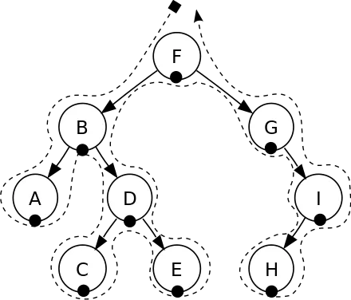
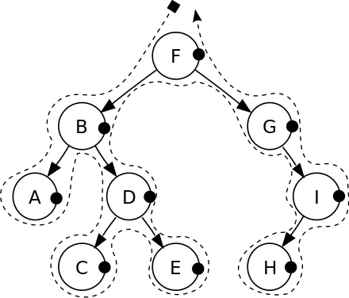

# Алгоритми для розгалужених структур

## Обхід дерева

Обхід дерева або пошук по дереву є одним з видів обходу графу, який передбачає відвідування (перевірку або модифікацію) кожної вершини дерева рівно один раз. Такі обходи класифікуються за порядком відвідування вершин. 

На відміну від пов'язаних списків, одновимірних масивів та інших лінійних структур даних, для яких існує канонічний обхід за допомогою лінійного порядку, дерева можна обходити у різні способи. Їх можна обходити вглиб або вшир. Існує три найпоширеніші способи їх проходження вглиб: прямий (pre-order), зворотній (post-order) та серединний (in-order). 

Обхід дерева передбачає ітераційний перегляд усіх вузлів. Оскільки з довільного вузла можна потрапити до більше ніж одного можливого наступного вузла (оскільки, це не лінійна структура даних), то, припускаючи послідовне обчислення (не паралельне), деякі вузли повинні бути відкладені, тобто, збережені якимось чином для подальшого відвідування. Це часто робиться з використанням таких структур як стек (LIFO) або черга (FIFO). Оскільки дерево є структурою даних, яка визначена рекурсивно, то обхід може бути визначений за допомогою рекурсії або, що є більш витонченим, корекурсії, у природній і зрозумілий спосіб; при використанні рекурсії відкладені вузли неявно зберігаються у стеці викликів.

## Обхід бінарного дерева

Обхід бінарного дерева є особливим випадком обходу дерева. 

Такий пошук називаються пошуком вглиб (англ. depth-first search, DFS), оскільки по дереву пошуку просуваються максимально глибоко для кожного нащадка, перед тим, як перейти до наступного брата. Для двійкового дерева вони визначаються як операції доступу на кожному вузлі, починаючи з поточного вузла, алгоритм якого такий:

Загальний рекурсивний підхід для обходу двійкового дерева такий:

Спустіться на один рівень до рекурсивного аргументу N. Якщо N існує (тобто, не є порожнім), то виконуються наступні три операції у певному порядку:
(L)	Рекурсивно обійти для N ліве піддерево.
(R)	Рекурсивно обійти для N праве піддерево.
(N)	Обробити поточний вузол N.
Повернутися, піднявшись на один рівень і прибути до батьківського вузла N.

Існують три види таких обходів, кожний з яких визначається рекурсивно:

1. прямий порядок (NLR) (англ. preorder) наступної послідовності:
відвідати корінь
відвідати ліве піддерево
відвідати праве піддерево
Тобто, в такому порядку обходу кожна вершина відвідується до того, як будуть відвідані її діти.

2. зворотний порядок (LRN) (англ. postorder) наступної послідовності:
відвідати ліве піддерево
відвідати праве піддерево
відвідати корінь
Тобто, в такому порядку кожна вершина відвідується лише після того, як будуть відвідані її діти.

3. серединний[4] (центрований) порядок (LNR) (англ. inorder) наступної послідовності:
відвідати ліве піддерево
відвідати корінь
відвідати праве піддерево
В такому порядку кожна вершина відвідується між відвіданням лівої та правої дитини. Такий порядок особливо часто застосовується в бінарних деревах пошуку, тому що дає можливість обходу вершин у порядку збільшення їхніх порядкових номерів.

## Обхід мережі (графа)

Обхід мережі виконується аналогічно обходу дерева. Можна обходити мережу, використовуючи або обхід в глибину, або обхід в ширину. Обхід в ширину звичайно схожий на прямий обхід дерева, хоча для мереж можна визначити також зворотний і навіть симетричний обхід.
Алгоритм для виконання прямого обходу бінарного дерева формулюється так:
1.	Звернутися до вузла.
2.	Виконати рекурсивний прямий обхід лівого дерева.
3.	Виконати рекурсивний прямий обхід правого дерева.
В дереві між зв’язаними між собою вузлами існує відношення батько – нащадок. Оскільки алгоритм починається з кореневого вузла і завжди виконується зверху вниз, він не звертається двічі ні до одного вузла.
У мережі вузли не обов’язково мають бути зв’язані в напрямку зверху вниз. Якщо спробувати застосувати до мережі алгоритм прямого обходу, може виникнути нескінченний цикл.
Щоб уникнути цього, алгоритм повинен позначати вузол після звернення до нього, при цьому при пошуку в сусідніх вузлах, перегляд відбувається тільки до вузлів, які ще не були помічені. Після того, як алгоритм завершить роботу, всі вузли в мережі будуть помічені (якщо мережа є зв’язною). Алгоритм прямого обходу мережі формулюється так:
1.	Помітити вузол.
2.	Звернутися до вузла.
3.	Виконати рекурсивний обхід не помічених сусідніх вузлів.
Оскільки такий алгоритм обходу не допускає звернення до жодного вузла двічі, то список обходу зв’язків не містить циклів і утворює дерево.
Якщо мережа є зв’язною, то дерево обходу міститиме всі вузли мережі. Оскільки це дерево охоплює всі вузли мережі, то воно називається стовбурним деревом. Можна використовувати схожий підхід з поміткою вузлів для перетворення обходу дерева в ширину в мережний алгоритм. Алгоритм обходу дерева починається з поміщення кореневого вузла в чергу. Потім перший вузол вилучається з черги, відбувається звернення до нього, а в кінець черги поміщаються його дочірні вузли. Цей процес повторюється до тих пір, поки черга не стає пустою.
В алгоритмі обходу мережі потрібно спочатку переконатися, що вузол не перевірявся раніше або він вже не знаходиться в черзі. Для цього помічають кожний вузол, який поміщається в чергу. Мережна версія цього алгоритму має так вигляд:
1.	Помітити перший вузол (який буде коренем стовбурного дерева) і додати його в кінець черги.
2.	Повторювати наступні кроки до тих пір, поки черга не стає пустою:
3.	Видалити з черги вузол і звернутися до нього.
4.	Для кожного з непомічених сусідніх вузлів, помітити його і додати в кінець черги.

## Найменші стовбурні дерева
Якщо була задана мережа з ціною зв’язків, то найменшим стовбурним деревом називається стовбурне дерево, в якому сумарна ціна всіх зв’язків в дереві буде найменшою. Найменше стовбурне дерево можна використовувати, щоб зв’язати всі вузли в мережі шляхом з якнайменшою ціною.
Наприклад, нехай потрібно розробити телефонну мережу, яка повинна з’єднати шість міст. Можна прокласти магістральний кабель між усіма парами міст, але це буде невиправдано дорого. Меншу вартість матиме рішення, при якому міста будуть сполучені зв’язками, які містяться в найменшому стовбурному дереві. Зауважимо, що мережа може мати декілька найменших стовбурних дерев.
Існує простий алгоритм пошуку найменшого стовбурного дерева для мережі:
1.	Поміщають в стовбурне дерево будь-який вузол.
2.	Знаходять зв’язок з найменшою ціною, який сполучає вузол в дереві з вузлом, який ще не був поміщений в дерево.
3.	Додають цей зв’язок і відповідний вузол в дерево.
4.	Повторювати кроки 2, 3 до тих пір, поки всі вузли не опиняться в дереві.

## Найкоротший маршрут
Алгоритми пошуку найкоротшого маршруту знаходять усі найкоротші шляхи із заданої точки до всіх решти точок мережі, при цьому передбачається, що мережа є зв’язаною. Набір зв’язків, які використовується всіма найкоротшими маршрутами, називається деревом найкоротшого маршруту.
Багато алгоритмів пошуку найкоротшого маршруту починають з порожнього дерева, до якого потім додається по одному зв’язку, до тих пір, поки дерево не буде заповнено. Ці алгоритми можна розбити на дві категорії відповідно до способу вибору наступного зв’язку, який повинен бути доданий до дерева найкоротшого маршруту.
Алгоритми установки міток завжди вибирають зв’язок, який гарантовано виявиться частиною кінцевого найкоротшого маршруту. Цей метод працює аналогічно методу пошуку найменшого стовбурного дерева. Якщо зв’язок був доданий в дерево, то він не буде видалений пізніше.
Алгоритми корекції міток додають зв’язки, які можуть бути або не бути частиною кінцевого найкоротшого маршруту. В процесі роботи алгоритму він може визначити, що на місце зв’язку, який вже знаходиться в дереві, потрібно помістити інший зв’язок. У цьому випадку алгоритм замінює старий зв’язок на новий і продовжує роботу. Заміна зв’язку в дереві може зробити можливими шляхи, які не були можливі до цього. Щоб перевірити ці шляхи, алгоритму доводиться знову перевірити шляхи, які були додані в дерево раніше і використовували видалений зв’язок.
Обидва алгоритми установки і корекції міток використовують список можливих зв’язків, у якому знаходяться зв’язки, що можуть бути додані в дерево найкоротшого маршруту, але вони по-різному оперують цим списком. Алгоритм установки міток завжди вибирає зв’язок, який обов’язково виявиться частиною дерева найкоротшого маршруту. Алгоритм корекції міток вибирає елемент, який знаходиться на вершині списку.
Вузьке місце алгоритму встановлення міток полягає в пошуку вузла з найменшим значенням поля відстані в списку можливих вузлів. Деякі варіанти цього алгоритму використовують інші структури даних для зберігання списку можливих вузлів. Наприклад, можна було б використовувати впорядкований зв’язний список. При використовуванні цього методу буде потрібно тільки один крок для того, щоб знайти наступний вузол, який буде доданий до дерева найкоротшого маршруту. Цей список буде завжди впорядкованим, тому вузол на вершині списку завжди буде шуканим вузлом.
Це полегшить пошук потрібного вузла в списку, але ускладнить додавання вузла в нього. Замість того щоб просто поміщати вузол на початок списку, його доведеться помістити в потрібну позицію.
Іноді також вимагається переміщати вузли в списку. Якщо в результаті додавання вузла в дерево найкоротшого маршруту зменшилася найкоротша відстань до іншого вузла, який вже був в списку, то потрібно перемістити цей елемент ближче до вершини списку.
Попередній алгоритм і цей його новий варіант є двома крайніми випадками управління списком можливих вузлів. Перший алгоритм зовсім не впорядковує список і витрачає достатньо багато часу на пошук вузлів в мережі. Другий витрачає багато часу на підтримку впорядкованості списку, але може дуже швидко вибирати з нього вузли. Інші варіанти використовують проміжні стратегії.
Наприклад, можна використовувати для зберігання списку можливих вузлів пріоритетну чергу на основі пірамід, тоді можна буде просто вибрати наступний вузол з вершини піраміди. Вставка нового вузла в піраміду і її впорядковування виконуватиметься швидше, ніж аналогічні операції для впорядкованого зв’язного списку. Інші стратегії використовують складні схеми організації блоків для того, щоб спростити пошук можливих вузлів.
На відміну від алгоритму установки міток, алгоритм корекції міток не може працювати з мережами, які містять цикли з від’ємною ціною. Якщо зустрічається такий цикл, то алгоритм нескінченно переміщається зв’язками в середині нього. При кожному обході циклу відстань до вузлів, що входять в нього, зменшується, при цьому алгоритм знову поміщає вузли в список можливих вузлів, і знову може перевіряти їх надалі. При наступній перевірці цих вузлів, відстань до них також зменшиться, і так далі. Цей процес продовжуватиметься до тих пір, поки відстань до цих вузлів не досягне нижнього граничного значення -32768, якщо довжина шляху була задана цілим числом. Якщо відомо, що в мережі є цикли з від’ємною ціною, то простіше за все просто використовувати для роботи з нею метод установки, а не корекції міток.
Алгоритм корекції міток дозволяє дуже швидко вибрати вузол із списку можливих вузлів. Він також може вставити вузол в список всього за один або два кроки. Недолік цього алгоритму полягає в тому, що коли він вибирає вузол із списку можливих вузлів, він може зробити не дуже хороший вибір.
Варіанти цього алгоритму намагаються підвищити якість вибору вузлів без великого ускладнення алгоритму. Один з методів, який непогано працює на практиці, полягає в тому, щоб додавати вузли одночасно на початок і кінець списку можливих вузлів. Якщо вузол раніше не потрапляв в список можливих вузлів, алгоритм, як завжди, додає його в кінець списку. Якщо вузол вже був раніше в списку можливих вузлів, але зараз його там нема, алгоритм вставляє його в початок списку. При цьому повторне звернення до вузла виконується практично відразу, можливо при наступному ж зверненні до списку.
Ідея, закладена в такому підході, полягає в тому, що якщо алгоритм скоює помилку, вона виправлялася найшвидше. Якщо помилка не буде виправлена протягом достатньо довгого часу, алгоритм може використовувати неправильну інформацію для побудови довгих помилкових шляхів, які потім доведеться виправляти. Завдяки швидкому виправленню помилок, алгоритм може зменшити кількість невірних шляхів, які доведеться перебудувати. В якнайкращому випадку, якщо всі сусідні вузли все ще знаходяться в списку можливих вузлів, повторна перевірка цього вузла до перевірки сусідів запобіжить побудові невірних шляхів.
