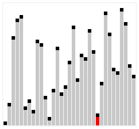

[Перелік лекцій](README.md)

# Алгоритми сортування

## Сортування бульбашкою

Алгоритм працює таким чином — у поданому наборі даних (списку чи масиві) порівнюються два сусідні елементи. Якщо один з елементів не відповідає критерію сортування (є більшим, або ж, навпаки, меншим за свого сусіда), то ці два елементи міняються місцями. Прохід по списку продовжується доти, доки дані не будуть відсортованими. Алгоритм отримав свою назву від того, що процес сортування за ним нагадує поведінку бульбашок повітря у резервуарі з водою. Оскільки для роботи з елементами масиву він використовує лише порівняння, це сортування на основі порівнянь.

Складність алгоритму у найгіршому випадку рівна О(n²), де n — кількість елементів для сортування. Існує чимало значно ефективніших алгоритмів, наприклад, з найгіршою ефективністю рівною O(n log n). Тому даний алгоритм має низьку ефективність у випадках, коли N є досить великим, за винятком рідкісних конкретних випадків, коли заздалегідь відомо, що масив з самого початку буде добре відсортований.

## Бульбашкове сортування включенням

Це модифікація обмінного варіанту сортування. В цьому методі вхідна і вихід множини знаходяться в одній послідовності, причому вихід – в початковій її частині. В початковому стані можна вважати, що перший елемент послідовності вже належить впорядкованій вихідній множині, інша частина послідовності – неврегульована вхідна. Перший елемент вхідної множини примикає до кінця вихідної множини. На кожному кроці сортування відбувається перерозподіл послідовності: вихідна множина збільшується на один елемент, а вхідна – зменшується. Це відбувається за рахунок того, що перший елемент вхідної множини тепер вважається останнім елементом вихідної. Потім виконується перегляд вихідної множини від кінця до початку з перестановкою сусідніх елементів, які не відповідають критерію впорядкованості. Перегляд припиняється, коли припиняються перестановки. Це приводить до того, що останній елемент вихідної множини „випливає” на своє місце в множині. Оскільки при цьому перестановка приводить до зсуву нового в вихідній множині елемента на одну позицію ліворуч, немає сенсу кожен раз проводити повний обмін між сусідніми елементами – достатньо зсовувати старий елемент праворуч, а новий елемент записати в вихідну множину, коли його місце буде встановлено. 

## Сортування простим включенням

Цей метод – „дослівна” реалізації стратегії включення. Порядок алгоритму сортування простим включенням – , якщо враховувати тільки операції порівняння. Але сортування вимагає ще й в середньому  переміщень, що робить її в такому варіанті значне менш ефективною, ніж сортування вибіркою.

## Сортування Шелла

Це ще одна модифікація сортування включенням. Суть її полягає в тому, що тут виконується порівняння ключів, віддалених один від одного на деяку відстань d. Початковий розмір d звичайно вибирається рівним половині загального розміру сортованої послідовності. Виконується сортування бульбашкою з інтервалом порівняння d. Потім величина d зменшується удвічі і знов виконується сортування бульбашкою, далі d зменшується ще удвічі і т.д. Останнє сортування бульбашкою виконується при d=1. Якісний порядок сортування Шелла залишається , середнє ж число порівнянь, визначене емпіричним шляхом, – N*log2(N)^2. Прискорення досягається за рахунок того, що виявленні „не на місці” елементи при d>1, швидше „спливають” на свої місця. Наступний приклад ілюструє сортування Шелла.

Итак, в чем же неопределнность? Неопределенность, именно в этом самом выборе расстояния D между двумя числами.

Есть огромное количество методов выбора числа D:

1. Самый просто пример это D = n / 2, D2 = D /2 … Dn =1 . В худшем случае сложность алогритма O(n) = N ^ 2
2. Предложение Хиббарда: проверить на всем N^i — 1<= N. В таком случае сложность алгоритма O(n) = n ^ (3/2)
3. Числа Седжвика и много много другого

## Сортування простою вибіркою

Даний метод реалізує практично „дослівно” сформульовану вище стратегію вибірки. При програмній реалізації алгоритму виникає проблема значення ключа „порожньо”. Досить часто програмісти використовують в якості такого деяке явно відсутнє у вхідній послідовності значення ключа, наприклад, максимальне з теоретично можливих значень. Інший підхід – створення окремого вектора, кожний елемент якого має логічний тип і відображає стан відповідного елемента вхідної множини (true – „не порожньо”, false – „порожньо”). Алгоритм дещо ускладнюється за рахунок того, що для установки початкового значення при пошуку мінімуму доводиться відкидати вже „порожні” елементи.

## Обмінне сортування простою вибіркою

Алгоритм сортування простою вибіркою рідко застосовується в попередньому варіанті. Набагато частіше застосовується його обмінний варіант. При обмінному сортуванні вибіркою вхідна і вихід множини розташовуються в одній і тій же ділянці пам’яті; вихідна – на початку ділянки, вхідна – в тій частині, що залишилася. У початковому стані вхідна множина займає всю ділянку, а вихідна множина – порожня. У міру виконання сортування вхідна множина звужується, а вихідна – розширяється.

Принцип методу полягає в наступному. Знаходять і вибирають в масиві елементів елемент з мінімальним значенням на інтервалі від 0 (першого) до N-1 (останнього) елемента і міняють його місцями з першим (0) елементом. На другому кроці знаходять елемент з мінімальним значенням на інтервалі від другого (1) до останнього (N-1) елемента і міняють місцями його з другим (1) елементом. І так далі для всіх елементів до N-1.

## Турнірне сортування

Цей метод сортування отримав свою назву через схожість з кубковою системою проведення спортивних змагань: учасники змагань розбиваються на пари, в яких розігрується перший тур; з переможців першого туру складаються пари для розиграшу другого туру і т.д. Алгоритм сортування складається з двох етапів. На першому етапі будується дерево: аналогічне схемі розиграшу кубка.

## Сортування впорядкованим бінарним деревом

Алгоритм складається з побудови впорядкованого бінарного дерева і подальшого його обходу. Якщо немає необхідності в побудові всього лінійного впорядкованого списку значень, то немає необхідності і в обході дерева, в цьому випадку застосовується пошук у впорядкованому бінарному дереві. Відзначимо, що порядок алгоритму – O(N*log2(N)), але в конкретних випадках все залежить від впорядкованості початкової послідовності, який впливає на ступінь збалансованості дерева і нарешті – на ефективність пошуку.

Заслуговує на увагу модифікація цього алгоритму запропонована Р.Флойдом. Метод сортування за допомогою прямої вибірки базується на повторних пошуках найменшого ключа серед n елементів, серед тих що залишилися n-1 елементів і так далі. Виявлення найменшого серед n елементів потребує – n-1 порівнянь, серед n-1 вже потрібно n-2 порівнянь і так далі. Як же в такому випадку можна удосконалити згаданий метод сортування? Цього можна добитися, тільки залишаючи після кожного проходу більше інформації, ніж просто ідентифікація єдиного мінімального елемента. Наприклад, виконавши n/2 порівнянь, можна визначити в кожній парі ключів менший. За допомогою n/4 порівнянь – менший із пари вже вибраних менших і так далі. Провівши n-1 порівнянь, можна побудувати дерево вибору і ідентифікувати його корінь як потрібний найменший ключ.

Другий етап сортування – спуск вздовж шляху, відміченого найменшим елементом, і виключення його з дерева шляхом заміни або на пустий елемент (дірку) в самому низу, або на елемент із сусідньої гілки в проміжних вершинах. Елемент, який перемістився в корінь дерева, знову буде найменшим (тепер вже другим) ключем, і його можна виключити. Після n таких кроків дерево стане пустим і процес сортування завершується.

## Швидке сортування Хоара

Даний алгоритм відноситься до розподільних і забезпечує показники ефективності O(N*log2(N)) навіть при якнайгіршому початковому розподілі.

Використовується два індекси – і і j – з початковими значеннями 0 і N-1 відповідно. Ключ K[і] порівнюється з ключем K[j]. Якщо ключі задовольняють критерію впорядкованості, то індекс j зменшується на 1 і проводиться наступне порівняння. Якщо ключі не задовольняють критерію, то записи R[і] і R[j] міняються місцями. При цьому індекс j фіксується і починає мінятися індекс і (збільшуватися на 1 після кожного порівняння). Після наступної перестановки фіксується і і починає змінюватися j і т.д. Прохід закінчується, коли індекси і і j стають рівними. Запис, що знаходиться на позиції зустрічі індексів, стоїть на своєму місці в послідовності. Цей запис ділить послідовність на дві підмножини. Всі записи, розташовані ліворуч від неї мають ключі, менші ніж ключ цього запису, всі записи праворуч – більші. Той же самий алгоритм застосовується до лівої підмножини, а потім до правої. Записи підмножини розподіляються на дві менші підмножини і так далі. Розподіл закінчується, коли отримана підмножина буде складатися з єдиного елемента – така підмножина вже є впорядкованою.

## Сортування попарним злиттям
Вхідна множина розглядається, як послідовність підмножин, кожна з яких складається з єдиного елемента і, отже, є вже впорядкованим. На першому проході кожні дві сусідні одноелементних множини зливаються в одну двоелементну впорядковану множину. На другому проході двоелементні множини зливаються в 4-елементні впорядковані множини і т.д. Врешті-решт отримують одну велику впорядковану множину.

Самою найважливішою частиною алгоритму є злиття двох впорядкованих множин. Цю частину алгоритму опишемо більш детально.

1. Початкові установки. Визначити довжини першої і другої початкових множин – l1 і l2 відповідно. Встановити індекси поточних елементів в початковій множині і1 і і2 в 0. Встановити індекс в вихідній множині j=1.

2. Цикл злиття. Виконувати крок 3 до тих пір, поки і1<=l1 і і2<=l2.

3. Порівняння. Порівняти ключ і1-го елемента з першої початкової множини з ключем і2-го елемента з другої початкової множини. Якщо ключ елемента з 1-ої множини менший, то записати і1-тий елемент з 1-ої множини на j-те місце в вихідній множині і збільшити і1 на 1. Інакше – записати і2-тий елемент з 2-ої множини на j-те місце в вихідній множині і збільшити і2 на 1. Збільшити j на 1.

4. Виведення залишків. Якщо і1<=l1, то переписати частину 1-ої початкової множини від і1 до l1 включно в вихідну множину. Інакше – переписати частину 2-ої початкової множини від і2 до l2 включно в вихідну множину.

## Підсумок

Зведена таблиця складності алгоритмів сортування

| Алгоритм                | Структура даних | Краща складність | Середня складність | Гірша складність | Гірший випадок |
| ----------------------- | --------------- | ---------------- | ------------------ | ---------------- | -------------- |
| Швидке сортування       | Масив           | 0(n log(n))      | 0(n log(n))        | 0(n\*n)          | 0(n)           |
| Сортування злиттям      | Масив           | 0(n log(n))      | 0(n log(n))        | 0(n log(n))      | 0(n)           |
| Пірамідальне сортування | Масив           | 0(n log(n))      | 0(n log(n))        | 0(n log(n))      | 0(1)           |
| Бульбашкове сортування  | Масив           | O(n)             | O(n\*n)            | O(n\*n)          | 0(1)           |
| Сортування вставкою     | Масив           | O(n)             | O(n\*n)            | O(n\*n)          | 0(1)           |
| Сортування вибором      | Масив           | O(n\*n)          | O(n\*n)            | O(n\*n)          | 0(1)           |
| Блочне сортування       | Масив           |                  |                    |                  |                |
| Порозрядне сортування   | Масив           |                  |                    |                  |                |

## Теми для самостійного вивчення

1.  Принципи роботи алгоритмів групи CRC
2.  Принципи роботи алгоритмів групи MD
3.  Принципи роботи алгоритмів групи SHA
4.  Недоліки алгоритмів групи MD

## Контрольні питання

1.  Як працює сортування Шелла, і що відрізняє його від інших алгоритмів сортування?
2.  Які переваги та недоліки сортування Шелла в порівнянні з іншими алгоритмами?
3.  Що таке сортування злиттям, і як відбувається процес злиття в цьому алгоритмі?
4.  Яким чином сортування злиттям впливає на швидкодію сортування, особливо при роботі з великими наборами даних?
5.  Як працює швидке сортування (Quicksort), і як обирається опорний елемент для розбиття масиву?
6.  Чому швидке сортування вважається ефективним для великих наборів даних?
7.  Які є найгірші та середні випадки для швидкого сортування?
8.  Як працює алгоритм сортування Шелла на практиці, і як вибирається розмір кроку для вставки?
9.  В яких випадках краще використовувати сортування Шелла, швидке сортування або сортування злиттям?