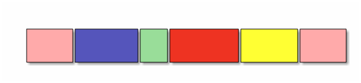

[Перелік лекцій](README.md)

# Статичні структури. Масиви та множини

## Зміст

1.  [Термінологія](#h01)
2.  [Теми для самостійного вивчення](#h101)
3.  [Контрольні питання](#h102)

Статичні структури відносяться до класу структур, які представляють собою структуровану множину примітивних, базових, структур. Оскільки статичні структури відрізняються відсутністю змінності, пам'ять для них виділяється автоматично - як правило, на етапі компіляції, або при виконанні - в момент активізації того програмного блоку, в якому вони описані. Ряд мов програмування допускають розміщення статичних структур в пам'яті на етапі виконання за явною вимогою програміста, але й у цьому випадку обсяг виділеної пам'яті залишається незмінним до знищення структури. Виділення пам'яті на етапі компіляції є такою зручною властивістю статичних структур, що у ряді задач програмісти використовують їх навіть для представлення об'єктів, які мають властивість змінності. Наприклад, коли розмір масиву невідомий наперед, для нього резервується максимально можливий розмір.

Статичні структури в мовах програмування зв'язані із структурованими типами. Структуровані типи в мовах програмування є тими засобами інтеграції, які дозволяють будувати структури даних будь-якої складності. До таких типів відносяться масиви, структури та їхні похідні типи.

## Масиви

Логічно масив об'єднує елементи одного типу даних, тобто належить до однорідного типу даних. Більше формально його можна визначити як впорядковану сукупність елементів деякого типу, які адресуються за допомогою одного або декількох індексів.

Масиви можна класифікувати за кількістю розмірностей масиву масиви поділяються на одновимірні масиви (вектори), двохвимірні (матриці) і багатовимірні (трьох, чотирьох і більше).

Логічно масив - це така структура даних, яка характеризується:

1.  фіксованим набором елементів одного і того ж типу;
2.  кожний елемент має унікальний набір значень індексів;
3.  кількість індексів визначають мірність масиву;
4.  звернення до елемента масиву виконується за ім'ям масиву і значенням індексів для даного елемента.

Фізична структура масиву - це спосіб розміщення елементів масиву в пам'яті комп'ютера. Під елемент масиву виділяється кількість байт пам'яті, яка визначається базовим типом елемента цього масиву. Кількість елементів масиву і розмір базового типу визначають розмір пам'яті для зберігання масиву.

Схематичне зображення масиву

Сама найважливіша операція фізичного рівня над масивом - доступ до заданого елемента. Як тільки реалізовано доступ до елемента, над ним може бути виконана будь-яка операція, що має сенс для того типу даних, якому відповідає елемент. Перетворення логічної структури масиву у фізичну називається процесом лінеаризації, в ході якого багатовимірна логічна структура масиву перетвориться в одновимірну фізичну структуру.

Адресою масиву є адреса першого байту початкового компоненту масиву. Індексація масивів в C/C++ обов'язково починається з нуля.

До операцій логічного рівня над масивами необхідно віднести такі як сортування масиву, пошук елемента за ключем.

Елемент\[0\]

Елемент\[1\]

…

Елемент\[n-1\]

## Розріджені масиви

На практиці зустрічаються масиви, які через певні причини можуть займати пам'ять не повністю, а частково. Це особливо актуально для масивів великих розмірів, таких що для їхнього зберігання в повному об'ємі пам'яті може бути недостатньо. Розріджений масив - це масив, більшість елементів якого рівні між собою, так що зберігати в пам'яті достатньо лише невелику кількість значень відмінних від основного (фонового) значення інших елементів. При роботи з розрідженими масивами питання розташування їх в пам'яті реалізуються на логічному рівні з врахуванням їхнього типу.

Розрізняють два типи розріджених масивів:

1.  масиви, в яких розташування елементів із значеннями відмінними від фонового, можуть бути описані математично;
2.  масиви з випадковим розташуванням елементів.

До **масивів з математичним описом розташування елементів** відносяться масиви, в яких існує закономірності в розташуванні елементів із значеннями відмінними від фонового.

Елементи, значення яких є фоновими, називають нульовими; елементи, значення яких відмінні від фонового, - ненульовими. Фонове значення не завжди рівне нулю. Ненульові значення зберігаються, як правило, в одновимірному масиві, а зв'язок між розташуванням у розрідженому масиві і в новому, одновимірному, описується математично за допомогою формули, що перетворює індекси масиву в індекси вектора.

На практиці для роботи з розрідженим масивом розробляються функції:

1.  для перетворення індексів масиву в індекс вектора;
2.  для отримання значення елемента масиву з його упакованого представлення за індексами;
3.  для запису значення елемента масиву в її упаковане представлення за індексами.

До **масивів з випадковим розташуванням елементів** відносяться масиви, в яких не існує закономірностей у розташуванні елементів із значеннями відмінними від фонового.

Один з основних способів зберігання подібних розріджених матриць полягає в запам'ятовуванні ненульових елементів в одновимірному масиві і ідентифікації кожного елемента масиву індексами.

Дане представлення масиву скорочує вимоги до об'єму пам'яті більш ніж в 2 рази. Спосіб послідовного розподілу має також ту перевагу, що операції над матрицями можуть бути виконані швидше, ніж це можливо при представленні у вигляді послідовного масиву, особливо якщо розмір матриці великий.

Методи послідовного розміщення для представлення розріджених матриць звичайно дозволяють швидше виконувати операції над матрицями і більш ефективно використати пам'ять, ніж методи із зв'язаними структурами. Проте послідовне представлення матриць має певні недоліки. Так включення і виключення нових елементів матриці викликає необхідність переміщення великої кількості інших елементів. Якщо включення нових елементів і їхнє виключення здійснюється часто, то повинен бути вибраний метод зв'язаних структур.

Метод зв'язаних структур, проте, переводить структуру даних, що представляється, в інший розділ класифікації. При тому, що логічна структура даних залишається статичною, фізична структура стає динамічною.

## Структури

На відміну від масивів чи множин, усі елементи яких однотипні, структура може містити елементи різних типів.

Схематичне зображення масиву

Схематичне зображення структури (запису)

Елементи структури називаються полями структури і можуть мати довільний тип, крім типу цієї ж структури, але можуть бути покажчиками на неї. Якщо при описі структури відсутній тип структури, обов'язково повинен бути вказаний список змінних, покажчиків або масивів визначеної структури.

Звернення до окремих полів структури замінюються на їхні адреси ще на етапі компіляції.

Самою найважливішою операцією для структури є операція доступу до вибраного поля структури - операція кваліфікації.

Над вибраним полем структури можливі будь-які операції, які допустимі для типів цього поля.

Більшість мов програмування підтримує деякі операції, які працюють із структурою, як з єдиним цілим, а не з окремими її полями. Це операція присвоєння значення одного запису іншому однотипному запису, при цьому відбувається по елементне копіювання.

## Об'єднання

Об'єднання представляють собою частковий випадок структури, усі поля якої розміщуються за однією ж і тою ж адресою. Формат опису такий же, як і в структури. Довжина об'єднання рівна найбільшій із довжин його полів. У кожен момент часу в змінній типу об'єднання зберігається тільки одне значення, і відповідальність за його правильне використання лягає на програміста.

Об'єднання застосовуються для економії пам'яті в тих випадках, коли відомо, що більше одного поля одночасно не потрібно, а також для різної інтерпретації одного і того ж бітового представлення.

Дуже часто деякі об'єкти програми відносяться до одного й того ж класу, відрізняючись лише деякими деталями. У цьому випадку застосовують комбінацію структурного типу і об'єднання. Об'єднання використовують як поля структури, при цьому в структурі включають поле, яке визначає, який саме елемент об'єднання використовується в кожний момент.

У загальному випадку змінна структура буде складатися з трьох частин: набір спільних компонентів, мітки активного компоненту і частини зі змінними компонентами.

## Бітові типи

В ряді задач може стати в нагоді робота з окремими бінарними розрядами даних. Частіше всього такі задачі виникають в системному програмуванні, коли, наприклад, окремий розряд зв'язаний з станом окремого апаратного перемикача або окремої шини передачі даних. Дані такого типу представляються у вигляді набору бітів, які упаковані в байти або слова, і логічно не зв'язаних один з одним. Операції над такими даними забезпечують доступ до вибраного біта даного.

Бітові поля - це особливий вид полів структури. Вони використовуються для компактного розміщення даних, наприклад, прапорців типу „так/ні”. Мінімально адресована комірка пам'яті - 1 байт, а для зберігання прапорця достатньо одного біта. Бітові поля описуються за допомогою структурного типу.

Бітові поля можуть бути довільного цілого типу. Ім'я поля може бути відсутнім, такі поля використовуються для вирівнювання на апаратну межу. Доступ до поля здійснюється звичайним способом - за іменем.

Над бітовими типами можливі три групи специфічних операцій: операції алгебри логіки, операції зсуву, операції порівняння.

Операції бульової алгебри - НІ, АБО, І, виключне АБО. Ці операції і за назвою, і за змістом подібні на операції над логічними аргументами, але відмінність у їх застосуванні до бітових аргументів полягає в тому, що операції виконуються над окремими розрядами. В мові C/C++ для побітових і загальних логічних операцій використовуються різні позначення.

Операції зсуву виконують зміщення бінарного коду на задану кількість розрядів ліворуч або праворуч. Із трьох можливих типів зсуву (арифметичний, логічний, циклічний) в мовах програмування частіше реалізується лише логічний.

## Теми для самостійного вивчення

1.  Алгоритми сортування масивів

## Контрольні питання

1.  Що представляє собою структура даних «масив»?
2.  Які основні дії виконуються над елементами структури даних?
3.  За яким алгоритмом визначається адреса будь-якого елемента одновимірного масиву?