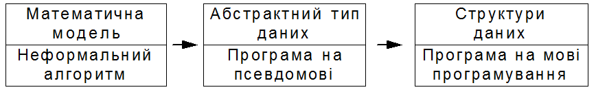

[Перелік лекцій](README.md)

# Побудова і аналіз алгоритмів

1.  [Термінологія](#h01)
2.  [Теми для самостійного вивчення](#h101)
3.  [Контрольні питання](#h102)

## Формалізація алгоритмів

Процес створення комп'ютерної програми для вирішення будь-якої практичної задачі складається з декількох етапів:

1.  формалізація і створення технічного завдання на вихідну задачу;
2.  розробка алгоритму вирішення задачі;
3.  написання, тестування, наладка і документування програми;
4.  отримання розв'язку вихідної задачі шляхом виконання програми.

Половина справи зроблена, якщо знати, що поставлена задача має вирішення. В першому наближенні більшість задач, які зустрічаються на практиці, не мають чіткого й однозначного опису. Певні задачі взагалі неможливо сформулювати в термінах, які допускають комп'ютерне вирішення. Навіть якщо допустити, що задача може бути вирішена на комп'ютері, часто для її формального опису потрібна велика кількість різноманітних параметрів. І лише в ході додаткових експериментів можна знайти інтервали зміни цих параметрів.

Якщо певні аспекти вирішуваної задачі можна виразити в термінах якої-небудь формальної моделі, то це, безумовно, необхідно зробити, так як в цьому випадку в рамках цієї моделі можна взнати, чи існують методи й алгоритми вирішення задачі. Навіть якщо такі методи й алгоритми не існують на сьогоднішній день, то застосування засобів і властивостей формальної моделі допоможе в побудові вирішення вихідної задачі.

Практично будь-яку галузь математики або інших наук можна застосувати до побудови моделі певного класу задач. Для задач, числових за своєю природою, можна побудувати моделі на основі загальних математичних конструкцій, таких як системи лінійних рівнянь, диференціальні рівняння. Для задач з символьними або текстовими даними можна застосувати моделі символьних послідовностей або формальних граматик. Вирішення таких задач містить етапи компіляції і інформаційного пошуку.

Коли побудована чи підібрана потрібна модель вихідної задачі, то природно шукати її вирішення в термінах цієї моделі. На цьому етапі основна мета полягає в побудові розв'язку в формі алгоритму, який складається з скінченої послідовності інструкцій, кожна з яких має чіткий зміст і може бути виконана з скінченими обчислювальними затратами за скінчений час. Інструкції можуть виконуватися в алгоритмі будь-яку кількість раз, при цьому вони самі визначають цю кількість повторень. Проте вимагається, щоб при будь-яких вхідних даних алгоритм завершився після виконання скінченої кількості інструкцій. Таким чином, програма, яка написана на основі розробленого алгоритму, при будь-яких початкових даних ніколи не повинна приводити до нескінченних циклічних обчислень.

Є ще один аспект у визначення алгоритмів. Алгоритмічні інструкції повинні мати „чіткий зміст” і виконуватися з „скінченими обчислювальними затратами”. Природно, те, що зрозуміло одній людині і має для неї „чіткий зміст”, може зовсім інакше представлятися іншій. Те ж саме можна сказати про поняття „скінчених затрат”: на практиці часто важко довести, що при будь-яких вихідних даних виконання послідовності інструкцій завершиться, навіть якщо чітко розуміти зміст кожної інструкції. У цій ситуації, враховуючи всі аргументи за і проти, було б корисним спробувати досягнути узгодження про „скінченні затрати” у відношенні до послідовності інструкцій, які складають алгоритм.

## Покрокове проектування алгоритмів

Оскільки для вирішення вихідної задачі застосовують деяку математичну модель, то тим самим можна формалізувати алгоритм вирішення в термінах цієї моделі. У початкових версіях алгоритму часто застосовуються узагальнені оператори, які потім перевизначаться у вигляді більш дрібних, чітко визначених інструкцій. Але для перетворення неформальних алгоритмів у комп'ютерні програми необхідно пройти через декілька етапів формалізації (цей процес називають покроковою деталізацією), поки не отримають програму, яка повністю складається з формальних операторів мови програмування.

В основу процесу проектування програми з розбиттям її на достатню кількість дрібних кроків можна покласти наступну послідовність дій:

Вихідним станом процесу проектування є більш-менш точне формулювання мети алгоритму, або конкретніше – результату, який повинен бути отриманий при його виконанні. Формулювання проводиться на природній мові.

Проводиться збір фактів, які стосуються будь-яких характеристик алгоритму, і робиться спроба їх представлення засобами мови.

Створюється образна модель процесу, який відбувається, використовуються графічні та інші способи представлення, образні „картинки”, які дозволяють краще зрозуміти виконання алгоритму в динаміці.

В образній моделі виділяється найбільш суттєва частина, для якої підбирається найбільш точне словесне формулювання.

Проводиться визначення змінних, які необхідні для формального представлення даного кроку алгоритму.

Вибирається одна з конструкцій – проста послідовність дій, умовна конструкція або циклу. Складні частини вибраної формальної конструкції (умова, заголовок циклу) залишаються в словесному формулюванні.

Для інших неформалізованих частин алгоритму, які залишились у словесному формулюванні – перерахована послідовність дій повторюється.

Зовнішня сторона такого процесу проектування програми полягає в тому, що одне словесне формулювання алгоритму замінюється на одну з трьох можливих конструкцій мови, елементи якої продовжують залишатися в неформальному, словесному формулюванні. Проте, це зовнішня сторона процесу. Насправді, кожне словесне формулювання алгоритму містить важливий перехід, який виконується в голові програміста і не може бути формалізованим – перехід від мети (результату) роботи програми до послідовності дій, які приводять до потрібного результату. Тобто алгоритм вже формулюється, але тільки з використанням образного мислення і природної мови.

Схематично узагальнений процес програмування можна представити наступною схемою.

Узагальнена схема процесу програмування

На першому етапі створюється модель вихідної задачі, для чого застосовуються відповідні математичні моделі. На цьому етапі для знаходження рішення також будується неформальний алгоритм.

На наступному етапі алгоритм записується на псевдомові – композиції конструкцій мови програмування і менш формальних і узагальнених операторів на простій мові. Продовженням цього етапу є заміна неформальних операторів послідовністю більш детальних і формальних операторів. З цієї точки зору програма на псевдомові повинна бути достатньо детальною, так як в ній фіксуються (визначаються) різні типи даних, над якими виконуються оператори. Потім створюються абстрактні типи даних для кожного зафіксованого типу даних (за винятком елементарних типів даних, таких як цілі й дійсні числа або символьні стрічки) шляхом завдання імен функцій для кожного оператора, який працює з даними абстрактного типа, і заміни їх (операторів) викликом відповідних функцій.

Третій етап процесу – програмування – забезпечує реалізацію кожного абстрактного типа даних і створення функцій для виконання різних операторів над даними цих типів. На цьому етапі також замінюються всі неформальні оператори псевдомови на код мови програмування. Результатом цього етапу повинна бути виконувана програма. Після її наладки отримують працюючу програму.

## Характеристики алгоритму

Охарактеризуємо поняття алгоритму не формально, а дескриптивно за допомогою таблиці:

Як бачимо, алгоритм – це механізм, який не тільки повинен гарантувати те, що вирішення колись буде знайдене, але й те, що буде знайдене саме оптимальне, тобто найкраще вирішення. Крім того, алгоритм повинен мати наступні п'ять якостей:

*   Обмеженість в часі – робота алгоритму обов'язково повинна завершитись через деякий розумний період часу.
*   Правильність – алгоритм повинен знаходити правильне, а не будь-яке рішення.
*   Детермінованість – скільки б разів не виконувався алгоритм з однаковими вхідними даними, результат повинен бути однаковим.
*   Скінченність – опис роботи алгоритму повинен мати скінчену кількість кроків.
*   Однозначність – кожний крок алгоритму повинен інтерпретуватися однозначно.

Як видно з таблиці, евристика – це пряма протилежність класичному алгоритму, так як вона не дає ніяких гарантій на те, що рішення буде знайдене, так само, як і на те, що воно буде оптимальним. Між ними є два перехідні стани, назв яким, на жаль, ще не придумали, і тому їх називають приблизними алгоритмами (рішення гарантоване, але його оптимальність – ні) і імовірнісні алгоритми (рішення не гарантоване, але якщо воно буде знайдене, то обов'язково буде оптимальним).

## Складність алгоритму

У процесі вирішення прикладних задач вибір потрібного алгоритму викликає певні труднощі. І справді, на чому базувати свій вибір, якщо алгоритм повинен задовольняти наступні протиріччя.

Бути простим для розуміння, перекладу в програмний код і наладки.

Ефективно використовувати комп'ютерні ресурси і виконуватися швидко.

Якщо написана програма повинна виконуватися лише декілька разів, то перша вимога найбільш важлива. Вартість робочого часу програміста, звичайно, значно перевищує вартість машинного часу виконання програми, тому вартість програми оптимізується за вартістю написання (а не виконання) програми. Якщо мати справу з задачею, вирішення якої потребує значних обчислювальних затрат, то вартість виконання програми може перевищити вартість написання програми, особливо якщо програма повинна виконуватися багаторазово. Тому, з економічної точки зору, перевагу буде мати складний комплексний алгоритм (в надії, що результуюча програма буде виконуватися суттєво швидше, ніж більш проста програма). Але і в цій ситуації розумніше спочатку реалізувати простий алгоритм, щоб визначити, як повинна себе вести більш складна програма. При побудові складної програмної системи бажано реалізувати її простий прототип, на якому можна провести необхідні виміри й змоделювати її поведінку в цілому, перш ніж приступати до розробки кінцевого варіанту. Таким чином, програмісти повинні бути обізнані не тільки з методами побудови швидких алгоритмів, але й знати, коли їх потрібно застосувати.

Існує декілька способів оцінки складності алгоритмів. Програмісти, звичайно, зосереджують увагу на швидкості алгоритму, але важливі й інші вимоги, наприклад, до розмірів пам'яті, вільного місця на диску або інших ресурсів. Від швидкого алгоритму може бути мало толку, якщо під нього буде потрібно більше пам'яті, ніж встановлено на комп'ютері.

Важливо розрізняти практичну складність, яка є точною мірою часу обчислення і об'єму пам'яті для конкретної моделі обчислювальної машини, і теоретичну складність, яка більш незалежна від практичних умов виконання алгоритму і дає порядок величини вартості.

Більшість алгоритмів надає вибір між швидкістю виконання і ресурсами. Задача може виконуватися швидше, використовуючи більше пам'яті, або навпаки – повільніше з меншим обсягом пам'яті.

Прикладом в даному випадку може слугувати алгоритм знаходження найкоротшого шляху. Задавши карту вулиць міста у вигляді мережі, можна написати алгоритм, що обчислює найкоротшу відстань між будь-якими двома точками цієї мережі. Замість того, щоб кожного разу заново перераховувати найкоротшу відстань між двома заданими точками, можна наперед прорахувати її для всіх пар точка і зберегти результати в таблиці. Тоді, щоб знайти найкоротшу відстань для двох заданих точка, достатньо буде просто взяти готові значення з таблиці. При цьому отримують результат, практично, миттєво, але це зажадає великий обсяг пам'яті. Карта вулиць для великого міста може містити сотні тисяч точок. Для такої мережі таблиця найкоротших відстаней містила б більше 10 мільярдів записів. В цьому випадку вибір між часом виконання і обсягом необхідної пам'яті очевидний.

Із цього зв'язку випливає ідея просторово-часової складності алгоритмів. При цьому підході складність алгоритму оцінюється в термінах часу і простору, і знаходиться компроміс між ними.

При порівнянні різних алгоритмів важливо розуміти, як складність алгоритму співвідноситься із складністю вирішуваної задачі. При розрахунках за одним алгоритмом сортування тисячі чисел може зайняти 1 секунду, а сортування мільйона – 10 секунд, тоді як розрахунки за іншими алгоритмами можуть зайняти 2 і 5 секунд відповідно. У цьому випадку не можна однозначно сказати, яка із двох програм краща – це буде залежати від вихідних даних.

## Ефективність алгоритмів

Одним із способів визначення часової ефективності алгоритмів полягає в наступному: на основі даного алгоритму потрібно написати програму і виміряти час її виконання на певному комп'ютері для вибраної множини вхідних даних. Хоча такий спосіб популярний і, безумовно, корисний, він породжує певні проблеми. Визначений час виконання програми залежить не тільки від використаного алгоритму, але й від архітектури і набору внутрішніх команд даного комп'ютера, від якості компілятора, і від рівня програміста, який реалізував даний алгоритм. Час виконання також може суттєво залежати від вибраної множини тестових вхідних даних. Ця залежність стає очевидною при реалізації одного й того ж алгоритму з використанням різних комп'ютерів, різних компіляторів, при залучені програмістів різного рівня і при використанні різних тестових даних. Щоб підвищити об'єктивність оцінки алгоритмів, учені, які працюють в галузі комп'ютерних наук, прийняли асимптотичну часову складність як основну міру ефективності виконання алгоритму.

Часто говорять, що час виконання алгоритму має порядок _T(N)_ від вхідних даних розміру _N_. Одиниця вимірювання _T(N)_ точно не визначена, але в більшості випадків розуміють під нею кількість інструкцій, які виконуються на ідеалізованому комп'ютері.

Для багатьох програм час виконання дійсно є функцією вхідних даних, а не їх розміру. У цьому випадку визначають _T(N)_ як час виконання в найгіршому випадку, тобто, як максимум часів виконання за всіма вхідними даними розміру _N_. Поряд з тим розглядають _Tcp(N)_ як середній (в статистичному розумінні) час виконання за всіма вхідними даними розміру _N_. Хоча _Tcp(N)_ є достатньо об'єктивною мірою виконання, але часто неможливо передбачити, або обґрунтувати, рівнозначність усіх вхідних даних. На практиці середній час виконання знайти складніше, ніж найгірший час виконання, так як математично це зробити важко і, крім цього, часто не буває простого визначення поняття „середніх” вхідних даних. Тому, в основному, користуються найгіршим часом виконання як міра часової складності алгоритмів.

Продуктивність алгоритму оцінюють за порядком величини. Говорять, що алгоритм має складність порядку _O(f(N))_, якщо час виконання алгоритму росте пропорційно функції _f(N)_ із збільшенням розмірності початкових даних _N_. _O_ – позначає „величина порядку”.

Приведемо деякі функції, які часто зустрічаються при оцінці складності алгоритмів. Функції приведемо в порядку зростання обчислювальної складності зверху вниз. Ефективність степеневих алгоритмів звичайно вважається поганою, лінійних – задовільній, логарифмічних – хорошою.

Функція

Примітка

_f(N)=C_

C – константа

_f(N)=log(log(N))_

_f(N)=log(N)_

_f(N)=NC_

C – константа від нуля до одиниці

_f(N)=N_

_f(N)=N\*log(N)_

_f(N)=NC_

C – константа більша одиниці

_f(N)=CN_

C – константа більша одиниці

_f(N)=N!_

тобто 1\*2\* … N

Графічне подання росту алгоритмів

Оцінка з точністю до порядку дає верхню межу складності алгоритму. Те, що програма має певний порядок складності, не означає, що алгоритм буде дійсно виконуватися так довго. При певних вхідних даних, багато алгоритмів виконується набагато швидше, ніж можна припустити на підставі їхнього порядку складності.

У числових алгоритмах точність і стійкість алгоритмів не менш важлива, ніж їх часова ефективність.

Аналіз складності алгоритму корисний для розуміння особливостей алгоритму і звичайно знаходить частини програми, що витрачають велику частину комп'ютерного часу. Надавши увагу оптимізації коду в цих частинах, можна внести максимальний ефект в збільшення продуктивності програми в цілому.

Іноді тестування алгоритмів є найбільш відповідним способом визначити якнайкращого алгоритму. При такому тестуванні важливо, щоб тестові дані були максимально наближені до реальних даних. Якщо тестові дані сильно відрізняються від реальних, результати тестування можуть сильно відрізнятися від реальних.

## Правила аналізу складності алгоритмів.

У загальному випадку час виконання оператора або групи операторів можна розглядати як функцію з параметрами – розміром вхідних даних і/або одної чи декількох змінних. Але для часу виконання програми в цілому допустимим параметром може бути лише розмір вхідних даних.

Час виконання операторів присвоєння, читання і запису звичайно має порядок _O(1)_.

Час виконання послідовності операторів визначається за правилом сум. Тому міра росту часу виконання послідовності операторів без визначення констант пропорційності співпадає з найбільшим часом виконання оператора в даній послідовності.

Час виконання умовних операторів складається з часу виконання умовно виконуваних операторів і часу обчислення самого логічного виразу. Час обчислення логічного виразу часто має порядок _O(1)_. Час для всієї конструкції if-then-else складається з часу обчислення логічного виразу і найбільшого з часів, який необхідний для виконання операторів, що виконуються при різних значеннях логічного виразу.

Час виконання циклу є сумою часів усіх часів виконуваних конструкцій циклу, які в свою чергу складаються з часів виконання операторів тіла циклу і часу обчислення умови завершення циклу (часто має порядок _O(1)_). Часто час виконання циклу обчислюється, нехтуючи визначенням констант пропорційності, як добуток кількості виконуваних операцій циклу на найбільший можливий час виконання тіла циклу. Час виконання кожного циклу, якщо в програмі їх декілька, повинен визначатися окремо.

## Теми для самостійного вивчення

1.  Принципи роботи алгоритмів групи CRC
2.  Принципи роботи алгоритмів групи MD
3.  Принципи роботи алгоритмів групи SHA
4.  Недоліки алгоритмів групи MD

## Контрольні питання

1.  Що таке хеш-функція?
2.  Яке призначення хеш-функцій?
3.  Які алгоритми хешування ви знаєте?
4.  В чому головна відмінність процесів хешування та шифрування?